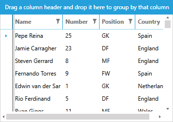
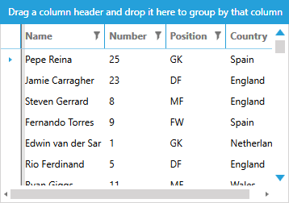
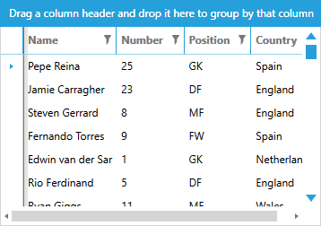

# Styling Scrollbars

Each of the themes from the UI for {{ site.framework_name }} provides a custom default style for the **ScrollBars** in your application.

__Scrollbar in Windows8 theme__


The article will show you how to modify these styles to suit your requirements.

>The templates provided in this article are extracted from the **Windows8** theme and if you extract the templates from another theme there might be slight differences. The approach for updating the templates, however, is similar for all themes.

## Get Default Style

You can get the default style of the ScrollBar element as explained in the [Modifying Default Styles]() article.

For the purposes of this article, we will assume that you're using the [implicit styles](#setting-a-theme-using-implicit-styles) mechanism for theming the controls and that you've manually extracted the default styles from the **System.Windows.xaml** file of the **Themes.Implicit** folder of your UI for {{ site.framework_name }} installation. You can, however, achieve the same result using the StyleManager approach and extracting the styles with Blend for Visual Studio, for example.

## Default Control Template

Before we modify the appearance of the control, let's first extract its default templates - **ScrollBarVerticalControlTemplate** and **ScrollBarHorizontalControlTemplate** - one for each **Orientation** of the control. You can place these templates in the App.xaml file of your application, for example.

__Example 1: Default ScrollBarVerticalControlTemplate__

```XAML
    <ControlTemplate x:Key="ScrollBarVerticalControlTemplate" TargetType="{x:Type ScrollBar}">
        <Grid>
            <Grid.RowDefinitions>
                <RowDefinition MaxHeight="12"/>
                <RowDefinition Height="1*"/>
                <RowDefinition MaxHeight="12"/>
            </Grid.RowDefinitions>
            <Border Grid.RowSpan="3" BorderThickness="{TemplateBinding BorderThickness}" BorderBrush="{TemplateBinding BorderBrush}" Background="{TemplateBinding Background}"/>
            <RepeatButton Style="{StaticResource RepeatButtonLineUpStyle}" Content="Up" Command="{x:Static ScrollBar.LineUpCommand}"/>
            <Track Name="PART_Track" Grid.Row="1" IsDirectionReversed="True">
                <Track.Resources>
                    <sys:Double x:Key="{x:Static SystemParameters.VerticalScrollBarButtonHeightKey}">32</sys:Double>
                </Track.Resources>
                <Track.DecreaseRepeatButton>
                    <RepeatButton Style="{StaticResource RepeatButtonBlankStyle}" Command="{x:Static ScrollBar.PageUpCommand}"/>
                </Track.DecreaseRepeatButton>
                <Track.IncreaseRepeatButton>
                    <RepeatButton Style="{StaticResource RepeatButtonBlankStyle}" Command="{x:Static ScrollBar.PageDownCommand}"/>
                </Track.IncreaseRepeatButton>
                <Track.Thumb>
                    <Thumb Style="{StaticResource ThumbVerticalStyle}"/>
                </Track.Thumb>
            </Track>
            <RepeatButton Style="{StaticResource RepeatButtonLineDownStyle}" Grid.Row="2" Command="{x:Static ScrollBar.LineDownCommand}"/>
        </Grid>
    </ControlTemplate>
```

>The template above depends on the following 2 namespace declarations:
* xmlns:telerik="http://schemas.telerik.com/2008/xaml/presentation"
* xmlns:sys="clr-namespace:System;assembly=mscorlib"

The **ScrollBarHorizontalControlTemplate** has similar content.
    
**Example 3** demonstrates the updated style with the two templates set which you can also place in your App.xaml file so that it affects all scrollbars in your application.

__Example 2: Apply the templates__

```XAML
    <Style TargetType="{x:Type ScrollBar}" BasedOn="{StaticResource ScrollBarStyle}">
        <Setter Property="Template" Value="{StaticResource ScrollBarVerticalControlTemplate}"/>
        <Style.Triggers>
            <Trigger Property="Orientation" Value="Horizontal">
                <Setter Property="Template" Value="{StaticResource ScrollBarHorizontalControlTemplate}"/>
            </Trigger>
        </Style.Triggers>
    </Style>
```

>If you're using the [StyleManager](#setting-a-theme-using-stylemanager) approach for theming the controls, you will also need to extract the default **ScrollBarStyle**.

## Increase the Width

Now that you've extracted the default style and templates, let's first increase the **Width** and **Height** of the scrollbars in the extracted style.

__Example 3: Increase scrollbar width__

```XAML
    <Style TargetType="{x:Type ScrollBar}" BasedOn="{StaticResource ScrollBarStyle}">
        <Setter Property="MinWidth" Value="20"/>
        <Setter Property="MinHeight" Value="20"/>
        <Setter Property="Template" Value="{StaticResource ScrollBarVerticalControlTemplate}"/>
        <Style.Triggers>
            <Trigger Property="Orientation" Value="Horizontal">
                <Setter Property="Template" Value="{StaticResource ScrollBarHorizontalControlTemplate}"/>
            </Trigger>
        </Style.Triggers>
    </Style>
```

__Scrollbars with increased size__



## Styling the Arrows

Now let us increase the size of the arrows of the scrollbars as well as change their color. To do this, you need to set the **Width**, **Height**, **Data** and **Fill** of the **Arrow** path inside the **RepeatButtonLineDownTemplate** and **RepeatButtonLineUpTemplate**.

You then need to set these templates in the respective styles for the **RepeatButtons** - **RepeatButtonLineDownStyle** and **RepeatButtonLineUpStyle**. Note that you need to define these resources before your new custom scrollbar style.

__Example 4: Apply the templates__

```XAML
    <ControlTemplate x:Key="RepeatButtonLineDownTemplate" TargetType="RepeatButton">
        <Border Background="Transparent">
            <Grid>
                <Path x:Name="Arrow" Width="12" Height="8" Data="M0,0 L12,0 L6,8z" Fill="{telerik:Windows8Resource ResourceKey=AccentBrush}"/>
            </Grid>
        </Border>
        <ControlTemplate.Triggers>
            <Trigger Property="IsMouseOver" Value="True">
                <Setter TargetName="Arrow" Property="Fill" Value="{telerik:Windows8Resource ResourceKey=MarkerBrush}"/>
            </Trigger>
            <Trigger Property="IsEnabled" Value="False">
                <Setter TargetName="Arrow" Property="Fill" Value="{telerik:Windows8Resource ResourceKey=BasicBrush}"/>
            </Trigger>
        </ControlTemplate.Triggers>
    </ControlTemplate>
    <Style x:Key="RepeatButtonLineDownStyle" TargetType="RepeatButton" BasedOn="{StaticResource RepeatButtonLineBaseStyle}">
        <Setter Property="Template" Value="{StaticResource RepeatButtonLineDownTemplate}"/>
    </Style>
```

>If you're using the [StyleManager](#setting-a-theme-using-stylemanager) approach for theming the controls, you will also need to extract the **RepeatButtonLineBaseStyle**.

You now need to do the same for the **RepeatButtonLineUpTemplate** and **RepeatButtonLineUpStyle** to style the other arrow.
    
__Scrollbars with increased arrow size__



    
## Styling the Thumbs

Finally, to modify the background of the scrollbar's thumb, for example, you need to extract and edit the respective **Thumb** style - **ThumbVerticalStyle** or **ThumbHorizontalStyle**. Let's use the **Accent** brush instead of the **Basic** one for the thumbs **Track** element.

__Example 5: Change thumb color__

```XAML
    <Style x:Key="ThumbVerticalStyle" TargetType="Thumb">
        <Setter Property="IsTabStop" Value="False"/>
        <Setter Property="SnapsToDevicePixels" Value="True"/>
        <Setter Property="FocusVisualStyle" Value="{x:Null}"/>
        <Setter Property="Template">
            <Setter.Value>
                <ControlTemplate TargetType="Thumb">
                    <Grid Background="Transparent">
                        <Rectangle x:Name="Track" Fill="{telerik:Windows8Resource ResourceKey=AccentBrush}" Margin="4 0"/>
                    </Grid>
                    <ControlTemplate.Triggers>
                        <Trigger Property="IsMouseOver" Value="True">
                            <Setter TargetName="Track" Property="Fill" Value="{telerik:Windows8Resource ResourceKey=MarkerBrush}"/>
                        </Trigger>
                        <Trigger Property="IsDragging" Value="True">
                            <Setter TargetName="Track" Property="Fill" Value="{telerik:Windows8Resource ResourceKey=MarkerBrush}"/>
                            <Setter TargetName="Track" Property="Margin" Value="3 0"/>
                        </Trigger>
                        <Trigger Property="IsEnabled" Value="False">
                            <Setter TargetName="Track" Property="Fill" Value="{telerik:Windows8Resource ResourceKey=BasicBrush}"/>
                        </Trigger>
                    </ControlTemplate.Triggers>
                </ControlTemplate>
            </Setter.Value>
        </Setter>
    </Style>
```
    
__Scrollbars with colored thumb__



## See Also

* [Setting a Theme]()
* [Modifying Default Styles]()
* [Editing Control Templates]()