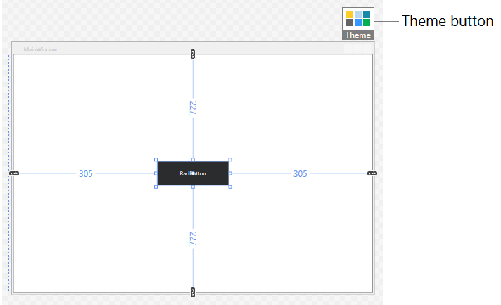
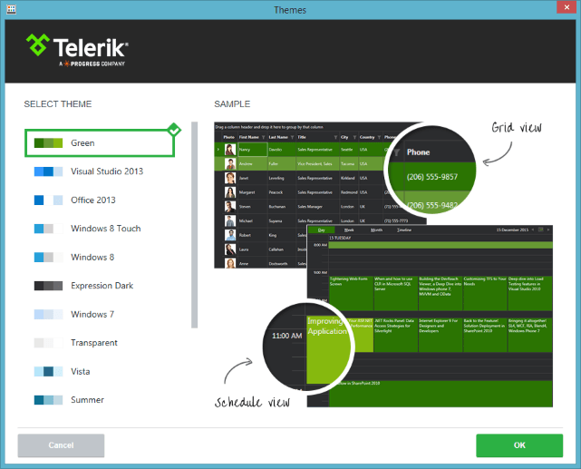
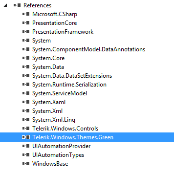
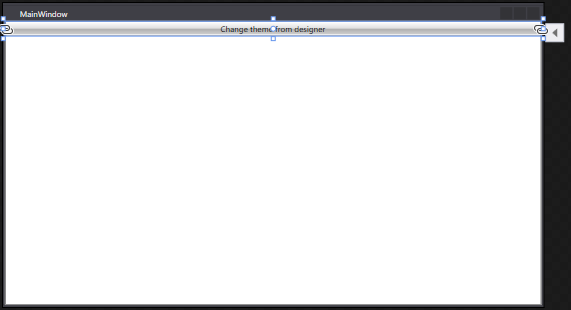
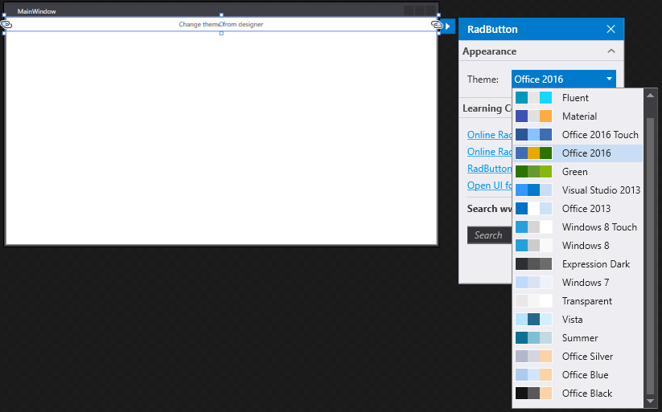

# Switching Themes at Design-time

The UI for WPF suite provides a mechanism that allows you to change the application theme at design-time with a few clicks.

> This mechanism is available only when the [implicit styles theming]() is used. In order to use it you will need to reference the [NoXaml](#noxaml-assemblies) version of the Telerik assemblies. 

The following example demonstrates how the feature works in few easy steps.

1. Select a Rad-control in the Visual Studio designer at design-time. This will display the Theme button at the designer's top right corner.  
	
	
2. Click on the __Theme__ button. This will open the Themes window where you can choose a theme.  
	
	
3. Select a theme and click __OK__. 

This will automatically add the new theme dll in the references of the project and merge the required resource dictionaries in the __App.xaml resources__.

#### __Figure 1: The added theme assembly reference__


__Example 1: The merged theme resources__
```XAML
	<Application.Resources>
		<ResourceDictionary>
			<ResourceDictionary.MergedDictionaries>
				<ResourceDictionary Source="/Telerik.Windows.Themes.Green;component/Themes/System.Windows.xaml" />
				<ResourceDictionary Source="/Telerik.Windows.Themes.Green;component/Themes/Telerik.Windows.Controls.xaml" />
			</ResourceDictionary.MergedDictionaries>
		</ResourceDictionary>
	</Application.Resources>
```

You can change the theme also by using the [Project Configuration Wizard]().

## Switching Themes at Design-time per control

With the __R2 2019__ version we introduced the option to change the theme per control at design-time.

> This option is available only when the [StyleManager](#setting-a-theme-using-stylemanager) is used. In order to use it you will need to reference the [Xaml](#xaml-assemblies) version of the Telerik assemblies. 

The following example demonstrates how the feature works in few easy steps.

1. Select a __Rad-control__ in the Visual Studio designer at design-time. This will display a button on the right side of the control.

	

2. Click the button and under Appearance, you can select the theme that you want to apply to the control. The __StyleManager.Theme__ attached property will be set to the chosen theme. The result is demonstrated in __Example 2__.
	

__Example 2: RadButton with Office2016 theme applied__
```XAML
	<telerik:RadButton Content="Change theme from designer" telerik:StyleManager.Theme="Office2016"   />
```

## See Also
* [Setting a Theme]()
* [Switching Themes at Runtime]()
* [Editing Control Templates]()
