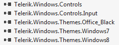
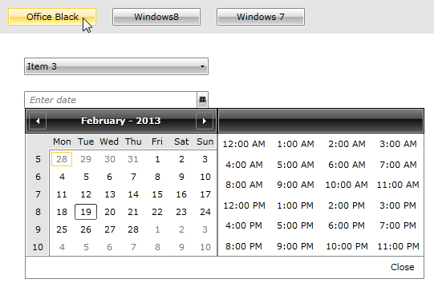
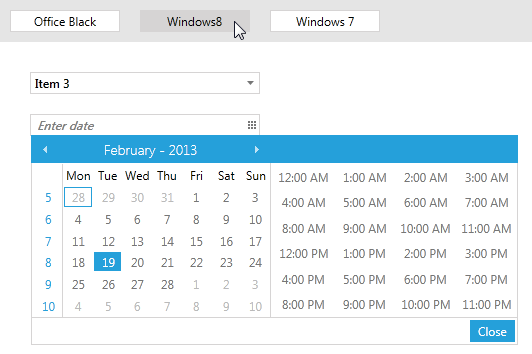
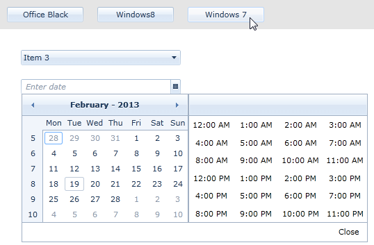

# Switching Themes at Runtime

>Before proceeding with this tutorial, please first read the [Setting a Theme (Using  Implicit Styles)]() help article.

By utilizing the theming mechanism with implicit styles, you can change the theme of Telerik UI for {{ site.framework_name }} controls at runtime without recreating the UI. All you need to do is remove the current merged dictionaries and then add the merged dictionaries of another theme to your application resources in code-behind:

#### __[C#] Merging resource dictionaries in code__ 
{{region styling-apperance-themes-runtime_0}}
	Application.Current.Resources.MergedDictionaries.Clear();
	Application.Current.Resources.MergedDictionaries.Add(new ResourceDictionary() { Source = ......});
{{endregion}}

This will apply different implicit styles to your control at runtime.

In this help article we'll go through a quick example to demonstrate the approach.

1. Add the required assemblies from the **Binaries.NoXaml** folder located in the installation folder of the controls. You must also include the theme assemblies.
	
	

2. Add the needed resource dictionaries for the default theme in **App.xaml**.  

	#### __[XAML] Merging ResourceDictionaries in XAML__ 
	{{region styling-apperance-themes-runtime_1}}
		<Application.Resources>
			<ResourceDictionary>
				<ResourceDictionary.MergedDictionaries>
					<ResourceDictionary Source="/Telerik.Windows.Themes.Office_Black;component/Themes/System.Windows.xaml"/>
					<ResourceDictionary Source="/Telerik.Windows.Themes.Office_Black;component/Themes/Telerik.Windows.Controls.xaml"/>
					<ResourceDictionary Source="/Telerik.Windows.Themes.Office_Black;component/Themes/Telerik.Windows.Controls.Input.xaml"/>
					...
				</ResourceDictionary.MergedDictionaries>
			</ResourceDictionary>
		</Application.Resources>
	{{endregion}}

3. Add a few controls of your choice to the page. In this example, we will add a **Grid**, **StackPanel**, **RadComboBox**,  **RadDateTimePicker** and three **RadButtons** to switch between three of the themes.        

	#### __[XAML] Defining the view__  
	{{region styling-apperance-themes-runtime_2}}
		<Grid x:Name="LayoutRoot" Background="White">
			<Grid.RowDefinitions>
				<RowDefinition Height="Auto" />
				<RowDefinition Height="*" />
			</Grid.RowDefinitions>
				
			<StackPanel Orientation="Horizontal" Background="#FFE5E5E5" HorizontalAlignment="Stretch">
				<telerik:RadButton Content="Office Black" VerticalAlignment="Center" Width="110"  Margin="10" Click="OfficeBlack_Click" />
				<telerik:RadButton Content="Windows8" VerticalAlignment="Center" Width="110" Margin="10" Click="Windows8_Click" />
				<telerik:RadButton Content="Windows 7" VerticalAlignment="Center" Width="110"  Margin="10" Click="Windows7_Click" />
			</StackPanel>
			
			<StackPanel Orientation="Vertical" Grid.Row="1" Margin="20" HorizontalAlignment="Left">
				<telerik:RadComboBox Width="230" Margin="10">
					<telerik:RadComboBoxItem Content="Item 1" />
					<telerik:RadComboBoxItem Content="Item 2" />
					<telerik:RadComboBoxItem Content="Item 3" />
					<telerik:RadComboBoxItem Content="Item 4" />
					<telerik:RadComboBoxItem Content="Item 5" />
				</telerik:RadComboBox>
				
				<telerik:RadDateTimePicker Width="230" Margin="10" IsDropDownOpen="True" />
			</StackPanel>
		</Grid>
	{{endregion}}

4. The example will use the simplest way to change the theme at runtime – it will use the **Click** event of each of the three buttons. Upon click, we will clear the merged dictionaries from the application resources and merge the new resource dictionaries from the theme assemblies.

	#### __[C#] Merge the theme resources at runtime__  
	{{region styling-apperance-themes-runtime_3}}
		private void OfficeBlack_Click(object sender, RoutedEventArgs e)
		{
			Application.Current.Resources.MergedDictionaries.Clear();
			Application.Current.Resources.MergedDictionaries.Add(new ResourceDictionary() { 
				Source = new Uri("/Telerik.Windows.Themes.Office_Black;component/Themes/System.Windows.xaml", UriKind.RelativeOrAbsolute)});
			Application.Current.Resources.MergedDictionaries.Add(new ResourceDictionary() { 
				Source = new Uri("/Telerik.Windows.Themes.Office_Black;component/Themes/Telerik.Windows.Controls.xaml", UriKind.RelativeOrAbsolute)});
			Application.Current.Resources.MergedDictionaries.Add(new ResourceDictionary() {
				Source = new Uri("/Telerik.Windows.Themes.Office_Black;component/Themes/Telerik.Windows.Controls.Input.xaml", UriKind.RelativeOrAbsolute)});
		}
		
		private void Windows8_Click(object sender, RoutedEventArgs e)
		{
			Application.Current.Resources.MergedDictionaries.Clear();
			Application.Current.Resources.MergedDictionaries.Add(new ResourceDictionary() { 
				Source = new Uri("/Telerik.Windows.Themes.Windows8;component/Themes/System.Windows.xaml", UriKind.RelativeOrAbsolute)});
			Application.Current.Resources.MergedDictionaries.Add(new ResourceDictionary() { 
				Source = new Uri("/Telerik.Windows.Themes.Windows8;component/Themes/Telerik.Windows.Controls.xaml", UriKind.RelativeOrAbsolute)});
			Application.Current.Resources.MergedDictionaries.Add(new ResourceDictionary() { 
				Source = new Uri("/Telerik.Windows.Themes.Windows8;component/Themes/Telerik.Windows.Controls.Input.xaml", UriKind.RelativeOrAbsolute)});
		}
		
		private void Windows7_Click(object sender, RoutedEventArgs e)
		{
			Application.Current.Resources.MergedDictionaries.Clear();
			Application.Current.Resources.MergedDictionaries.Add(new ResourceDictionary() { 
				Source = new Uri("/Telerik.Windows.Themes.Windows7;component/Themes/System.Windows.xaml", UriKind.RelativeOrAbsolute)});
			Application.Current.Resources.MergedDictionaries.Add(new ResourceDictionary() { 
				Source = new Uri("/Telerik.Windows.Themes.Windows7;component/Themes/Telerik.Windows.Controls.xaml", UriKind.RelativeOrAbsolute)});
			Application.Current.Resources.MergedDictionaries.Add(new ResourceDictionary() { 
				Source = new Uri("/Telerik.Windows.Themes.Windows7;component/Themes/Telerik.Windows.Controls.Input.xaml", UriKind.RelativeOrAbsolute)});
		}
	{{endregion}}

5. The following pictures show the final result.

	__Click the Office Black button to show a black and grey theme.__  
	
	

	__The Windows8 theme shows a different set of colors for all controls – the flat styling of Windows 8.__  
	
	

	__And finally, the Windows7 theme shows a blue-grey gradient set of colors for the controls.__  
	
	

## See Also

* [Switching Theme Color Variation at Runtime]()
* [Switching Themes at Design-time]()
* [Switching Custom Styles with Themes at Runtime]()
* [Setting a Theme on MS Controls]()
* [Switching Icons at Runtime]()
