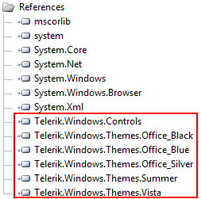

# Setting a Theme with StyleManager

The purpose of this tutorial is to show you how to set a built-in theme to __UI__ for Silverlight.

This topic contains the following sections:

* [Setting instance-specific built-in theme in XAML](#setting-a-theme-with-stylemanager)

* [Setting instance-specific built-in theme in the code-behind](#setting-instance-specific-built-in-theme-in-xaml)

* [Setting application-wide built-in theme in the code-behind](#setting-instance-specific-built-in-theme-in-the-code-behind)

* [Create a custom theme](#create-a-custom-theme)

>Currently Telerik __Silverlight controls__ support the following themes:

* __Office Black__ - this is the __default__ theme. No assembly is required for it.

* __Office Blue__ - requires __Telerik.Windows.Themes.Office_Blue.dll__.

* __Office Silver__ - requires __Telerik.Windows.Themes.Office_Silver.dll__.

* __Expression Dark__ - requires __Telerik.Windows.Themes.Expression_Dark.dll__.

* __Summer__ - requires __Telerik.Windows.Themes.Summer.dll__.

* __Vista__ - requires __Telerik.Windows.Themes.Vista.dll__.

* __Windows 7__ - requires __Telerik.Windows.Themes.Windows7.dll__.

* __Transparent__ - requires __Telerik.Windows.Themes.Transparent.dll__

* __Windows8__ - requires __Telerik.Windows.Themes.Windows8.dll__

* __Windows8Touch__ - requires __Telerik.Windows.Themes.Windows8Touch.dll__

>The __Silverlight themes__ are located in separate assemblies in order the size of the control assembly to be optimized. You can use the [Telerik Assembly Minifier](http://minifier.telerik.com/) tool to minimize the size of the theme as well.

1. Create a new Silverlight application or open an existing one.

1. Click the menu item *Project -> Add Reference...*.

1. Navigate to the place where you have installed __UI for Silverlight__.

* Browse Binaries (Bin) folder.

* Select the assembly that references your theme as it is shown above.
	
	

Now you are ready to use the themes either for a single control or for all controls in your application scope.

>In the following examples the __Vista__ theme will be used.

## Setting Instance-Specific Built-In Theme in XAML

In order to change the theme of a single control in XAML you have to declare a resource of type Theme and set an appropriate key. To complete this procedure follow the instructions below.

1. Open the user control that hosts your control. 

1. Declare one of the Telerik Silverlight controls and set the attached property __StyleManager.Theme__ value to __Vista__.

1. After executing all steps your code should be similar to this:

	#### __XAML__
	
	{{region common-styling-apperance-setting-theme_0}}
		<UserControl x:Class="Test.MainPage"
		    xmlns="http://schemas.microsoft.com/winfx/2006/xaml/presentation" 
		    xmlns:x="http://schemas.microsoft.com/winfx/2006/xaml"
		    xmlns:telerik="clr-namespace:Telerik.Windows.Controls;assembly=Telerik.Windows.Controls">
		    <Grid x:Name="LayoutRoot">
		
		        <telerik:RadSlider telerik:StyleManager.Theme="Vista"/>
		
		    </Grid>
		</UserControl>
		{{endregion}}

## Setting Instance-Specific Built-In Theme in the Code-Behind

You can also choose to change the theme for the Telerik Silverlight controls in code-behind. To achieve this follow the brief steps described below.

1. Open your user control.

1. Make sure you have explicitly named the target control in XAML. 

1. In the constructor of your user control place the following code:

	#### __C#__
	
	{{region common-styling-apperance-setting-theme_1}}
		StyleManager.SetTheme(radSlider, new VistaTheme() );
		{{endregion}}
	
	
	
	#### __VB.NET__
	
	{{region common-styling-apperance-setting-theme_2}}
		StyleManager.SetTheme(radSlider, New VistaTheme())
		{{endregion}}

The result of both approaches will be similar and can be seen on the next figure.

## Setting Application-Wide Built-In Theme in the Code-Behind

Changing the application theme is very similar to changing the theme of a single control in Silverlight. However, changing the application theme is in much bigger scale as it affects all controls in the scope of your application. You could set the desired theme in the constructor of the application. Here is a quick glimpse at how to change the application theme:

To change the application theme in code-behind you should follow the instructions below:

1. Open an existing application or create a new one. 

1. Open __MainPage.xaml.cs__

	>In this case __MainPage.xaml.cs__ is your entry point for the application. If you wonder which is your startup page, open the __App.xaml.cs__ file and see the __Application_Startup__ event handler:
	
	#### __C#__
	
	{{region common-styling-apperance-setting-theme_3}}
		private void Application_Startup( object sender, StartupEventArgs e )
		{
		    this.RootVisual = new MainPage();
		}
		{{endregion}}
	
	
	
	#### __VB.NET__
	
	{{region common-styling-apperance-setting-theme_4}}
		Private Sub Application_Startup(ByVal sender As Object, ByVal e As StartupEventArgs)
		    Me.RootVisual = New MainPage()
		End Sub
		{{endregion}}

1. Declare the following code __before the InitializeComponent()__ call, depending on the name of your theme as follows:

	#### __C#__
	
	{{region common-styling-apperance-setting-theme_5}}
		StyleManager.ApplicationTheme = new VistaTheme();
		{{endregion}}
	
	
	
	#### __VB.NET__
	
	{{region common-styling-apperance-setting-theme_6}}
		StyleManager.ApplicationTheme = New VistaTheme()
		{{endregion}}

1. After properly executing the following steps your __MainPage__ class should be similar to this:

	#### __C#__
	
	{{region common-styling-apperance-setting-theme_7}}
		public partial class MainPage : UserControl
		{
		    public MainPage()
		    {
		        StyleManager.ApplicationTheme = new VistaTheme();
		
		        InitializeComponent();
		    }
		}
		{{endregion}}
	
	
	
	#### __VB.NET__
	
	{{region common-styling-apperance-setting-theme_8}}
		Public Partial Class MainPage
		    Inherits UserControl
		    Public Sub New()
		        StyleManager.ApplicationTheme = New VistaTheme()
		
		        InitializeComponent()
		    End Sub
		End Class
		{{endregion}}
	
	
	>tipWith the same success setting an application-wide built-in theme can be done in the constructor of your Application class (App.xaml.cs):
	
	#### __C#__
	
	{{region common-styling-apperance-setting-theme_9}}
		public partial class App : Application
		{
		    public App()
		    {
		        this.Startup += this.Application_Startup;
		        this.Exit += this.Application_Exit;
		        this.UnhandledException += this.Application_UnhandledException;
		
		        StyleManager.ApplicationTheme = new VistaTheme();
		
		        InitializeComponent();
		    }
		}
		{{endregion}}
	
	
	
	#### __VB.NET__
	
	{{region common-styling-apperance-setting-theme_10}}
		Public Partial Class App
		    Inherits Application
		
		    Public Sub New()
		        AddHandler Startup, AddressOf Me.Application_Startup
		        AddHandler [Exit], AddressOf Me.Application_Exit
		        AddHandler UnhandledException, AddressOf Me.Application_UnhandledException
		
		        StyleManager.ApplicationTheme = New VistaTheme()
		
		        InitializeComponent()
		    End Sub
		End Class
		{{endregion}}

## Create a Custom Theme

This section contains the following subsections:

* [Create a new theme project and add styles (XAML) for the controls you want to style](#create-a-new-theme-project-and-add-styles-for-controls-you-want-to-style).

* [Using the Theme class](#using-the-theme-class). This approach is used for the creation of the built-in themes for __UI for Silverlight__.

## Create a New Theme Project and Add Styles for Controls You Want to Style

1. Create a new __Silverlight Class Library__ project.

2. Add a new __Silverlight Resource Dictionary__. Here you should define the styles for the controls you want to style.

3. At the end you should have a single file that merges all your XAML files (if you have separate XAML files) using the __ResourceDictionary.MergedDictionaries__ construction.

	For example, if you merge your styles in __Generic.xaml__ file, then you can set the theme pointing to this file:
	
	#### __C#__
	
	{{region common-styling-apperance-setting-theme_11}}
		Telerik.Windows.Controls.StyleManager.ApplicationTheme = new Theme( Uri( "/Telerik.Windows.Themes.CustomTheme;component/Themes/Generic.xaml", UriKind.Relative ) );
		{{endregion}}
	
	
	
	#### __VB.NET__
	
	{{region common-styling-apperance-setting-theme_12}}
		Telerik.Windows.Controls.StyleManager.ApplicationTheme = New Theme(Uri("/Telerik.Windows.Themes.CustomTheme;component/Themes/Generic.xaml", UriKind.Relative))
		{{endregion}}
	
	
	
	In the above code snippet it is assumed that:
	
	* The theme project name is __Telerik.Windows.Themes.CustomTheme__.
	
	* The __Generic.xaml__ file is located in the __Themes__ folder.

## Using the Theme Class

1. Create a new __Silverlight Class Library__ project.

1. Add a new __Silverlight Resource Dictionary__. Here you should define the styles for the controls you want to style.

1. At the end you should have a single file that merges all your XAML files (if you have separate XAML files) using the __ResourceDictionary.MergedDictionaries__ construction.

1. Create a new class which derives from __Theme__.

	#### __C#__
	
	{{region common-styling-apperance-setting-theme_13}}
		public class CustomTheme : Telerik.Windows.Controls.Theme
		{
		}
		{{endregion}}
	
	
	
	#### __VB.NET__
	
	{{region common-styling-apperance-setting-theme_14}}
		Public Class CustomTheme
		    Inherits Telerik.Windows.Controls.Theme
		End Class
		{{endregion}}

1. Set the __ThemeLocationAttribute__ attribute to __BuiltIn__ like this:

	#### __C#__
	
	{{region common-styling-apperance-setting-theme_15}}
		[ThemeLocation( ThemeLocation.BuiltIn )]
		public class CustomTheme : Telerik.Windows.Controls.Theme
		{
		}
		{{endregion}}
	
	
	
	#### __VB.NET__
	
	{{region common-styling-apperance-setting-theme_16}}
		<ThemeLocation(ThemeLocation.BuiltIn)> _
		Public Class CustomTheme
		    Inherits Telerik.Windows.Controls.Theme
		End Class
		{{endregion}}

1. In the class constructor set the __Source__ property of the Theme.

	#### __C#__
	
	{{region common-styling-apperance-setting-theme_17}}
		public CustomTheme()
		{
		    this.Source = new Uri( "/Telerik.Windows.Themes.CustomTheme;component/themes/Generic.xaml", UriKind.Relative );
		}
		{{endregion}}
	
	
	
	#### __VB.NET__
	
	{{region common-styling-apperance-setting-theme_18}}
		Public Sub New()
		    Me.Source = New Uri("/Telerik.Windows.Themes.CustomTheme;component/Themes/Generic.xaml", UriKind.Relative)
		End Sub
		{{endregion}}

In the above code snippet it is assumed that:

* The theme project name is __Telerik.Windows.Themes.CustomTheme__.

* The __Generic.xaml__ file is located in the __Themes__ folder.

## See Also

 * [Modifying a Built-In Theme]()

 * [Theming-Overview]()
