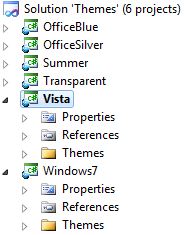
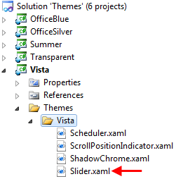

# Modifying a Built-In Theme

## 

The purpose of this topic is to show you how to modify and apply a built-in theme.

__In order to modify\extend and apply a built-in theme:__

1. Open Windows Explorer and navigate to the place where you have installed __UI for Silverlight__.

1. Browse the __Themes__ folder.

1. Open the __Themes__ solution in Visual Studio.

	

1. Choose the theme that you want to modify. In this example the __Vista__ theme will be modified.

1. Expand the Themes -> Vista folder in the Vista project.

1. Locate the XAML file for the target controls and modify it the way you need. In this demo, the __RadSlider__ theme will be modified for simplicity.

	

1. Open the Slider.xaml file and modify the __SliderBackgroundTrack__ brush to __Red__.

	
	#### __XAML__
	
	{{region common-styling-apperance-modifying-built-in-theme_0}}
		<SolidColorBrush x:Key="SliderBackgroundTrack" Color="Red" />
		{{endregion}}

1. Save the XAML file and __build the Vista project__. Since you are modifying the __Vista__ theme, you will get a new __Telerik.Windows.Themes.Vista.dll__ assembly when you build it.

1. The next step is to set the theme in your application. Open your project and add reference to the __Telerik.Windows.Themes.Vista.dll__.

	>After building the Vista project, the new assembly will be located at the __Themes\Vista\Bin\Debug__ folder.

1. Open the App.xaml.cs file and add the following code in the constructor. This will be enough to apply the theme globally to all Telerik controls.

	#### __C#__
	
	{{region common-styling-apperance-modifying-built-in-theme_1}}
		Telerik.Windows.Controls.StyleManager.ApplicationTheme = new Telerik.Windows.Controls.VistaTheme();
		{{endregion}}
	
	
	
	#### __VB.NET__
	
	{{region common-styling-apperance-modifying-built-in-theme_2}}
		Telerik.Windows.Controls.StyleManager.ApplicationTheme = New Telerik.Windows.Controls.VistaTheme()
		{{endregion}}
	    
	

1. If you want to apply the theme only for a specific control, then you should stick to the following approach:

	#### __XAML__
	
	{{region common-styling-apperance-modifying-built-in-theme_3}}
		<telerik:RadSlider x:Name="radSlider" telerik:StyleManager.Theme="Vista"/>
		{{endregion}}

# See Also

 * [Creating a Custom Theme Project - Using the Telerik Approach]()
