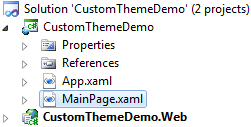
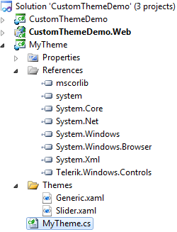

# Creating a Custom Theme Project

## 

The second option to create a custom theme is to create your own custom theme project, which doesn't follow the approach from the Telerik built-in themes. Basically, what you need to do is to create XAML files for the controls that you want to style and then to combine them in one file (like Generic.xaml) using __ResourceDictionary.MergedDictionaries__. Then you create a new class, which derives from __Telerik.Windows.Controls.Theme__. In the constructor you should set the source to point to the Generic.xaml file (that merges all your XAML files from the theme project). The tricky part here is that you should have references to all assemblies that you are styling. Which means that if you have Style for __RadMenu__ in your theme project, you should have a reference to the __Telerik.Windows.Controls.Navigation.dll__ assembly in your application or you will get an exception.

The purpose of this topic is to show you how to do that.

1. Open Visual Studio and create a new Silverlight Application. Name the project __CustomThemeDemo__.

	

1. Add a new Silverlight class library project to your solution, named __MyTheme__.

1. In the __MyTheme__ project add references to the Telerik assemblies containing the controls you want to style. For example, if you have Style for __RadMenu__, you should have a reference to the __Telerik.Windows.Controls.Navigation.dll__ assembly. In this demo the __RadSlider__ control will be styled for simplicity. That's why you need to add a reference only to the __Telerik.Windows.Controls.dll__ assembly.

1. In the __MyTheme__ project, add a new folder named __Themes__. All XAML files, describing the styles for the target controls, should be placed in the Themes folder. In the following example, the original Vista theme of the RadSlider control is copied from the UI for Silverlight installation folder (~*UI for Silverlight Installation Folder\Themes\Vista\Themes\Vista\Slider.xaml*) and pasted in the Themes folder of the MyTheme project.

1. Add a new __ResourceDictionary__ to the __Themes__ folder. Name it __Generic.xaml__. Use __Generic.xaml__ as a __Resource Dictionary__ which contains __Merged Resource Dictionaries__ only.
	
	#### __XAML__
	
	{{region common-styling-apperance-themes-custom-theme-project_0}}
		<ResourceDictionary
		    xmlns="http://schemas.microsoft.com/winfx/2006/xaml/presentation" 
		    xmlns:x="http://schemas.microsoft.com/winfx/2006/xaml">
		    <ResourceDictionary.MergedDictionaries>
		        <ResourceDictionary Source="/MyTheme;component/Themes/Slider.xaml" />
		    </ResourceDictionary.MergedDictionaries>
		</ResourceDictionary>
		{{endregion}}

1. Just for the demonstration, open the Slider.xaml file and modify the __SliderBackgroundTrack__ brush to __Red__.
	
	#### __XAML__
	
	{{region common-styling-apperance-themes-custom-theme-project_1}}
		<SolidColorBrush x:Key="SliderBackgroundTrack" Color="Red" />
		{{endregion}}

1. Add a new class named __MyTheme__ to the __MyTheme__ project. That class should derive from the __Telerik.Windows.Controls.Theme__ base class. In the constructor you should set the source to point to the Generic.xaml file (that merges all your XAML files from the theme project).

	#### __C#__
	
	{{region common-styling-apperance-themes-custom-theme-project_2}}
		using System;
		namespace MyTheme
		{
		    public class MyTheme : Telerik.Windows.Controls.Theme
		    {
		        public MyTheme()
		        {
		            this.Source = new Uri( "/MyTheme;component/Themes/Generic.xaml", UriKind.Relative );
		        }
		    }
		}
		{{endregion}}
	
	
	#### __VB.NET__
	
	{{region common-styling-apperance-themes-custom-theme-project_3}}
		Imports System
		Namespace MyTheme
		 Public Class MyTheme
		  Inherits Telerik.Windows.Controls.Theme
		  Public Sub New()
		   Me.Source = New Uri("/MyTheme;component/Themes/Generic.xaml", UriKind.Relative)
		  End Sub
		 End Class
		End Namespace
		{{endregion}}

1. Finally, the __MyTheme__ project should have the following structure.

	

1. The next step is to apply the custom theme. In the Silverlight client project, add a reference to the project containing your custom theme (in this case this is the __MyTheme__ project). 

	>You should have references to all assemblies that you are styling. Which means that if you have Style for __RadMenu__ in your theme project, you should have a reference to the __Telerik.Windows.Controls.Navigation.dll__ assembly in your application or you will get an exception.

1. Open the App.xaml.cs file and add the following code in the constructor. This will be enough to apply the theme globally to all Telerik Silverlight controls.

	#### __C#__
	
	{{region common-styling-apperance-themes-custom-theme-project_4}}
		Telerik.Windows.Controls.StyleManager.ApplicationTheme = new MyTheme.MyTheme();
		{{endregion}}
	
	
	
	#### __VB.NET__
	
	{{region common-styling-apperance-themes-custom-theme-project_5}}
		Telerik.Windows.Controls.StyleManager.ApplicationTheme = New MyTheme.MyTheme()
		{{endregion}}

1. If you want to apply the theme only for a specific control, then you should stick to the following approach:

	#### __XAML__
	
	{{region common-styling-apperance-themes-custom-theme-project_6}}
		<UserControl.Resources>
		    <myThemeProject:MyTheme x:Name="MyTheme" />
		</UserControl.Resources>
		<Grid x:Name="LayoutRoot"
		        Background="White" Margin="50">
		    <telerik:RadSlider x:Name="radSlider"
		                        telerik:StyleManager.Theme="{StaticResource MyTheme}"/>
		</Grid>
		{{endregion}}
	
	
	

# See Also

 * [Creating a Custom Theme Project - Using the Telerik Approach]()

 * [Modifying a Built-In Theme]()
