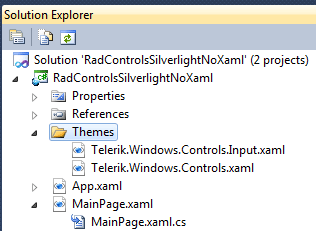
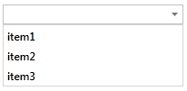
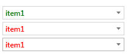

# Setting a Theme (Using  Implicit Styles)

UI for SilverlightWPF gives the option to disable the Telerik StyleManager and to style the controls using
        implicit styles (e.g. Style without x:Key attribute).  There are a number of benefits of using implicit styles over the Telerik StyleManager.
        Some are listed below:
      

* Custom themes are now much easier  - created only via merged dictionaries

* Basing styles on a theme is made simple

* Assemblies with smaller size

* Improved Blend support

After installing UI for SilverlightWPF, you will find the following folders in your installation folder (usually C://Program Files/Telerik/ UI for WPFSilverlight [version]/)
    

* __Binaries__  - the standard binaries including theme dlls.

* __Binaries.NoXaml__ – binaries without XAML, even the default Office_Black theme is not included.

* __Themes.Implicit__ – implicit styles friendly XAML.

>With Q1 2014 the __Themes__ folder, containing the stanadard themes used with StyleManager, are not provided in the installation package anymore.
        However, they can be separately downloaded  from the UI for SilverlightWPF download page in your [Telerik account](http://www.telerik.com/account.aspx).

You may still apply a theme using our theming mechanism through utilizing the standard Telerik StyleManager and referencing binaries from the Binaries folder of 
        your personal installation. The approach of creating custom themes and modifying the default Telerik themes, via the Telerik StyleManager remains the same.
      

You may read more about this following this link:
      [Setting a Theme with StyleManager]()[Setting a Theme with StyleManager]()

This article explains details on using implicit styles with Telerik UI and covers the following topics:
      

* [Applying theme globally in your application](#applying-theme-globally-in-your-application)

* [Basing styles on theme style](#basing-styles-on-theme-style)

* [Setting Implicit Styles for RadComboBox Example](#setting-implicit-styles-for-radcombobox-example)

* [Implicit Styles guidelines for all assemblies](#implicit-styles-guidelines-for-all-assemblies)

* [Styling custom controls](#styling-custom-controls)

## Applying theme globally in your application

The newly included Themes.Implicit folder lists resource dictionaries by assembly name. These resource dictionaries contain implicit styles and relevant needed resources.
          They can be merged in the resources of your application (in App.xaml) and as a result will be applied implicitly on any control
          that does not have a __local__ Style set.  For example, if you need to style a control from Telerik.Windows.Controls.dll, you
          need the  Telerik.Windows.Controls.xaml resource dictionary. You will find such a file in each theme folder inside the Themes.Implicit folder.
          The file structure is illustrated below:
        

* …/Themes.Implicit/<platform>/OfficeBlack/Themes/Telerik.Windows.Controls.xaml

* …/Themes.Implicit/<platform>/OfficeBlue/Themes/Telerik.Windows.Controls.xaml

* Etc.

As a general rule of thumb you should merge the .xaml files for each assembly reference you have in your project. For example if you
          include Telerik.Windows.Controls.Docking.dll, you also need NoXAML references to:
        

* Telerik.Windows.Controls.dll

* Telerik.Windows.Controls.Navigation.dll

So you need to add the xaml for all these assemblies from the selected theme:
        

* System.Windows.xaml

* Telerik.Windows.Controls.xaml

* Telerik.Windows.Controls.Navigation.xaml

* Telerik.Windows.Controls.Docking.xaml

>If you copy the xaml files in your project, please make sure that they are with the proper build action. Generally  it should be Resource, but for the Telerik.Windows.Controls.RibbonView.xaml the build action should be Page. This is caused by several x:Shared setters, which cannot be set in loose XAML. More information can be found in 
          [MSDN](http://msdn.microsoft.com/en-us/library/aa970778%28v=vs.110%29.aspx).

## Basing styles on theme style

Telerik UI for SilverlightWPF follows a naming convention and every control has a style formed by the name of the control type  follow a *naming convention* and every control  has a style formed by the name of the control type followed by  a “Style” suffix.
          For example, for the __RadComboBox__  there is a style with x:Key=”RadComboBoxStyle”. See the code in __Example 2__ .
        

#### __[XAML] Example 2: Custom styles for RadComboBox__

{{region styling-apperance-implicit-styles-overview_5}}
		
		
	{{endregion}}

## Setting Implicit Styles for RadComboBox Example

We will apply implicit styles from the Windows8 theme on the RadComboBox in our example project.
        

* First, add references to the required assemblies from Binaries.NoXaml folder.

* Next, create a Themes folder in your project and copy the corresponding .xaml files from __Themes.Implicit/../Windows8/../Themes/ folder__ as shown in __Figure 1__.
        
              

Figure 1: Copy the needed .xaml in the project

>The build action should be Resource for most of the xaml files, but Page for the Telerik.Windows.Controls.RibbonView.xaml one.

* 
            The next step is to merge these ResourceDictionaries in the App.xaml file as shown in __Example 3__.          
            

#### __[XAML] Example 3: Merging the ResourceDictionaries__

{{region styling-apperance-implicit-styles-overview_0}}
	<Application xmlns="http://schemas.microsoft.com/winfx/2006/xaml/presentation"
	             xmlns:x="http://schemas.microsoft.com/winfx/2006/xaml" 
	             x:Class="RadControlsSilverlightNoXaml.App"
	             >
	    <Application.Resources>
			<ResourceDictionary>
				<ResourceDictionary.MergedDictionaries>
					<ResourceDictionary Source="Themes/Telerik.Windows.Controls.xaml" />
					<ResourceDictionary Source="Themes/Telerik.Windows.Controls.Input.xaml" />
				</ResourceDictionary.MergedDictionaries>
			</ResourceDictionary>
		</Application.Resources>
	</Application>
	{{endregion}}

* 
            And here is the result:
            

With implicit styles now being an integrated part of Telerik theming mechanism, it is easier than ever to create a custom style based on a theme.
          Simply base your custom style on the needed control using the name of the control and the suffix “Style” as a StaticResource Key.
        

__Example 4__ shows how to create two custom styles for __RadComboBox__ based on the Windows8 theme using the project above (the one with x:Key set).         
        

#### __[XAML] Example 4: Add custom styles for RadComboBox __

{{region styling-apperance-implicit-styles-overview_1}}
	<Application.Resources>
		<ResourceDictionary>
			<ResourceDictionary.MergedDictionaries>
				<ResourceDictionary Source="Themes/Telerik.Windows.Controls.xaml" />
				<ResourceDictionary Source="Themes/Telerik.Windows.Controls.Input.xaml" />
			</ResourceDictionary.MergedDictionaries>
		</ResourceDictionary>
		
		
	</Application.Resources>
	{{endregion}}

If you have three __RadComboBoxes__ as shown in __Example 5__.          
        

#### __[XAML] Example 5: RadComboBoxes with custom styling__

{{region styling-apperance-implicit-styles-overview_2}}
	<StackPanel>
		<telerik:RadComboBox ItemsSource="{Binding}" Width="200" Margin="2" Style="{StaticResource CustomStyle}" />
		<telerik:RadComboBox ItemsSource="{Binding}" Width="200" Margin="2" />
		<telerik:RadComboBox ItemsSource="{Binding}" Width="200" Margin="2" />
	</StackPanel>
	{{endregion}}

The __RadComboBox__ instances will be displayed as shown in __Figure 3__.
        

Figure 3: RadComboBox instances with custom styles.

## Implicit Styles guidelines for all assemblies

__Example 6__ lists the .xaml files corresponding to the Telerik assemblies and the dependencies between them.
        

#### __[XAML] Example 6: All .xaml files corresponding to Telerik assemblies__

{{region styling-apperance-implicit-styles-overview_3}}
	<Application.Resources>
		<ResourceDictionary>
			<ResourceDictionary.MergedDictionaries>
	
				<!-- Telerik.Windows.Controls is used by all assemblies -->			
				<ResourceDictionary Source="Themes/Telerik.Windows.Controls.xaml" />
	
				<ResourceDictionary Source="Themes/System.Windows.xaml" />	
				<ResourceDictionary Source="Themes/Telerik.Windows.Controls.Input.xaml" />
	
				<!-- Requires: System.Windows.xaml -->
				<ResourceDictionary Source="Themes/Telerik.Windows.Controls.Navigation.xaml" />
	
		 		<ResourceDictionary Source="Themes/Telerik.Windows.Controls.Chart.xaml" />
	
				<!-- Requires: Telerik.Windows.Controls.Input -->	
				<ResourceDictionary Source="Themes/Telerik.Windows.Controls.Data.xaml" />
	
				<ResourceDictionary Source="Themes/Telerik.Windows.Controls.DataVisualization.xaml" />
	
				<!-- Requires: Telerik.Windows.Controls.Navigation -->
				<ResourceDictionary Source="Themes/Telerik.Windows.Controls.Docking.xaml" />
	
				<ResourceDictionary Source="Themes/Telerik.Windows.Controls.Expressions.xaml" />
	
				<ResourceDictionary Source="Themes/Telerik.Windows.Controls.FixedDocumentViewers.xaml" />
	
				<!-- Requires: Telerik.Windows.Controls.Input -->
				<ResourceDictionary Source="Themes/Telerik.Windows.Controls.GridView.xaml" />
	
				<ResourceDictionary Source="Themes/Telerik.Windows.Controls.ImageEditor.xaml" />
	
				<!-- Requires: Telerik.Windows.Controls.Input, Telerik.Windows.Controls.Navigation -->
				<ResourceDictionary Source="Themes/Telerik.Windows.Controls.RibbonView.xaml" />
	
				<ResourceDictionary Source="Themes/Telerik.Windows.Controls.RichTextBoxUI.xaml" />
	
				<!-- Requires: System.Windows, Telerik.Windows.Controls.Input, Telerik.Windows.Controls.Navigation -->
				<ResourceDictionary Source="Themes/Telerik.Windows.Controls.ScheduleView.xaml" />
	
				<!-- Requires: Telerik.Windows.Controls.Input, Telerik.Windows.Controls.Navigation -->
				<ResourceDictionary Source="Themes/Telerik.Windows.Documents.xaml" />
			</ResourceDictionary.MergedDictionaries>
		</ResourceDictionary>
	</Application.Resources>
	{{endregion}}

## Styling custom controls

If you're using Implicit Styles to style custom controls, note that it will not receive automatically the inherited control style. You should add the following style after the merged dictionaries to fix this:
        

#### __[XAML] Example 7: Adding Style for styling custom control__

{{region styling-apperance-implicit-styles-overview_7}}
	<Application.Resources>
	  <ResourceDictionary>
	    <ResourceDictionary.MergedDictionaries>
	      <ResourceDictionary Source="Themes/System.Windows.xaml" />
	      <ResourceDictionary Source="Themes/Telerik.Windows.Controls.xaml" />
	      <ResourceDictionary Source="Themes/Telerik.Windows.Controls.GridView.xaml" />
	      <ResourceDictionary Source="Themes/Telerik.Windows.Controls.Input.xaml" />
	      <Style TargetType="local:MyCustomGrid" BasedOn="{StaticResource RadGridViewStyle}"/>
	    </ResourceDictionary.MergedDictionaries>
	  </ResourceDictionary>
	</Application.Resources>
	{{endregion}}

The important part is setting TargetType property to the type of the custom control.

#### __[C#] Example 7: Setting the DefaultStyleKey for styling custom control__

{{region styling_customstyles}}
	public class MyCustomGrid : RadGridView
	{
	    static MyCustomGrid()
	    {
	        this.DefaultStyleKey = typeof(MyCustomGrid);
	    }
	}
	{{endregion}}

