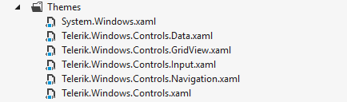

# Setting a Theme with Telerik UI for {{ site.framework_name }}

>tip Before you proceed reading this topic we recommend you read the [Xaml vs. NoXaml]() article.

The __Telerik UI for {{ site.framework_name }}__ suite provides a [variety of themes]() that will help you achieve outstanding visual appearance and great user experience. Before choosing what theme to apply you might find it useful to familiarize with the [themes concept](#what-is-a-theme) and the difference between Xaml and NoXaml.

## What is a Theme?

A theme contains all the styles and resources needed for the visualization of the Telerik controls. Each theme consists of multiple XAML files. You can think of each separate file as a collection of compliant styles which are needed for the visualization of a certain control. As most of the custom controls are quite complex and contain other custom controls within themselves, often you will need the resources of several files. 

## Theme Setting Mechanisms

There are two mechanisms that can be used to set a theme.

* [Using Implicit Styles](#setting-a-theme-using-implicit-styles)
	In this case use NoXaml dlls.
	
* [Using StyleManager](#setting-a-theme-using-stylemanager)
	In this case use Xaml dlls.

## Setting a Theme Using Implicit Styles

Using implicit styles gives you full Blend support and smaller dlls size. To use this mechanism you will need to use the __NoXaml__ version of the UI for {{ site.framework_name }} dlls.

To change the theme you will need to take the following few steps.

1. __Reference the NoXaml version__ of the Telerik UI for {{ site.framework_name }} dlls. They can be found in the &#42;/Telerik UI for {{ site.framework_name }} installation folder/Binaries.NoXaml/&#42; folder.

2. __Get the .xaml files__ with the control styles and templates.	
	
	There are two options to get the .xaml files.	
	
	<ul>
		<li>[Reference the theme dll](#reference-theme-dll) from the <em>/Binaries.NoXaml/</em> folder - for example Telerik.Windows.Themes.Office_Black.dll. The theme dll contains ResourceDictionary files with the styles for the controls.</li>
		<li>[Copy the XAML files in a dedicated folder in your application](#copy-the-xaml-files-in-a-dedicated-folder-in-your-application). You can get the files from the <em>/Telerik UI for {{ site.framework_name }} installation folder/Themes.Implicit/</em> folder.</li>
	</ul>
	
3. __Merge the required .xaml files__ in the App.xaml file. 
	
	In the implicit styles (NoXaml) scenario you will need to merge the resources for each referenced dll. For example, to use RadGridView you will need to reference the following dlls.
		
	* Telerik.Windows.Controls.dll
    * Telerik.Windows.Controls.Input.dll
	* Telerik.Windows.Controls.GridView.dll
	* Telerik.Windows.Data.dll
		
	And then merge the dictionaries for the controls in the dlls as shown in __Example 1__.
	
	__Merging .xaml files for the Office_Black theme (from the theme dll)__
	```XAML
		<Application>
			<Application.Resources>
				<ResourceDictionary>
					<ResourceDictionary.MergedDictionaries>
						<ResourceDictionary Source="/Telerik.Windows.Themes.Windows11;component/Themes/System.Windows.xaml"/>
						<ResourceDictionary Source="/Telerik.Windows.Themes.Windows11;component/Themes/Telerik.Windows.Controls.xaml"/>
						<ResourceDictionary Source="/Telerik.Windows.Themes.Windows11;component/Themes/Telerik.Windows.Controls.Input.xaml"/>
						<ResourceDictionary Source="/Telerik.Windows.Themes.Windows11;component/Themes/Telerik.Windows.Controls.GridView.xaml"/>         
					</ResourceDictionary.MergedDictionaries>
				</ResourceDictionary>
			</Application.Resources>
		</Application>
	```	
	
	Note that the `Telerik.Windows.Data.dll` doesn't have any UI (controls) so it doesn't have a ResourceDictionary with styles and templates.
	
> Merging the .xaml files in App.xaml will apply the theme to all controls in the application. To apply the theme only for a specific view you can merge the dictionaries in its Resources. For example, in the `<UserControl.Resources></UserControl.Resources>`. To apply the theme only for a specific control you can merge the dictionaries in the Resources of the control's parent container.  

<!-- -->

>important Keep in mind that, when creating custom controls or styles based on Telerik controls you will need to use their base styles. Read more about this in the [Styling the Controls]() article.

### How to get the .xaml files required for merging

You can find all required .xaml files in two places, respectively you can use two approaches to reference them in the project.

<strong id="reference-theme-dll">Reference theme dll</strong>

All styles and templates for the themes are encapsulated in **theme dlls** located in the **/Binaries.NoXaml/** folder (Telerik.Windows.Themes.Material.dll, Telerik.Windows.Themes.Office2016.dll, etc.). To get the styles for a specific theme you can just merge its ResourceDictionaries directly from the theme assembly. For example, if you are using the **Windows11** theme, you should add a reference to the **Telerik.Windows.Themes.Windows11.dll** and then merge the needed .xaml files as shown in **Example 1** .

> We recommend this approach because upgrading and maintaining is easier. The other one (copying the XAML files) is better if you have highly customized controls or you use only several controls and don't want to include a dll with all styles.

<strong id="copy-the-xaml-files-in-a-dedicated-folder-in-your-application">Copy the XAML files in a dedicated folder in your application</strong>

The default styles and resources for each theme are shipped also in the **/Telerik UI for {{ site.framework_name }} installation folder/Themes.Implicit** folder. In order to apply a certain theme for your application you can copy all the required **XAML** files from the respective theme's folder (depends on the set of controls you are using) in a folder from your application. And then merge the ResourceDictionaries in the application's **MergedDictionaries** collection. You should merge all .xaml files corresponding to each assembly reference you have in your project, as shown in **Example 2** and **Figure 1**. 

#### Figure 1: Copy the needed XAML files in a separate folder in your application


__The MergedDictionaries in your application resources__

```XAML
	<Application.Resources>
		<ResourceDictionary>
			<ResourceDictionary.MergedDictionaries>
				<ResourceDictionary Source="/Themes/System.Windows.xaml"/>
				<ResourceDictionary Source="/Themes/Telerik.Windows.Controls.xaml"/>
				<ResourceDictionary Source="/Themes/Telerik.Windows.Controls.Input.xaml"/>
				<ResourceDictionary Source="/Themes/Telerik.Windows.Controls.GridView.xaml"/>
			</ResourceDictionary.MergedDictionaries>
		</ResourceDictionary>
	</Application.Resources>
```

>tip If you merge a ResourceDictionary for a dll that is missing from the project's References an error will occur.
<!-- -->

>caution You should not set application theme using the StyleManager when using implicit styles. 

>If you copy the .xaml files in your project, please make sure that their [Build Action](https://docs.microsoft.com/en-us/visualstudio/ide/build-actions?view=vs-2019) is set to __Page__.  

## Setting a Theme Using StyleManager

> Switching the theme at runtime when using `StyleManager` is not supported. To enable this feature, use the [NoXaml dlls and Implicit Styles](#setting-a-theme-using-implicit-styles) theming. Read more in the [Switching Themes at Runtime]() article.

StyleManager is used when working with the standard (Xaml) dlls. The StyleManager is a class that applies different styles on the Telerik controls based on the set theme. It allows you to set the theme on a control level and on application level.

To change the theme via the StyleManager you will need to take the following few steps.

1. __Reference the Xaml version__ of the Telerik UI for {{ site.framework_name }} dlls. They can be found in the */Telerik UI for {{ site.framework_name }} installation folder/Binaries/* folder.

3. __Set the StyleManager.Theme attached property__ on the control you want to theme. Or set the __StyleManager.ApplicationTheme__ static property before calling the **InitializeComponent** method of the view or the App.xaml.cs file. This will set the theme globally for all Telerik controls.

   	__Setting the theme on a control level in XAML__
	```XAML
		<telerik:RadGridView telerik:StyleManager.Theme="Windows11" />
	```

	__Setting the theme on a control level in code__
	```C#		
		StyleManager.SetTheme(radControlInstance, new Office2016Theme());
	```
	```VB.NET	
		StyleManager.SetTheme(radControlInstance, New Office2016Theme())
	```
	
	__Setting the theme on application level__
	```C#		
		StyleManager.ApplicationTheme = new Office2016Theme();
		InitializeComponent();
	```
	```VB.NET		
		StyleManager.ApplicationTheme = New Office2016Theme()
		InitializeComponent()
	```

Read more about this approach in the [StyleManager]()[StyleManager]() help section.

>caution Merging theme resource dictionaries when using StyleManager (mixing implicit styles theming and StyleManager) is not supported. Use StyleManager only with Xaml dlls, or Implicit Styles only with NoXaml binaries.

## Changing Color Variation

Some of the Telerik themes support palettes, which contains resources for the associated theme. Some of the palettes have different color variations, which can be changed with the **LoadPreset** method.

__Changing the color variation of the theme__

```C#
	//default color variation
	GreenPalette.LoadPreset(GreenPalette.ColorVariation.Dark);
```
```VB.NET
	//default color variation
	GreenPalette.LoadPreset(GreenPalette.ColorVariation.Dark)
```

To see which themes support more than one color variation please check the [Available Themes]() article.

## Does a Theme Affect All {{ site.framework_name }} Controls?

All Themes are specifically designed to style **Telerik** controls. However, there are some **native Microsoft {{ site.framework_name }}** controls which are affected by the theming mechanism as well. You can find a list of these controls in the [Setting a Theme on MS Controls]() article.

## See Also  
* [Styling the Controls]()
* [Switching Themes at Runtime]()
* [Switching Custom Styles with Themes at Runtime]()
* [Switching Themes at Design-Time]()
* [Xaml vs. NoXaml]()
* [Controls Dependencies]()

