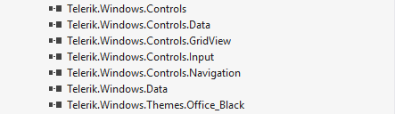
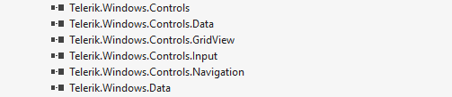

# Setting a Theme

__UI for SilverlightWPF__ suite provides a [variety of themes]() that will help you achieve outstanding visual appearance and great user experience. Before choosing what theme to apply and what approach to take in order to do so, you might find it useful to familiarize with the [Themes Concept](#what-is-a-theme) and their [Distribution](#where-can-a-theme-be-found).

The theming mechanism makes it really easy for you to change the overall appearance of your application. Furthermore, it is simple for you to make customizations, assemblies have smaller size and modifications through **Blend** is supported. 

## What is a Theme?

A theme contains all the styles and resources needed for the visualization of the **Telerik** controls. Each theme consists of multiple **XAML** files. You can think of each separate file as a collection of compliant styles which are needed for the visualisation of a certain control. As most of the custom controls are quite complex and contain within themselves other custom controls, often you will need the resources of several files. 

To apply a theme, you need to merge these files into the **Merged Dictionaries** of your application. As you most probably will be using just a subset of the available controls, you can merge only several files which are needed for the specific controls. This leads to a smaller assembly size and an easy-to-customize appearance.  

## Where Can a Theme Be Found?

After installing the __UI for SilverlightWPF__ suite, you will find the following structure in the installation folder (usually C://Program Files/Telerik/ UI for WPFSilverlight [version]/)
    

* __[Binaries](#standard-binaries-vs-noxaml-binaries)__: The standard binaries including the themes dlls.

* __[Binaries.NoXaml](#standard-binaries-vs-noxaml-binaries)__: Binaries without XAML, even the default **Office_Black** theme is not included.

* __[Themes.Implicit](#themesimplicit-folder)__: The theme-specific XAML code for all the controls.

### Themes.Implicit Folder

As its name suggests, the **Themes.Implicit** folder contains all styles and resources needed for the visualization of the **UI for WPF** controls. Further digging into its structure, you will notice that it contains separate folders for each available theme.  

### Standard Binaries vs NoXAML Binaries

The **standard binaries** include the implementation of the different controls as well as the styles and the resources needed for their visualization. As our assemblies contain multiple components, all styles for them are included and the assembly size is larger. 

The **NoXAML binaries**, on the other hand, *do not include any XAML files* - no styles, no brushes or any other resources. This results in smaller assembly size and would mean that when you use them, you have to provide the resources needed for the visualization of the controls. This happens by merging the needed **XAML files** from the **Themes folder** into the Application's **Merged Dictionaries**.

## Does a Theme Affect All WPF Controls?

All Themes are specifically designed to style **Telerik** controls. However, there are some **native Microsoft SilverlightWPF** controls which are affected by the theming mechanism as well. You can find a list of these controls in the [Setting a Theme on MS Controls]() article.

## Applying a Theme for Your Application

Now that you have an idea of the concepts behind the theming mechanism, it is time to set up your project so that it is correctly applied. 

There are two main approaches from which you can choose:

* [Reference the **theme DLL**](#reference-the-theme-dll) which includes *all XAML files* for the respective theme and merge only the needed **XAML** files in the **MergedDictionaries** of your application.

* [Copy the different **XAML** files of the controls](#copy-the-xaml-files-in-a-dedicated-folder-in-your-application) which you will use in your application(from the respective theme`s folder) into a dedicated folder in your application and merge them in the application's **MergedDictionaries**. This approach is preferred in case you need to directly modify the default styles and resources of the theme.

The approaches are shown in details below:

### Reference the Theme DLL

 All XAML files are included in a separate __Theme DLL__ located in the **Binaries.NoXaml** folder (Telerik.Windows.Themes.Expression_Dark.dll, Telerik.Windows.Themes.Windows8.dll, etc.). So instead of copying all the XAML files in your project(as shown in the second approach), you can just merge them directly from the theme assembly. For example, if you are using the **Office_Black** theme, you should add a reference to the **Telerik.Windows.Themes.Office_Black.dll** and then merge the needed .xaml files as shown in **Figure 1** and **Example 1** .

#### __Figure 1: Add reference to the theme binary file:__

#### __[XAML] Example 1: After you add a reference, you should merge the needed .xaml files__
{{region styling-apperance-implicit-styles-overview-0}}
	 <Application.Resources>
		<ResourceDictionary>
			<ResourceDictionary.MergedDictionaries>
				<ResourceDictionary Source="/Telerik.Windows.Themes.Office_Black;component/Themes/System.Windows.xaml"/>
				<ResourceDictionary Source="/Telerik.Windows.Themes.Office_Black;component/Themes/Telerik.Windows.Controls.xaml"/>
				<ResourceDictionary Source="/Telerik.Windows.Themes.Office_Black;component/Themes/Telerik.Windows.Controls.Input.xaml"/>
				<ResourceDictionary Source="/Telerik.Windows.Themes.Office_Black;component/Themes/Telerik.Windows.Controls.Navigation.xaml"/>
				<ResourceDictionary Source="/Telerik.Windows.Themes.Office_Black;component/Themes/Telerik.Windows.Controls.GridView.xaml"/>	             
				<ResourceDictionary Source="/Telerik.Windows.Themes.Office_Black;component/Themes/Telerik.Windows.Controls.Data.xaml"/>              
			</ResourceDictionary.MergedDictionaries>
		</ResourceDictionary>	
	 </Application.Resources>
{{endregion}}
 
### Copy the XAML files in a dedicated folder in your application

As already advised, the default styles and resources for each theme are shipped in the **Themes.Implicit** folder. In order to apply a certain theme for your application you need to merge all the required **XAML** files from the respective theme's folder(depends on the set of controls you are using) in the application's **MergedDictionaries**. You should merge all **XAML** files corresponding to each assembly reference you have in your project, as shown in **Example 1** and **Figure 1 and 2**. 

#### __Figure 2: The binary references in your application:__

>important The references should point to the binary files from the __Binaries.NoXAML__ folder.

#### __Figure 3: Copy the needed XAML files in a separate folder in your application:__

#### __[XAML] Example 2: The MergedDictionaries in your application resources:__
{{region styling-apperance-implicit-styles-overview-1}}
	<Application.Resources>
		<ResourceDictionary>
			<ResourceDictionary.MergedDictionaries>
				<ResourceDictionary Source="/Themes/System.Windows.xaml"/>
				<ResourceDictionary Source="/Themes/Telerik.Windows.Controls.xaml"/>
				<ResourceDictionary Source="/Themes/Telerik.Windows.Controls.Input.xaml"/>
				<ResourceDictionary Source="/Themes/Telerik.Windows.Controls.Navigation.xaml"/>
				<ResourceDictionary Source="/Themes/Telerik.Windows.Controls.GridView.xaml"/>               
				<ResourceDictionary Source="/Themes/Telerik.Windows.Controls.Data.xaml"/>
	    		</ResourceDictionary.MergedDictionaries>
		</ResourceDictionary>
	</Application.Resources>
{{endregion}}

>If you copy the XAML files in your project, please make sure that they are with the proper build action. Generally it should be __Resource__, but for the __Telerik.Windows.Controls.RibbonView.xaml__ file the build action should be __Page__. __Telerik.Windows.Controls.RichTextBoxUI.xaml__ also should be with build action __Page__ since it includes all RibbonView styles. This is caused by several x:Shared setters, which cannot be set in loose XAML. More information can be found in [MSDN](http://msdn.microsoft.com/en-us/library/aa970778%28v=vs.110%29.aspx).

>tip You should not set Application Theme using the __StyleManager__ when using implicit styles. 

## See Also

* [Styling the Controls]()

* [Switching Custom Styles with Themes at Runtime]()

* [Switching Themes at Design-Time]()
