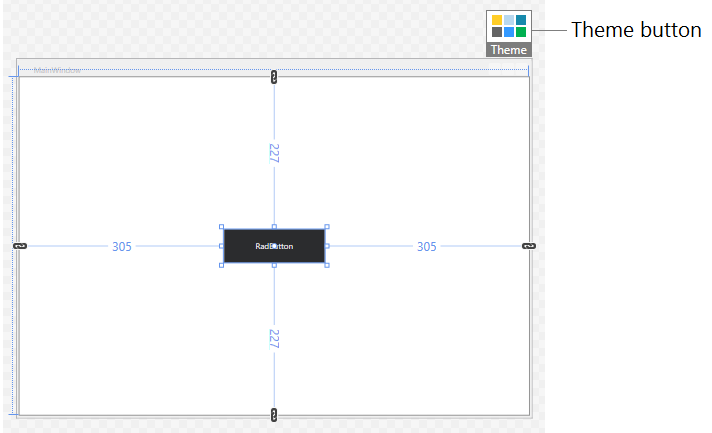
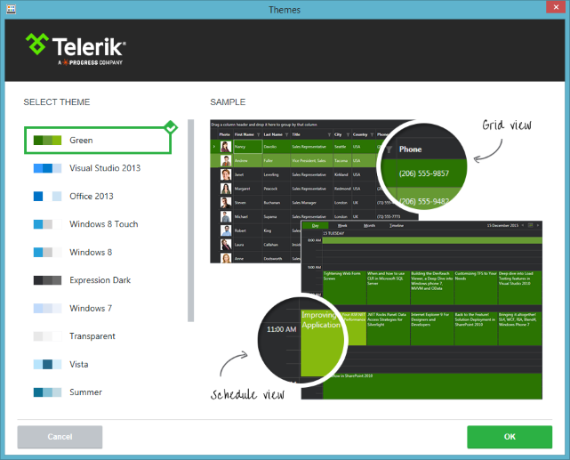

# Switching Themes at Design-time

With R2 2016 we introduced a mechanism that allows you to change the application theme at design-time with a few clicks.

> This mechanism is available only when the [implicit styles theming]() is used. In order to use it you will need to reference the NoXaml version of the Telerik assemblies. 

The following example demonstrates how the feature works in few easy steps.

1. Select a Rad-control in the Visual Studio designer at design-time. This will display the Theme button at the designer's top right corner.  
	
	
2. Click on the __Theme__ button. This will open the Themes window where you can choose a theme.  
	
	
3. Select a theme and click __OK__. 

This will automatically add the new theme dll in the references of the project and merge the required resource dictionaries in the __App.xaml resources__.

#### __Figure 1: The added theme assembly reference__

#### __[XAML] Example 1: The merged theme resources__
	<Application.Resources>
		<ResourceDictionary>
			<ResourceDictionary.MergedDictionaries>
				<ResourceDictionary Source="/Telerik.Windows.Themes.Green;component/Themes/System.Windows.xaml" />
				<ResourceDictionary Source="/Telerik.Windows.Themes.Green;component/Themes/Telerik.Windows.Controls.xaml" />
			</ResourceDictionary.MergedDictionaries>
		</ResourceDictionary>
	</Application.Resources>

> You can change the theme also by using the [Project Configuration Wizard]().
	
## See Also
* [Setting a Theme]()
* [Switching Themes at Runtime]()
* [Editing Control Templates]()
