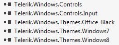
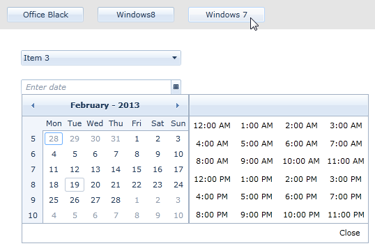

# Switching Themes at Runtime

>Before proceeding with this tutorial, please first read the [Setting a Theme (Using  Implicit Styles)]() help article.

By utilizing the theming mechanism with implicit styles, you can change the theme of Telerik SilverlightWPF controls at runtime without recreating the UI.  
      All you need to do is remove the current merged dictionaries and then  add the merged dictionaries of another theme to your application resources in code-behind:
      

#### __C#__

{{region styling-apperance-themes-runtime_0}}
	Application.Current.Resources.MergedDictionaries.Clear();
	Application.Current.Resources.MergedDictionaries.Add(new ResourceDictionary() { Source = ......});
	{{endregion}}

This will apply different implicit styles to your control at runtime.

In this help article we'll go through a quick example to demonstrate the approach.

## 

1. Add the required assemblies from the Binaries.NoXaml folder located in the Telerik UI installation folder. You must also include the theme assemblies:
       	 

1. Add the needed resource dictionaries for the default theme in App.xaml:
       	

#### __XAML__

{{region styling-apperance-themes-runtime_1}}
	<Application.Resources>
		<ResourceDictionary>
			<ResourceDictionary.MergedDictionaries>
				<ResourceDictionary Source="/Telerik.Windows.Themes.Office_Black;component/Themes/System.Windows.xaml"/>
				<ResourceDictionary Source="/Telerik.Windows.Themes.Office_Black;component/Themes/Telerik.Windows.Controls.xaml"/>
				<ResourceDictionary Source="/Telerik.Windows.Themes.Office_Black;component/Themes/Telerik.Windows.Controls.Input.xaml"/>
				...
			</ResourceDictionary.MergedDictionaries>
		</ResourceDictionary>
	</Application.Resources>
	{{endregion}}

1. 
          Add a few controls of your choice to the page. In this example, we will add a grid, a stackpanel, a RadComboBox, a RadDateTimePicker and three buttons RadButtons to switch between three of the themes.
        

#### __XAML__

{{region styling-apperance-themes-runtime_2}}
	<Grid x:Name="LayoutRoot" Background="White">
		<Grid.RowDefinitions>
			<RowDefinition Height="Auto" />
			<RowDefinition Height="*" />
		</Grid.RowDefinitions>
			
		<StackPanel Orientation="Horizontal" Background="#FFE5E5E5" HorizontalAlignment="Stretch">
			<telerik:RadButton Content="Office Black" VerticalAlignment="Center" Width="110"  Margin="10" Click="OfficeBlack_Click" />
			<telerik:RadButton Content="Windows8" VerticalAlignment="Center" Width="110" Margin="10" Click="Windows8_Click" />
			<telerik:RadButton Content="Windows 7" VerticalAlignment="Center" Width="110"  Margin="10" Click="Windows7_Click" />
		</StackPanel>
		
		<StackPanel Orientation="Vertical" Grid.Row="1" Margin="20" HorizontalAlignment="Left">
			<telerik:RadComboBox Width="230" Margin="10">
				<telerik:RadComboBoxItem Content="Item 1" />
				<telerik:RadComboBoxItem Content="Item 2" />
				<telerik:RadComboBoxItem Content="Item 3" />
				<telerik:RadComboBoxItem Content="Item 4" />
				<telerik:RadComboBoxItem Content="Item 5" />
			</telerik:RadComboBox>
			
			<telerik:RadDateTimePicker Width="230" Margin="10" IsDropDownOpen="True" />
		</StackPanel>
	</Grid>
	{{endregion}}

1. The example will use the simplest way to change the theme at runtime – it will use the Click event of each of the three RadButtons. 
       	Upon click, we will clear merged dictionaries from the application resources and merge new resource dictionaries from the theme assemblies:
       

#### __C#__

{{region styling-apperance-themes-runtime_3}}
	private void OfficeBlack_Click(object sender, RoutedEventArgs e)
	{
		Application.Current.Resources.MergedDictionaries.Clear();
		Application.Current.Resources.MergedDictionaries.Add(new ResourceDictionary() { 
			Source = new Uri("/Telerik.Windows.Themes.Office_Black;component/Themes/System.Windows.xaml", UriKind.RelativeOrAbsolute)});
		Application.Current.Resources.MergedDictionaries.Add(new ResourceDictionary() { 
			Source = new Uri("/Telerik.Windows.Themes.Office_Black;component/Themes/Telerik.Windows.Controls.xaml", UriKind.RelativeOrAbsolute)});
		Application.Current.Resources.MergedDictionaries.Add(new ResourceDictionary() {
			Source = new Uri("/Telerik.Windows.Themes.Office_Black;component/Themes/Telerik.Windows.Controls.Input.xaml", UriKind.RelativeOrAbsolute)});
	}
	
	private void Windows8_Click(object sender, RoutedEventArgs e)
	{
		Application.Current.Resources.MergedDictionaries.Clear();
		Application.Current.Resources.MergedDictionaries.Add(new ResourceDictionary() { 
			Source = new Uri("/Telerik.Windows.Themes.Windows8;component/Themes/System.Windows.xaml", UriKind.RelativeOrAbsolute)});
		Application.Current.Resources.MergedDictionaries.Add(new ResourceDictionary() { 
			Source = new Uri("/Telerik.Windows.Themes.Windows8;component/Themes/Telerik.Windows.Controls.xaml", UriKind.RelativeOrAbsolute)});
		Application.Current.Resources.MergedDictionaries.Add(new ResourceDictionary() { 
			Source = new Uri("/Telerik.Windows.Themes.Windows8;component/Themes/Telerik.Windows.Controls.Input.xaml", UriKind.RelativeOrAbsolute)});
	}
	
	private void Windows7_Click(object sender, RoutedEventArgs e)
	{
		Application.Current.Resources.MergedDictionaries.Clear();
		Application.Current.Resources.MergedDictionaries.Add(new ResourceDictionary() { 
			Source = new Uri("/Telerik.Windows.Themes.Windows7;component/Themes/System.Windows.xaml", UriKind.RelativeOrAbsolute)});
		Application.Current.Resources.MergedDictionaries.Add(new ResourceDictionary() { 
			Source = new Uri("/Telerik.Windows.Themes.Windows7;component/Themes/Telerik.Windows.Controls.xaml", UriKind.RelativeOrAbsolute)});
		Application.Current.Resources.MergedDictionaries.Add(new ResourceDictionary() { 
			Source = new Uri("/Telerik.Windows.Themes.Windows7;component/Themes/Telerik.Windows.Controls.Input.xaml", UriKind.RelativeOrAbsolute)});
	}
	{{endregion}}

1. Figures 1-3 show the result:      
      	  

Figure 1: Click the Office Black button to show a black and grey theme.

Figure 2: The Windows8 theme shows a different set of colors for all controls – the flat styling of Windows 8.

Figure 3: And finally, the Windows 7 theme shows a blue-grey gradient set of colors for the controls.
