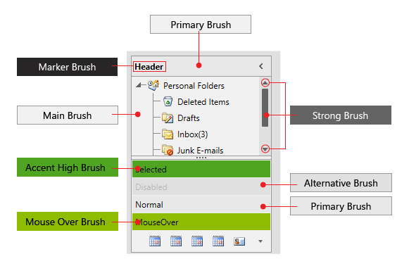
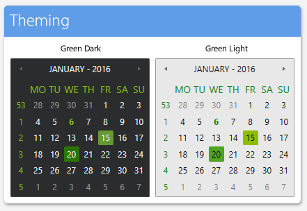
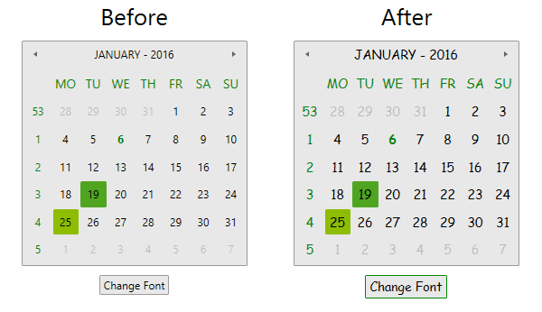
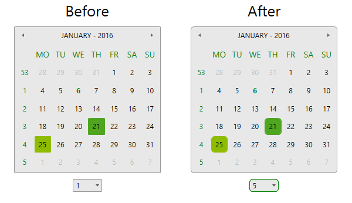
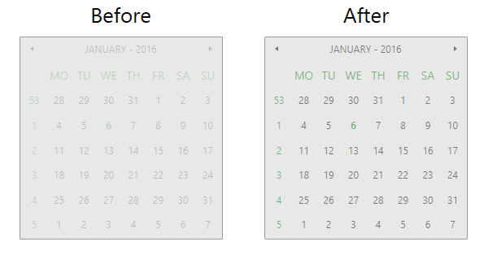
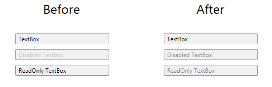

<style>
.theme-palette-color {
	width:20px;
	height:20px;
	margin: auto;
	border: 1px solid black;
}

.green-strongbrush-dark {	
	background:#646464;
}
.green-strongbrush-ligth {	
	background:#646464;
}
.green-validationbrush-dark {	
	background:#E60000;
}
.green-validationbrush-ligth {	
	background:#E60000;
}
.green-fixedbrush-dark {	
	background:#FFFFFF;
}
.green-fixedbrush-ligth {	
	background:#FFFFFF;
}
.green-accenthighbrush-dark {	
	background:#2B7402;
}
.green-accenthighbrush-ligth {	
	background:#4FA520;
}
.green-accentlowbrush-dark {	
	background:#86B90E;
}
.green-accentlowbrush-ligth {	
	background:#008406;
}
.green-semiaccentlowbrush-dark {	
	background: #CFDF9D;
}
.green-semiaccentlowbrush-ligth {	
	background: #A0CC9A;
}
.green-mouseoverbrush-dark {	
	background: #669933;
}
.green-mouseoverbrush-ligth {	
	background: #8EBC00;
}
.green-mainbrush-dark {	
	background: #1B1B1F;
}
.green-mainbrush-ligth {	
	background: #F1F1F1;
}
.green-primarybrush-dark {	
	background: #2B2C2E;
}
.green-primarybrush-ligth {	
	background: #E8E8E8;
}
.green-alternativebrush-dark {	
	background: #1D1E21;
}
.green-alternativebrush-ligth {	
	background: #E0E0E0;
}
.green-markerbrush-dark {	
	background: #F1F1F1;
}
.green-markerbrush-ligth {	
	background: #000000;
}
.green-basicbrush-dark {	
	background: #474747;
}
.green-basicbrush-ligth {	
	background: #999999;
}
.green-selectedbrush-dark {	
	background: #FFFFFF;
}
.green-selectedbrush-ligth {	
	background: #353535;
}
.green-lowbrush-dark {	
	background: #343434;
}
.green-lowbrush-ligth {	
	background: #8D8D8D;
}
.green-highbrush-dark {	
	background: #131313;
}
.green-highbrush-ligth {	
	background: #ECECEC;
}
.green-complementarybrush-dark {	
	background: #444446;
}
.green-complementarybrush-ligth {	
	background: #CACACA;
}

article table
{
    table-layout: auto;
}
</style>

# Green Theme

The `Green` theme delivers a flat modern UI represented by two color variations – `Light` and `Dark` which are based on green accents.

Jump to the following topics to learn about the specifics of the theme's palette and features.

* [Default Theme Colors](#default-theme-colors)
* [Default Theme Brushes](#default-theme-brushes)
* [Changing Palette Colors](#changing-palette-colors)
* [Changing Theme Variation](#changing-theme-variation)
* [Changing Font Properties](#changing-font-properties)
* [Changing Corner Radius](#changing-corner-radius)
* [Changing Opacity](#changing-opacity)

## Default Theme Colors

Below you can find the differences between the two color variations. Every brush has relevant HEX value in the corresponding color variation.

| Color name | Light | | Dark (default) | |
| ---------- | ----- | --- | -------------- | --- |
| __Colors, which are same in the two palettes__ |  |  |		
| StrongColor | #FF646464 | <div class="theme-palette-color green-strongbrush-ligth"></div> | #FF646464 | <div class="theme-palette-color green-strongbrush-dark"></div> |
| ValidationColor |	 #FFE60000 | <div class="theme-palette-color green-validationbrush-ligth"></div> | #FFE60000 | <div class="theme-palette-color green-validationbrush-dark"></div> |
| FixedColor | #FFFFFFFF | <div class="theme-palette-color green-fixedbrush-ligth"></div> | #FFFFFFFF | <div class="theme-palette-color green-fixedbrush-dark"></div> |
| ReadOnlyBackgroundColor | #00FFFFFF | <div class="theme-palette-color green-fixedbrush-ligth"></div> | #00FFFFFF | <div class="theme-palette-color green-fixedbrush-dark"></div> |
| __Colors, which are different in the two palettes__ |  |  |
| AccentHighColor | #FF4FA520 | <div class="theme-palette-color green-accenthighbrush-ligth"></div> | #FF2B7402 | <div class="theme-palette-color green-accenthighbrush-dark"></div> |
| AccentLowColor | #FF008406 | <div class="theme-palette-color green-accentlowbrush-ligth"></div> | #FF86B90E | <div class="theme-palette-color green-accentlowbrush-dark"></div> |
| SemiAccentLowColor | #59008406 | <div class="theme-palette-color green-semiaccentlowbrush-ligth"></div> | #5986B90E | <div class="theme-palette-color green-semiaccentlowbrush-dark"></div> |
| MouseOverColor | #FF8EBC00 | <div class="theme-palette-color green-mouseoverbrush-ligth"></div> | #FF669933 | <div class="theme-palette-color green-mouseoverbrush-dark"></div> |
| MainColor | #FFF1F1F1 | <div class="theme-palette-color green-mainbrush-ligth"></div> | #FF1B1B1F | <div class="theme-palette-color green-mainbrush-dark"></div> |
| PrimaryColor | #FFE8E8E8 | <div class="theme-palette-color green-primarybrush-ligth"></div> | #FF2B2C2E | <div class="theme-palette-color green-primarybrush-dark"></div> |
| AlternativeColor | #FFE0E0E0 | <div class="theme-palette-color green-alternativebrush-ligth"></div> | #FF1D1E21 | <div class="theme-palette-color green-alternativebrush-dark"></div> |
| MarkerColor | #FF000000 | <div class="theme-palette-color green-markerbrush-ligth"></div> | #FFF1F1F1 | <div class="theme-palette-color green-markerbrush-dark"></div> |
| BasicColor | #FF999999 | <div class="theme-palette-color green-basicbrush-ligth"></div> | #FF474747 | <div class="theme-palette-color green-basicbrush-dark"></div> |
| SelectedColor | #FF353535	| <div class="theme-palette-color green-selectedbrush-ligth"></div> | #FFFFFFFF | <div class="theme-palette-color green-selectedbrush-dark"></div> |
| LowColor | #FF8D8D8D | <div class="theme-palette-color green-lowbrush-ligth"></div> | #FF343434 | <div class="theme-palette-color green-lowbrush-dark"></div> |
| HighColor | #FFECECEC | <div class="theme-palette-color green-highbrush-ligth"></div> | #FF131313 | <div class="theme-palette-color green-highbrush-dark"></div> |
| ComplementaryColor | #FFCACACA | <div class="theme-palette-color green-strongbrush-ligth"></div> | #FF444446 | <div class="theme-palette-color green-strongbrush-dark"></div> |

## Default Theme Brushes

Below you can find more details about each brush and where it is usually applied.

### Common Brushes
* `StrongBrush`&mdash;Gray by default and it is mainly used for filling paths in elements when they are in Normal state.
* `ValidatonBrush`&mdash;Red by default and it is used for validation where such is applicable in our controls.
* `FixedBrush`&mdash;White by default and it is the main color for text or paths which are over elements with validation background.

### Accent Brushes
* `AccentHighBrush`&mdash;A green brush.
* `AccentLowBrush`&mdash;A slightly darker/lighter (depends on color variation) than the previous green brush. 
* `SemiAccentLowBrush`&mdash;The same as AccentLowBrush but with 35% opacity.
* `MouseOverBrush`&mdash;Used as a background or border brush of controls or elements when they are in MouseOver state.

### Foreground Brushes
* `MarkerBrush`&mdash;The default brush used as foreground color.
* `SelectedBrush`&mdash;Used for paths’ fill in elements that are in MouseOver, Pressed or Selected state.

### Background Brushes
* `MainBrush`&mdash;Used as background of controls with direct input such as TextBox, PasswordBox, RadMaskedInput, Editable RadComboBox, RadAutoCompleteBox. Also, used as main background of elements that has different content with unpredictable background.
* `PrimaryBrush`&mdash;Used as a background of controls when in their Normal state, excluding controls with direct input.
* `AlternativeBrush`&mdash;Used as an alternative background – i.e. for popups or where we want to distinguish one element from another.
* `HighBrush`&mdash;Used as a background in RadMenu and RadTimeline.
* `ComplementaryBrush`&mdash;Used as a background in RadRadialMenu and RadScheduleView.
* `ReadOnlyBackgroundBrush`&mdash;Used as a background of controls in their ReadOnly state. Its default value is Transparent.

### Border Brushes
* `BasicBrush`&mdash;Used as a border brush of controls in their Normal state.
* `LowBrush`&mdash;Used as a border brush of controls in their ReadOnly state.

__Theme brushes preview__



## Changing Palette Colors

The Green theme provides dynamic change of the palette colors responsible for the brushes used in the controls. Their defaults are stated above. This mechanism is used to modify the color variation of the theme. 

The general naming convention is: `GreenPalette.Palette.[name]Color` is responsible for `[name]Brush` – e.g. `GreenPalette.Palette.AccentHighColor` sets the color for `telerik:GreenResource ResourceKey=AccentHighBrush`

Changing the colors can be achieved in code behind.

__Setting palette colors__
```C#
	GreenPalette.Palette.AccentHighColor = Color.FromRgb(255, 0, 0);
```

## Changing Theme Variation

The Green theme comes with two built-in colro variations:

__The ColorVariation enumeration that determines which color variation should be used__
```C#
	/// <summary>
	/// Represents theme color variations.
	/// </summary>
	public enum ColorVariation
	{
		/// <summary>
		/// Represents Dark Green theme palette.
		/// </summary>
		Dark,

		/// <summary>
		/// Represents Light Green theme palette.
		/// </summary>
		Light
	}
```

>important The `Dark` color variation of the theme is designed with a dark background in mind. It is recommended to use such a background in your application when choosing it. 

__Light and Dark color variations demonstrated with RadCalendar__



You can switch between the color variations by calling the `LoadPreset` method as shown below:

__Changing the color variation of the theme__
```C#
	//default color variation
	GreenPalette.LoadPreset(GreenPalette.ColorVariation.Dark);	

	//light color variation
	GreenPalette.LoadPreset(GreenPalette.ColorVariation.Light);
```
```VB.NET
	//default color variation
	GreenPalette.LoadPreset(GreenPalette.ColorVariation.Dark)

	//light color variation
	GreenPalette.LoadPreset(GreenPalette.ColorVariation.Light)
```

## Changing Font Properties

When using the `Green Theme` you can dynamically change the `FontSize` and `FontFamily` properties of all components in the application.

The FontSize and FontFamily properties are public so you can easily modify the theme resources at one single point. The most commonly used font size in the theme is named FontSize and its default value is __12__. Bigger font sizes are used for headers and footers while smaller ones are used inside complex controls such as `RadRibbonView`, `RadGauge`, `RadGanttView`, etc. As for the FontFamily resource - its default value is `Segoe UI`.

> Please note that for complex scenarios we strongly recommend setting the FontSize property only initially before the application is initialized. Also, we recommend values between 11px and 19px for it.

A list with all the available FontSize and FontFamily options with their default values follows:

__Default FontFamily and FontSize values__
```C#
	GreenPalette.Palette.FontSizeXS = 10;
	GreenPalette.Palette.FontSizeS = 11; 
	GreenPalette.Palette.FontSize = 12;
	GreenPalette.Palette.FontSizeL = 13;
	GreenPalette.Palette.FontSizeXL = 14; 
	GreenPalette.Palette.FontFamily = new FontFamily("Segoe UI");
```
```VB.NET
	GreenPalette.Palette.FontSizeXS = 10
	GreenPalette.Palette.FontSizeS = 11
	GreenPalette.Palette.FontSize = 12
	GreenPalette.Palette.FontSizeL = 13
	GreenPalette.Palette.FontSizeXL = 14
	GreenPalette.Palette.FontFamily = New FontFamily("Segoe UI");
```

More details regarding the rarely used font sizes can be found below:  
* `GreenPalette.Palette.FontSizeXS` is used in: 
	* TimeBar's SelectionRangeStyle in Telerik.Windows.Controls.DataVisualization
	* Map’s Scale and MouseLocationIndicator in Telerik.Windows.Controls.DataVisualization
	* AggregateResultsList, GridViewHeaderCell and GridViewGroupPanel in Telerik.Windows.Controls.GridView

* `GreenPalette.Palette.FontSizeS` is used in: 
	* ChartBaseStyle and TrackBallInfoControlStyle in Telerik.Windows.Controls.Chart.xaml
	* HorizontalBulletGraphStyle and VerticalBullerGraphStyle in Telerik.Windows.Controls.DataVisualization	
	* TimeBar's ItemControlStyle in Telerik.Windows.Controls.DataVisualization
	* RibbonView’s GroupChromeStyle in Telerik.Windows.Controls.RibbonView
	* GanttView's EventContainerStyle in Telerik.Windows.Controls.GanntView 
	* ScheduleView TimeRulerItems' styles in Telerik.Windows.Controls.ScheduleView
	* DiagramRulerStyle in Telerik.Windows.Controls.Diagrams.Extensions.xaml
	
* `GreenPalette.Palette.FontSizeL` is used in: 
	* GanttView's GanttDragResizeVisualCueTemplate in Telerik.Windows.Controls.GanntView 
	* ScheduleView TimeRulerGroupItems' and TimeRulerMonthViewGroupItem’s styles in Telerik.Windows.Controls.ScheduleView 

* `GreenPalette.Palette.FontSizeXL` is used in: 
	* ScheduleView TimeRulerMonthViewItem’s styles in Telerik.Windows.Controls.ScheduleView 

As the following example shows, you can change the default FontFamily from "Segoe UI" to "Comic Sans MS" and the FontSize from __12__ to __14__ on a click of a button:

__The view of the example__
```XAML
	<StackPanel> 
		 <telerik:RadCalendar x:Name="Calendar" Width="250" Height="250" Margin="4 10"/> 
		 <telerik:RadButton x:Name="BtnChangeFontSize"
								   Content="Change Font"
								   HorizontalAlignment="Center" VerticalAlignment="Center" 
								   Click="OnButtonChangeFontSizeClick" />
	</StackPanel>
```

__Changing the FontSize and the FontFamily__
```C#
	private void OnButtonChangeFontSizeClick(object sender, RoutedEventArgs e)
	{
		GreenPalette.Palette.FontSize = 14;
		GreenPalette.Palette.FontFamily = new FontFamily("Comic Sans MS");
	}
```
```VB.NET
	Private Sub OnButtonChangeFontSizeClick(sender As Object, e As RoutedEventArgs)
		GreenPalette.Palette.FontSize = 14
		GreenPalette.Palette.FontFamily = New FontFamily("Comic Sans MS")
	End Sub
```

__Change in theme fonts__


	
## Changing Corner Radius 

The Green theme also exposes an easy way to modify the corner radius of many elements in your application. You can use the following properties which are shown below with their default values:

__Default CornerRadius values__	
```C#
	GreenPalette.Palette.CornerRadius = new CornerRadius(1, 1, 1, 1);
	GreenPalette.Palette.CornerRadiusBottom = new CornerRadius(0, 0, 1, 1);
	GreenPalette.Palette.CornerRadiusLeft = new CornerRadius(1, 0, 0, 1);
	GreenPalette.Palette.CornerRadiusRight = new CornerRadius(0, 1, 1, 0);
	GreenPalette.Palette.CornerRadiusTop = new CornerRadius(1, 1, 0, 0);
```
```VB.NET
	GreenPalette.Palette.CornerRadius = New CornerRadius(1, 1, 1, 1)
	GreenPalette.Palette.CornerRadiusBottom = New CornerRadius(0, 0, 1, 1)
	GreenPalette.Palette.CornerRadiusLeft = New CornerRadius(1, 0, 0, 1)
	GreenPalette.Palette.CornerRadiusRight = New CornerRadius(0, 1, 1, 0)
	GreenPalette.Palette.CornerRadiusTop = New CornerRadius(1, 1, 0, 0)
```

__The view of the example__	
```XAML
	<StackPanel>
		 <telerik:RadCalendar x:Name="Calendar" Width="250" Height="250" Margin="4 10"/>
		 <telerik:RadComboBox x:Name="ComboBoxChangeCornerRadius"
							  SelectionChanged="ComboBoxChangeCornerRadius_SelectionChanged" 
							  Width="50"
							  SelectedIndex="1"
							  HorizontalAlignment="Center" />
	</StackPanel>
```

__Changing the CornerRadius__	
```C#
	public MainWindow()
	{
		InitializeComponent();
		this.CornerRadiusComboBox.ItemsSource = Enumerable.Range(0, 10);
	}
	
	private void ComboBoxChangeCornerRadius_SelectionChanged(object sender, RoutedEventArgs e)
	{ 
		var selectedCornerSize = sender as RadComboBox;
		if (selectedCornerSize != null && selectedCornerSize.SelectedValue != null)
		{
			double selectedValue = Convert.ToDouble(selectedCornerSize.SelectedValue);
			GreenPalette.Palette.CornerRadius = new CornerRadius(selectedValue, selectedValue, selectedValue, selectedValue);
			GreenPalette.Palette.CornerRadiusBottom = new CornerRadius(0, 0, selectedValue, selectedValue);
			GreenPalette.Palette.CornerRadiusLeft = new CornerRadius(selectedValue, 0, 0, selectedValue);
			GreenPalette.Palette.CornerRadiusRight = new CornerRadius(0, selectedValue, selectedValue, 0);
			GreenPalette.Palette.CornerRadiusTop = new CornerRadius(selectedValue, selectedValue, 0, 0); 
		}
	}
```
```VB.NET
	Public Sub New()
		InitializeComponent()
		Me.CornerRadiusComboBox.ItemsSource = Enumerable.Range(0, 10)
	End Sub

	Private Sub ComboBoxChangeCornerRadius_SelectionChanged(sender As Object, e As RoutedEventArgs)
		Dim selectedCornerSize = TryCast(sender, RadComboBox)
		If selectedCornerSize IsNot Nothing AndAlso selectedCornerSize.SelectedValue IsNot Nothing Then
			Dim selectedValue As Double = Convert.ToDouble(selectedCornerSize.SelectedValue)
			GreenPalette.Palette.CornerRadius = New CornerRadius(selectedValue, selectedValue, selectedValue, selectedValue)
			GreenPalette.Palette.CornerRadiusBottom = New CornerRadius(0, 0, selectedValue, selectedValue)
			GreenPalette.Palette.CornerRadiusLeft = New CornerRadius(selectedValue, 0, 0, selectedValue)
			GreenPalette.Palette.CornerRadiusRight = New CornerRadius(0, selectedValue, selectedValue, 0)
			GreenPalette.Palette.CornerRadiusTop = New CornerRadius(selectedValue, selectedValue, 0, 0)
		End If
	End Sub
```

__Changes in corner radius__	



## Changing Opacity 

If you need to change the opacity of disabled elements, you can easily do it by using the `DisabledOpacity` property of the GreenPalette as follows: 

__The view of the opacity__	
```XAML
	<telerik:RadCalendar x:Name="Calendar" Width="250" Height="250" Margin="4 10" IsEnabled="False"/>
```

__Changing the DisabledOpacity__	
```C#
	GreenPalette.Palette.DisabledOpacity = 0.5;
```
```VB.NET
	GreenPalette.Palette.DisabledOpacity = 0.5
```
	
__Changes in the disabled elements opacity__


	
The same is applicable for the ReadOnly state of controls by using the exposed `ReadOnlyOpacity` property of GreenPalette. The default values are __0.2__ for the `DisabledOpacity` and __1__ for the `ReadOnlyOpacity` property. 

__The view of the example__		
```XAML
	<StackPanel Width="200" HorizontalAlignment="Center">
		<TextBox Text="TextBox" Margin="5" />
		<TextBox Text="Disabled TextBox" Margin="5" IsEnabled="False" />
		<TextBox Text="ReadOnly TextBox" Margin="5" IsReadOnly="True" />
	</StackPanel>
```

__Changing the opacity__		
```C#
	GreenPalette.Palette.DisabledOpacity = 0.5;
	GreenPalette.Palette.ReadOnlyOpacity = 0.5;
```
```VB.NET
	GreenPalette.Palette.DisabledOpacity = 0.5
	GreenPalette.Palette.ReadOnlyOpacity = 0.5
```

__Changes in the readonly elements opacity__

	

## Merging Modified Palette Resources With StyleManager Theming Approach

When modifying fonts, colors, or other resources from the `GreenPalette` and `StyleManager` is used as theming mechanism, the theme's `ResourceDictionary` needs to be merged in __App.xaml__ file to apply the changes.

__Merging the theme's ResourceDictionary in App.xaml__
```XAML
	<Application.Resources> 
	    <ResourceDictionary> 
	        <ResourceDictionary.MergedDictionaries> 
	            <telerik:GreenResourceDictionary/> 
	        </ResourceDictionary.MergedDictionaries> 
	    </ResourceDictionary> 
	</Application.Resources>
```

## See Also
* [Setting a Theme (Using Implicit Styles)]()
* [Office2013 Theme]()
* [VisualStudio2013 Theme]()
* [Windows8 and Windows8Touch Colors and Fonts]()
