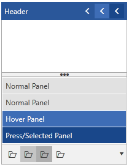
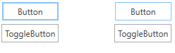
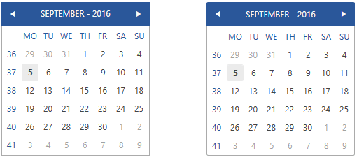
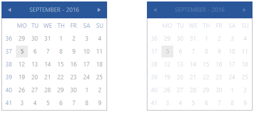

<style>
.theme-palette-color {
	width:20px;
	height:20px;
	margin: auto;
	border: 1px solid black;
}

.office2016-theme-mainbrush {	
	background: #FFFFFF;
}
.office2016-theme-primarybrush {	
	background: #E6E6E6;
}
.office2016-theme-complementarybrush {	
	background: #E1E1E1;
}
.office2016-theme-alternativebrush {	
	background: #F1F1F1;
}
.office2016-theme-basicbrush {	
	background: #ABABAB;
}
.office2016-theme-markerbrush {	
	background: #444444;
}
.office2016-theme-markerinvertedbrush {	
	background: #F9F9F9;
}
.office2016-theme-iconbrush {	
	background: #444444;
}
.office2016-theme-validationbrush {	
	background: #E81123;
}
.office2016-theme-accentbrush {	
	background: #2A579A;
}
.office2016-theme-accentmouseoverbrush {	
	background: #3E6DB6;
}
.office2016-theme-accentpressedbrush {	
	background: #19478A;
}
.office2016-theme-accentfocusedbrush {	
	background: #88C3FF;
}
.office2016-theme-mouseoverbrush {	
	background: #C5C5C5;
}
.office2016-theme-pressedbrush {	
	background: #AEAEAE;
}
.office2016-theme-selectedbrush {	
	background: #EBEBEB;
}
.office2016-theme-readonlybackgroundbrush {	
	background: #FFFFFF;
}
.office2016-theme-readonlyborderbrush {	
	background: #ABABAB;
}

article table
{
    table-layout: auto;
}
</style>

# Office2016 Theme

The `Office2016 Theme` delivers a flat modern UI represented by a single color variation, designed to be easily customized.

Jump to the following topics to learn about the specifics of the theme's palette and features.

* [Default Theme Colors](#default-theme-colors)
* [Default Theme Brushes](#default-theme-brushes)
* [Changing Palette Colors](#changing-palette-colors)
* [Changing Font Properties](#changing-font-properties)
* [Changing FocusThickness](#changing-focusthickness)
* [Changing Corner Radius](#changing-corner-radius)
* [Using Glyphs](#using-glyphs)
* [Changing Opacity](#changing-opacity)

## Default Theme Colors

The Office2016 has one color variation, but it is designed to be easily modified via the exposed colors in the theme palette. The default values of the brushes in the theme are listed below:

|Color name|Hex code||
|----------|-----------|---|
|MainColor|#FFFFFFFF|<div class="theme-palette-color office2016-theme-mainbrush"></div>|
|PrimaryColor|#FFE6E6E6|<div class="theme-palette-color office2016-theme-primarybrush"></div>|
|ComplementaryColor|#FFE1E1E1|<div class="theme-palette-color office2016-theme-complementarybrush"></div>|
|AlternativeColor|#FFF1F1F1|<div class="theme-palette-color office2016-theme-alternativebrush"></div>|
|BasicColor|#FFABABAB|<div class="theme-palette-color office2016-theme-basicbrush"></div>|
|MarkerColor|#FF444444|<div class="theme-palette-color office2016-theme-markerbrush"></div>|
|MarkerInvertedColor|#FFF9F9F9|<div class="theme-palette-color office2016-theme-markerinvertedbrush"></div>|
|IconColor|#FF444444|<div class="theme-palette-color office2016-theme-iconbrush"></div>|
|ValidationColor|#FFE81123|<div class="theme-palette-color office2016-theme-validationbrush"></div>|
|AccentColor|#FF2A579A|<div class="theme-palette-color office2016-theme-accentbrush"></div>|
|AccentMouseOverColor|#FF3E6DB6|<div class="theme-palette-color office2016-theme-accentmouseoverbrush"></div>|
|AccentPressedColor|#FF19478A|<div class="theme-palette-color office2016-theme-accentpressedbrush"></div>|
|AccentFocusedColor|#FF88C3FF|<div class="theme-palette-color office2016-theme-accentfocusedbrush"></div>|
|MouseOverColor|#FFC5C5C5|<div class="theme-palette-color office2016-theme-mouseoverbrush"></div>|
|PressedColor|#FFAEAEAE|<div class="theme-palette-color office2016-theme-pressedbrush"></div>|
|SelectedColor|#FFEBEBEB|<div class="theme-palette-color office2016-theme-selectedbrush"></div>|
|ReadOnlyBackgroundColor|#FFFFFFFF|<div class="theme-palette-color office2016-theme-readonlybackgroundbrush"></div>|
|ReadOnlyBorderColor|#FFABABAB|<div class="theme-palette-color office2016-theme-readonlyborderbrush"></div>|

## Default Theme Brushes

Below you can find more details about each brush and where it is usually applied.

* `MainBrush`&mdash;This brush is white by default and it is mainly used as background of the controls.
* `MarkerBrush`&mdash;This brush is dark by default and it is used as foregound color. 
* `MarkerInvertedBrush`&mdash;This brush is a light color by default and it is mostly used as foreground color while you interact with the control. If the control has accent interaction states, we apply the brush for better contrast.

The Office2016 palette provides both accent and non-accent brushes for the different interaction states. 

The __accent brushes__ are by default deep blue brushes and are used to highlight input and interaction elements - e.g. buttons.

* `AccentBrush`&mdash;This is the main accent brush and it is used mainly for headers and interaction feedback.
* `AccentMouseOverBrush`&mdash;This brush is brighter shade of blue and it is used for controls in accent-colored mouse over state.
* `AccentPressedBrush`&mdash;This is the darkest shade of blue and it is used for controls in accent-colored pressed state.

The __non-accent brushes__ are different shades of grey by default and are used for interaction feedback in secondary input or navigation elements and other components which do not need accenting – e.g. RadListBox, buttons in RadRibbonView.

* `MouseOverBrush`&mdash;This is the non-accent brush for the background of the control while in mouse over state.
* `PressedBrush`&mdash;This is the non-accent brush for the background of the control while in pressed state.
* `SelectedBrush`&mdash;This is the non-accent brush for the background of the control while in selected state.
* `AccentFocusedBrush`&mdash;This brush is light blue and it's the default brush for the focused visual and rarely for any other interaction.
* `ValidatonBrush`&mdash;This brush is red by default and it is used for failed validation where such is applicable in our controls.

There are several brushes used as background color other than the MainBrush.

* `PrimaryBrush`&mdash;This brush is used as a background of the input controls in disabled state.
* `AlternativeBrush`&mdash;This brush is used as an alternative background – i.e. for popups or if we want to distinguish one element from another and for more complex controls – RadRichTextBox, RadImageEditor, RadTabControlItem. 
* `ComplementaryBrush`&mdash;This is used for background of components in more complex controls or their states. For example in RadOutlookBar, RadPanelBar, RadTreeView.

The default stroke / border brushes follow:

* `BasicBrush`&mdash;This brush is grey and it is used as the default border brush of the controls while in normal state.
* `IconBrush`&mdash;This brush is black by default and it is used for glyphs and paths.

There are two read-only brushes as well:

* `ReadOnlyBackgroundBrush`&mdash;This brush is white by default and it is used as a background brush of the controls while in read-only state.
* `ReadOnlyBorderBrush`&mdash;This brush is light gray by default and it is used as a border brush of the controls while in read-only state.

And here is an example of how to change them:

__Changing the read-only colors__
```C#
	Office2016Palette.Palette.ReadOnlyBackgroundColor = (Color)ColorConverter.ConvertFromString("#FFFBDD");
	Office2016Palette.Palette.ReadOnlyBorderColor = (Color)ColorConverter.ConvertFromString("#5F5F5F");
```


__Theme colors__

	

## Changing Palette Colors

Office2016 provides dynamic change of the palette colors responsible for the brushes used in our controls. Their defaults are stated above. This mechanism is used to modify the color variation of the theme. 

The general naming convention is: `Office2016Palette.Palette.[name]Color` is responsible for `[name]Brush` – e.g. `Office2016Palette.Palette.AccentColor` sets the color for `telerik:Offie2016Resource ResourceKey=AccentBrush`

Changing the colors can be achieved in code behind.

__Setting palette colors__
```C#
	Office2016Palette.Palette.AccentColor = Color.FromRgb(255, 0, 0);
```

## Changing Font Properties

When using the Office2016 theme you can dynamically change the `FontSize` and `FontFamily` properties of all components in the application the same way as you do in all other [Available Themes]() which support ThemePalette.

The FontSize and FontFamily properties are public so you can easily modify the theme resources at a single point. The most commonly used font size in the theme is named FontSize and its default value is __12__. 

>important For complex scenarios we strongly recommend setting the FontSize property only initially before the application is initialized. Also, we recommend values between __11px__ and __19px__ for it.

The following example shows the default font sizes and families.

__Default FontSize and FontFamily__
```C#
	Office2016Palette.Palette.FontSizeS = 10;
	Office2016Palette.Palette.FontSize = 12;
	Office2016Palette.Palette.FontSizeL = 14;
	Office2016Palette.Palette.FontFamily = new FontFamily(“Segoe UI”);
```

The following examples show how to change the default FontFamily from "Segoe UI" to "Times New Roman" and the FontSize from __12__ to __14__ on a click of a button.

__Example view definition__
```XAML
	<StackPanel>
		<telerik:RadCalendar HorizontalAlignment="Center" />
		<telerik:RadButton Content="Change Font" Click=" OnButtonChangeFontSizeClick " HorizontalAlignment="Center" VerticalAlignment="Center" Margin="0 5 0 0"/>
	</StackPanel>
```
	
__Changing the theme's FontSize and FontFamily__
```C#
	private void OnButtonChangeFontSizeClick(object sender, RoutedEventArgs e)
	{
		Office2016Palette.Palette.FontSize = 14;
		Office2016Palette.Palette.FontFamily = new FontFamily("Calibri");
	}
```

__Setting FontSize and FontFamily__

	


## Changing FocusThickness

The `Office2016` theme palette includes a `FocusThickness` property. It defines the thickness of the buttons’ focus border. As our design is inspired by the Microsoft Office, the focus border of the buttons is thicker than the one of the other controls and elements. By default the FocusThickness is set to __2__, but it is easily changeable in a similar way to the other palette properties.

__Setting focus border thickness__
```C#
	Office2016Palette.Palette.FocusThickness = new Thickness(1);
```
	
__Setting the focus border thickness__

	

## Changing Corner Radius

The Office2016 theme exposes an easy way to modify the corner radius of many elements in your application. You can use the corner radius properties of the palette. By default all radius values are 0.

__Setting corner radius__
```C#
	Office2016Palette.Palette.CornerRadius = new CornerRadius(0,0,0,0);
	Office2016Palette.Palette.CornerRadiusTop = new CornerRadius(0,0,0,0);
	Office2016Palette.Palette.CornerRadiusBottom = new CornerRadius(0,0,0,0);
	Office2016Palette.Palette.CornerRadiusLeft = new CornerRadius(0,0,0,0);
	Office2016Palette.Palette.CornerRadiusRight = new CornerRadius(0,0,0,0);
```

The following example shows how to change the default corner radius from 0 to 2.

__Changing the default corner radius__
```C#
	Office2016Palette.Palette.CornerRadius = new CornerRadius(2); 
	Office2016Palette.Palette.CornerRadiusBottom = new CornerRadius(0, 0, 2, 2);
	Office2016Palette.Palette.CornerRadiusLeft = new CornerRadius(2, 0, 0, 2);
	Office2016Palette.Palette.CornerRadiusRight = new CornerRadius(0, 2, 2, 0);
	Office2016Palette.Palette.CornerRadiusTop = new CornerRadius(2, 2, 0, 0);
```

__Setting the corner radius__

	

## Using Glyphs

With Office2016 theme, an approach to add icons and icon-like images has been introduced to replace the images or paths that are used in themes introduced prior to this one. The `TelerikWebUI` font provides over 400 scalable vector glyphs that are available for use to our clients. This approach provides a number of advantages and benefits, including:
* The glyphs are vector paths which are easily scalable without loss of quality.
* There is a wide range of different beautiful built-in glyphs to choose from.
* They are easily colored – since they are text shapes. It is achieved by setting a Foreground color, which allows their usage in scenarios where the background of the control changes between light and dark color in different interaction states – e.g. buttons.
* They are all contained in the small font file and available for use with the inclusion of the Telerik.Windows.Controls assembly and merging the needed resource dictionary for easier referencing.
* They are available for use in any of our themes, when the needed resources are included. They are not specific for the Office2016 theme.

Since each glyph’s string value is ambiguous and not related to its shape, we are providing a resource dictionary with key-value pairs for easier usage and referencing in projects. It also provides compatibility for future inclusions of new glyphs as it is updated to any shifts in the string values of the existing glyphs with no need to change the references in the projects.

__Adding the ResourceDictionary with the glyphs__
```XAML
	<ResourceDictionary Source="/Telerik.Windows.Controls;component/Themes/FontResources.xaml"/> 
```

__Using glyphs__
```XAML
	<TextBlock FontFamily=”{StaticResource TelerikWebUI}”
			   Foreground=”{telerik:Office2016Resource ResourceKey=IconBrush}”
			   Text=”{StaticResource GlyphHeart}” 			   			   
			   FontWeight=”Normal” 
			   FontSize=”16” />
```

__Heart glyph__

	

> You can read more about the usage of the new glyph's feature and see the available glyphs in [this article]().

## Changing Opacity

You can easily change the opacity of any disabled element by using the `DisabledOpacity` property of the `Office2016Palette`. The default value of the property is __0.5__.

__Setting the disabled opacity__
```C#
	Office2016Palette.Palette.DisabledOpacity = 0.3;
```

__Setting the disabled opacity__

	

## Merging Modified Palette Resources With StyleManager Theming Approach

When modifying fonts, colors, or other resources from the `Office2016Palette` and `StyleManager` is used as theming mechanism, the theme's `ResourceDictionary` needs to be merged in __App.xaml__ file to apply the changes.

__Merging the theme's ResourceDictionary in App.xaml__
```XAML
	<Application.Resources> 
	    <ResourceDictionary> 
	        <ResourceDictionary.MergedDictionaries> 
	            <telerik:Office2016ResourceDictionary/> 
	        </ResourceDictionary.MergedDictionaries> 
	    </ResourceDictionary> 
	</Application.Resources>
```

## See Also
 * [Setting a Theme (Using  Implicit Styles)]()
 * [Office2013 Theme]()
 * [VisualStudio2013 Theme]()
 * [Green Theme]()
