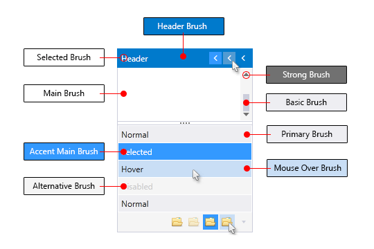
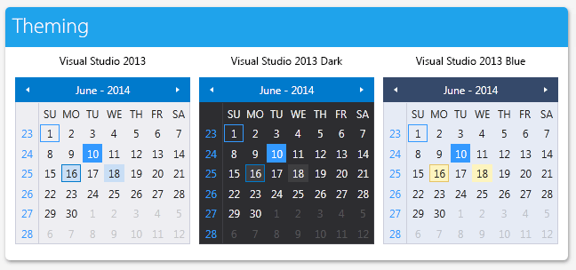
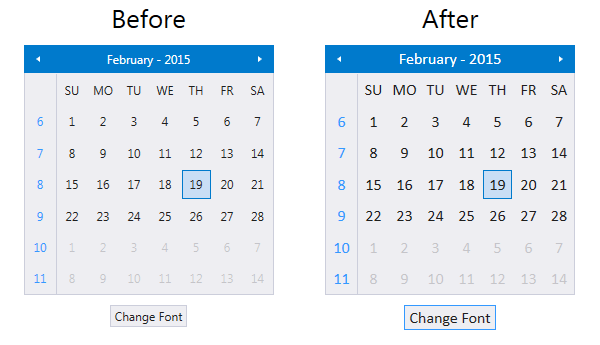

<style>
.theme-palette-color {
	width:20px;
	height:20px;
	margin: auto;
	border: 1px solid black;
}

article table
{
    table-layout: auto;
}
</style>

# VisualStudio2013 Theme

Inspired by the Visual Studio design, the `VisualStudio2013` theme comes with three built-in color variations – `Light`, `Dark` and `Blue`.        

Jump to the following topics to learn about the specifics of the theme's palette and features.

* [Default Theme Colors](#default-theme-colors)
* [Default Theme Brushes](#default-theme-brushes)
* [Changing Palette Colors](#changing-palette-colors)
* [Changing Theme Variation](#changing-theme-variation)
* [Changing Font Properties](#changing-font-properties)
* [Changing Opacity](#changing-opacity)

## Default Theme Colors

Below you can find the differences between the three color variations. Each brush has relevant HEX value in the corresponding color variation.

|Color name|Light (default)| |Dark| |Blue| |
|----------|---------------|---|----|---|----|---|
|__Colors, which are same in the three palettes__| | | | | | |
|AccentMainColor|FF3399FF|<div class="theme-palette-color" style="background: #3399FF"></div>|FF3399FF|<div class="theme-palette-color" style="background: #3399FF"></div>|FF3399FF|<div class="theme-palette-color" style="background: #3399FF"></div>|
|AccentDarkColor|FF007ACC|<div class="theme-palette-color" style="background: #007ACC"></div>|FF007ACC|<div class="theme-palette-color" style="background: #007ACC"></div>|FF007ACC|<div class="theme-palette-color" style="background: #007ACC"></div>|
|SelectedColor|FFFFFFFF|<div class="theme-palette-color" style="background: #FFFFFF"></div>|FFFFFFFF|<div class="theme-palette-color" style="background: #FFFFFF"></div>|FFFFFFFF|<div class="theme-palette-color" style="background: #FFFFFF"></div>|
|ValidationColor|FFFF3333|<div class="theme-palette-color" style="background: #FF3333"></div>|FFFF3333|<div class="theme-palette-color" style="background: #FF3333"></div>|FFFF3333|<div class="theme-palette-color" style="background: #FF3333"></div>|
|__Color, which are different in the three palettes__| | | | | | |
|AccentColor|FF007ACC|<div class="theme-palette-color" style="background: #007ACC"></div>|FF007ACC|<div class="theme-palette-color" style="background: #007ACC"></div>|FFE5C365|<div class="theme-palette-color" style="background: #E5C365"></div>|
|MarkerColor|FF1E1E1E|<div class="theme-palette-color" style="background: #1E1E1E"></div>|FFF1F1F1|<div class="theme-palette-color" style="background: #F1F1F1"></div>|FF1E1E1E|<div class="theme-palette-color" style="background: #1E1E1E"></div>|
|StrongColor|FF717171|<div class="theme-palette-color" style="background: #717171"></div>|FF999999|<div class="theme-palette-color" style="background: #999999"></div>|FF717171|<div class="theme-palette-color" style="background: #717171"></div>|
|MainColor|FFFFFFFF|<div class="theme-palette-color" style="background: #FFFFFF"></div>|FF1E1E1E|<div class="theme-palette-color" style="background: #1E1E1E"></div>|FFFFFFFF|<div class="theme-palette-color" style="background: #FFFFFF"></div>|
|PrimaryColor|FFEEEEF2|<div class="theme-palette-color" style="background: #EEEEF2"></div>|FF2D2D30|<div class="theme-palette-color" style="background: #2D2D30"></div>|FFE6EBF5|<div class="theme-palette-color" style="background: #E6EBF5"></div>|
|AlternativeColor|FFF5F5F5|<div class="theme-palette-color" style="background: #F5F5F5"></div>|FF252526|<div class="theme-palette-color" style="background: #252526"></div>|FFF6F6F6|<div class="theme-palette-color" style="background: #F6F6F6"></div>|
|MouseOverColor|FFC9DEF5|<div class="theme-palette-color" style="background: #C9DEF5"></div>|FF3E3E40|<div class="theme-palette-color" style="background: #3E3E40"></div>|FFFDF4BF|<div class="theme-palette-color" style="background: #FDF4BF"></div>|
|BasicColor|FFCCCEDB|<div class="theme-palette-color" style="background: #CCCEDB"></div>|FF3F3F46|<div class="theme-palette-color" style="background: #3F3F46"></div>|FFCCCEDB|<div class="theme-palette-color" style="background: #CCCEDB"></div>|
|SemiBasicColor|66CCCEDB|<div class="theme-palette-color" style="background: #CCCEDB"></div>|663F3F46|<div class="theme-palette-color" style="background: #"></div>|66CCCEDB|<div class="theme-palette-color" style="background: #CCCEDB"></div>|
|HeaderColor|FF007ACC|<div class="theme-palette-color" style="background: #007ACC"></div>|FF007ACC|<div class="theme-palette-color" style="background: #007ACC"></div>|FF35496A|<div class="theme-palette-color" style="background: #35496A"></div>|
|ComplementaryColor|FFDBDDE6|<div class="theme-palette-color" style="background: #DBDDE6"></div>|FF434346|<div class="theme-palette-color" style="background: #434346"></div>|FFDBDDE6|<div class="theme-palette-color" style="background: #DBDDE6"></div>|
|ReadOnlyBackgroundColor|FFF5F5F5|<div class="theme-palette-color" style="background: #F5F5F5"></div>|FF252526|<div class="theme-palette-color" style="background: #252526"></div>|FFF6F6F6|<div class="theme-palette-color" style="background: #F6F6F6"></div>|
|ReadOnlyBorderColor|FFCCCEDB|<div class="theme-palette-color" style="background: #CCCEDB"></div>|FF3F3F46|<div class="theme-palette-color" style="background: #3F3F46"></div>|FFCCCEDB|<div class="theme-palette-color" style="background: #CCCEDB"></div>|
|__Additional color__| | | | | | |		
|DefaultForegroundColor|FF1E1E1E|<div class="theme-palette-color" style="background: #1E1E1E"></div>|FFF1F1F1|<div class="theme-palette-color" style="background: #F1F1F1"></div>|FF1E1E1E|<div class="theme-palette-color" style="background: #1E1E1E"></div>|

## Default Theme Brushes

Here you can find more details about each brush and where it is usually applied.

### Common Brushes (same for all variations)
* `AccentMainBrush`&mdash;Blue by default and it is the main accent brush for the theme
* `AccentDarkBrush`&mdash;Blue by default and it is the darker accent brush for the theme
* `SelectedBrush`&mdash;White by default and is the main color for text or paths which are over elements with accent background
* `ValidatonBrush`&mdash;Red by default and it is the brush used for validation where such is applicable in our controls

### Foreground Brushes
* `MarkerBrush`&mdash;the main brush used for text color, also path's fill in MouseOver state
* `StrongBrush`&mdash;paths' and ticks' fill in Normal state, also ReadOnly text

### Background and Border Brushes
* `AccentBrush`&mdash;another accent brush, usually used for the border of elements in their MouseOver, Active, Toggled or Focused state. 
* `MainBrush`&mdash;used for background of controls with direct input such as TextBox, MaskedInput, Editable ComboBox, AutoCompleteBox, PasswordBox. Also used as main background of elements that has different content with unpredictable background (PrimaryBrush or AlternativeBrush).
* `PrimaryBrush`&mdash;used for background of most of the controls that have no direct input in their normal state.
* `AlternativeBrush`&mdash;used as alternative background of PrimaryBrush. Also used as background of Popups and DropDowns.
* `MouseOverBrush`&mdash;used for background of elements that are in MouseOver state.
* `BasicBrush`&mdash;widely used for border color of controls in their Normal state.
* `SemiBasicBrush`&mdash;the same brush as BasicBrush with 40% opacity, used for background of elements that are in MouseOver state.

### Special State/Elements Brushes
* `HeaderBrush`&mdash;used for the background of headers in controls such as Window, RibbonView, ScheduleView, Docking Pane, Docking ToolWindow, TileView.
* `ComplementaryBrush`&mdash;used for elements in Disabled state.

The only resource that is of type Color and does not have a respective SolidColorBrush is the \* `DefaultForegroundColor`. It is currently used only in the ExpressionEditor.

The following screenshot shows the usage of some of the brushes:



## Changing Palette Colors

The VisualStudio2013 theme provides dynamic change of the palette colors responsible for the brushes used in our controls. Their defaults are stated above. This mechanism is used to modify the color variation of the theme. 

The general naming convention is: `VisualStudio2013Palette.Palette.[name]Color` is responsible for `[name]Brush` – e.g. `VisualStudio2013Palette.Palette.AccentColor` sets the color for `telerik:VisualStudio2013Resource ResourceKey=AccentBrush`

Changing the colors can be achieved in code behind.

__Setting palette colors__
```C#
	VisualStudio2013Palette.Palette.AccentColor = Color.FromRgb(255, 0, 0);
```

## Changing Theme Variation

There are three palettes of colors which can be easily set by choosing one of the three default color variations:

The next screenshot displays RadCalendar in the three color variations:



You can switch the three color palettes by calling the `LoadPreset` method as shown below:        


```C#	
	//default color variation
	VisualStudio2013Palette.LoadPreset(VisualStudio2013Palette.ColorVariation.Light);
	
	//blue color variation
	VisualStudio2013Palette.LoadPreset(VisualStudio2013Palette.ColorVariation.Blue);
	
	//dark color variation
	VisualStudio2013Palette.LoadPreset(VisualStudio2013Palette.ColorVariation.Dark); 
```

>important The `Dark` variation of the theme is designed with a dark background in mind. It is recommended to use such a background in your application when choosing it.

## Changing Font Properties

The `FontSize` and `FontFamily` properties of all components in the application can be dynamically changed for the VisualStudio2013 theme the same way as in all other [Available Themes]() which support ThemePalette.

These properties are public so you can easily modify the theme resources at one single point. The most commonly used FontSize in the theme is named FontSize and its default value is __12__. The bigger font sizes are used for headers and footers while smaller ones are used inside complex controls such as `RadRibbonView`, `RadGauge`, `RadGanttView`, etc. As for the FontFamily - there is only one FontFamily resource which is named FontFamily and it is set to `Segoe UI`.

>Please note that for complex scenarios we strongly recommend setting font size only initially before the application is initialized. We recommend font sizes between 11px and 19px for the FontSize property.

All the available `FontSizes` and `FontFamily` as well as their __default values__:


```C#
	VisualStudio2013Palette.Palette.FontSizeXXS = 9; 
	VisualStudio2013Palette.Palette.FontSizeXS = 10;
	VisualStudio2013Palette.Palette.FontSizeS = 11; 
	VisualStudio2013Palette.Palette.FontSize = 12;
	VisualStudio2013Palette.Palette.FontSizeL = 13;
	VisualStudio2013Palette.Palette.FontSizeXL = 20;
	VisualStudio2013Palette.Palette.FontSizeXXL = 22;
	VisualStudio2013Palette.Palette.FontFamily = new FontFamily("Segoe UI");
```

More details regarding the usage of the rarely used font sizes inside the different controls can be found below:

* `VisualStudio2013Palette.Palette.FontSizeXXS` is used only in:
	* HorizontalBulletGraphStyle and VerticalBullerGraphStyle in Telerik.Windows.Controls.DataVisualization
  
* `VisualStudio2013Palette.Palette.FontSizeXS` is used in: 
	* TimeBar's SelectionRangeStyle in Telerik.Windows.Controls.DataVisualization
	* ExpressionEditor in Telerik.Windows.Controls.Expressions
	* GridViewGroupPanel in Telerik.Windows.Controls.GridView
  
* `VisualStudio2013Palette.Palette.FontSizeS` is used in: 
	* TimeBar's ItemControlStyle in Telerik.Windows.Controls.DataVisualization
	* GanttView's EventContainerStyle in Telerik.Windows.Controls.GanntView
	* ScheduleView TimeRulerItems' styles in Telerik.Windows.Controls.ScheduleView 
  
* `VisualStudio2013Palette.Palette.FontSizeL` is used in: 		
	* TimeBar's GroupControlStyle in Telerik.Windows.Controls.DataVisualization		
	* Docking's Headers in Telerik.Windows.Controls.Docking 
	* ScheduleView TimeRulerGroupItems' styles in Telerik.Windows.Controls.ScheduleView 
	
* `VisualStudio2013Palette.Palette.FontSizeXXL` is used in: 
	* ScheduleView warnings
	
As the following example shows, you can change the default FontFamily from "Segoe UI" to "Calibri" and the FontSize from __12__ to __16__ on a click of a button:


```XAML
	<StackPanel>
		<StackPanel Orientation="Horizontal" HorizontalAlignment="Center">
			<telerik:RadCalendar x:Name="Calendar" Width="250" Height="250" Margin="4 10"/>
			<telerik:RadClock x:Name="Clock" Height="250" Margin="4 10" TimeInterval="0:0:1"/>
		</StackPanel>
		<telerik:RadButton x:Name="BtnChangeFontSize" VerticalAlignment="Center" 
						   HorizontalAlignment="Center" Content="Change Font"
						   Click="OnButtonChangeFontSizeClick" />
	</StackPanel>
</StackPanel>
```


```C#
	private void OnButtonChangeFontSizeClick(object sender, RoutedEventArgs e)
	{
	   VisualStudio2013Palette.Palette.FontSize = 16;
	   VisualStudio2013Palette.Palette.FontFamily = new FontFamily("Calibri");
	}
```

This will be the final result:



## Changing Opacity

Since the __R2 2019__ version, you can easily change the opacity of the disabled and read-only elements by using the `DisabledOpacity` and `ReadOnlyOpacity` properties of the `VisualStudio2013Palette`. The default values are __0.2__ and __0.4__ respectively. 
Also, to control the background and border color in the read-only state, you can use the following brushes:

* `ReadOnlyBackgroundBrush`&mdash;Used as a background of elements that are in a read-only state.
* `ReadOnlyBorderBrush`&mdash;Used in borders inside elements that are in a read-only state.

__Changing the read-only and disabled opacity__
```C#
	VisualStudio2013Palette.Palette.ReadOnlyOpacity = 0.5;
	VisualStudio2013Palette.Palette.DisabledOpacity = 0.5;
```

## Merging Modified Palette Resources With StyleManager Theming Approach

When modifying fonts, colors, or other resources from the `VisualStudio2013Palette` and `StyleManager` is used as theming mechanism, the theme's `ResourceDictionary` needs to be merged in __App.xaml__ file to apply the changes.

__Merging the theme's ResourceDictionary in App.xaml__
```XAML
	<Application.Resources> 
	    <ResourceDictionary> 
	        <ResourceDictionary.MergedDictionaries> 
	            <telerik:VisualStudio2013ResourceDictionary/> 
	        </ResourceDictionary.MergedDictionaries> 
	    </ResourceDictionary> 
	</Application.Resources>
```

## See Also
 * [Setting a Theme (Using  Implicit Styles)]()
