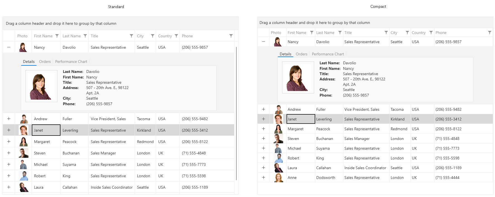

<style>
.theme-palette-color {
	width:20px;
	height:20px;
	margin: auto;
	border: 1px solid black;
}

/* Light color variation */
.windows11theme-accentcolor{
	background: #005FB8;
}
.windows11theme-accentmouseovercolor{
	background-color: rgba(0, 95, 184, 0.9);
}
.windows11theme-accentpressedcolor{
	background-color: rgba(0, 95, 184, 0.8);
}
.windows11theme-accentselectedcolor{
	background: #0078D4;
}
.windows11theme-accentcontrolbordergradientstop1color{
	background-color: rgba(255, 255, 255, 0.08);
}
.windows11theme-accentcontrolbordergradientstop2color{
	background-color: rgba(0, 0, 0, 0.4);
}
.windows11theme-accentcontrolforegroundcolor{
	background: #FFFFFF;
}
.windows11theme-alternativecolor{
	background: #F3F3F3;
}
.windows11theme-buttonbordergradientstop1color{
	background-color:rgba(0, 0, 0, 0.05);
}
.windows11theme-buttonbordergradientstop2color{
	background-color:rgba(0, 0, 0, 0.16);
}
.windows11theme-disabledbackgroundcolor{
	background-color:rgba(249, 249, 249, 0.30);
}
.windows11theme-disabledbordercolor{
	background-color:rgba(0, 0, 0, 0.06);
}
.windows11theme-disabledforegroundcolor{
	background: #000000;
}
.windows11theme-focuscolor{
	background-color:rgba(0, 0, 0, 0.89);
}
.windows11theme-focusinnercolor{
	background-color:rgba(255, 255, 255, 0.70);
}
.windows11theme-iconcolor{
	background-color:rgba(0, 0, 0, 0.89);
}
.windows11theme-iconsecondarycolor{
	background-color:rgba(0, 0, 0, 0.61);
}
.windows11theme-inputbordergradientstop1color{
	background-color:rgba(0, 0, 0, 0.06);
}
.windows11theme-inputbordergradientstop2color{
	background-color:rgba(0, 0, 0, 0.45);
}
.windows11theme-mouseoverbackgroundcolor{
	background-color:rgba(249, 249, 249, 0.70);
}
.windows11theme-mouseoverbordergradientstop1color{
	background-color:rgba(0, 0, 0, 0.06);
}
.windows11theme-mouseoverbordergradientstop2color{
	background-color:rgba(0, 0, 0, 0.44);
}
.windows11theme-overlaycolor{
	background: #FBFBFB;
}
.windows11theme-pressedbackgroundcolor{
	background-color:rgba(249, 249, 249, 0.30);
}
.windows11theme-primarybackgroundcolor{
	background-color:rgba(255, 255, 255, 0.70);
}
.windows11theme-primarybordercolor{
	background-color:rgba(0, 0, 0, 0.06);
}
.windows11theme-primaryforegroundcolor{
	background-color:rgba(0, 0, 0, 0.89);
}
.windows11theme-primarysolidbackgroundcolor{
	background: #FFFFFF;
}
.windows11theme-primarysolidbordercolor{
	background: #ECECEC;
}
.windows11theme-readonlybackgroundcolor{
	background-color:rgba(246, 246, 246, 0.90);
}
.windows11theme-readonlybordercolor{
	background: #EBEBEB;
}
.windows11theme-secondarybackgroundcolor{
	background: #EEEEEE;
}
.windows11theme-secondarybordercolor{
	background-color:rgba(0, 0, 0, 0.16);
}
.windows11theme-secondaryforegroundcolor{
	background-color:rgba(0, 0, 0, 0.61);
}
.windows11theme-selectedcolor{
	background-color:rgba(0, 0, 0, 0.04);
}
.windows11theme-selectedmouseovercolor{
	background-color:rgba(0, 0, 0, 0.02);
}
.windows11theme-selectedunfocusedcolor{
	background: #D9D9D9;
}
.windows11theme-strokecolor{
	background: #C4C4C4;
}
.windows11theme-subtlecolor{
	background-color:rgba(0, 0, 0, 0.04);
}
.windows11theme-subtlesecondarycolor{
	background-color:rgba(0, 0, 0, 0.02);
}
.windows11theme-tertiarybackgroundcolor{
	background: #F9F9F9;
}
.windows11theme-tertiarybordercolor{
	background: #EBEBEB;
}
.windows11theme-tertiaryforegroundcolor{
	background-color:rgba(0, 0, 0, 0.45);
}
.windows11theme-tertiarysmokebackgroundcolor{
	background-color:rgba(0, 0, 0, 0.30);
}
.windows11theme-validationcolor{
	background: #C42B1C;
}

/* Dark color variation */
.windows11theme-accentcolor-dark{
	background: #60CDFF;
}
.windows11theme-accentmouseovercolor-dark{
	background-color: rgba(96, 205, 255, 0.9);
}
.windows11theme-accentpressedcolor-dark{
	background-color: rgba(96, 205, 255, 0.8);
}
.windows11theme-accentselectedcolor-dark{
	background: #0078D4;
}
.windows11theme-accentcontrolbordergradientstop1color{
	background-color: rgba(255, 255, 255, 0.08);
}
.windows11theme-accentcontrolbordergradientstop2color{
	background-color: rgba(0, 0, 0, 0.14);
}
.windows11theme-accentcontrolforegroundcolor-dark{
	background: #FFFFFF;
}
.windows11theme-alternativecolor-dark{
	background: #202020;
}
.windows11theme-buttonbordergradientstop1color-dark{
	background-color:rgba(255, 255, 255, 0.09);
}
.windows11theme-buttonbordergradientstop2color-dark{
	background-color:rgba(255, 255, 255, 0.07);
}
.windows11theme-disabledbackgroundcolor-dark{
	background-color:rgba(255, 255, 255, 0.04);
}
.windows11theme-disabledbordercolor-dark{
	background-color:rgba(255, 255, 255, 0.07);
}
.windows11theme-disabledforegroundcolor-dark{
	background: #FFFFFF;
}
.windows11theme-focuscolor-dark{
	background: #FFFFFF;
}
.windows11theme-focusinnercolor-dark{
	background-color:rgba(0, 0, 0, 0.70);
}
.windows11theme-iconcolor-dark{
	background: #FFFFFF;
}
.windows11theme-iconsecondarycolor-dark{
	background-color:rgba(255, 255, 255, 0.78);
}
.windows11theme-inputbordergradientstop1color-dark{
	background-color:rgba(255, 255, 255, 0.08);
}
.windows11theme-inputbordergradientstop2color-dark{
	background-color:rgba(255, 255, 255, 0.54);
}
.windows11theme-mouseoverbackgroundcolor-dark{
	background-color:rgba(255, 255, 255, 0.08);
}
.windows11theme-mouseoverbordergradientstop1color-dark{
	background-color:rgba(255, 255, 255, 0.08);
}
.windows11theme-mouseoverbordergradientstop2color-dark{
	background-color:rgba(255, 255, 255, 0.54);
}
.windows11theme-overlaycolor-dark{
	background: #2D2D2D;
}
.windows11theme-pressedbackgroundcolor-dark{
	background-color:rgba(255, 255, 255, 0.03);
}
.windows11theme-primarybackgroundcolor-dark{
	background-color:rgba(255, 255, 255, 0.06);
}
.windows11theme-primarybordercolor-dark{
	background-color:rgba(255, 255, 255, 0.07);
}
.windows11theme-primaryforegroundcolor-dark{
	background: #FFFFFF;
}
.windows11theme-primarysolidbackgroundcolor-dark{
	background: #1E1E1E;
}
.windows11theme-primarysolidbordercolor-dark{
	background: #2C2C2C;
}
.windows11theme-readonlybackgroundcolor-dark{
	background-color:rgba(255, 255, 255, 0.03);
}
.windows11theme-readonlybordercolor-dark{
	background: #1C1C1C;
}
.windows11theme-secondarybackgroundcolor-dark{
	background: #1C1C1C;
}
.windows11theme-secondarybordercolor-dark{
	background-color:rgba(255, 255, 255, 0.09);
}
.windows11theme-secondaryforegroundcolor-dark{
	background-color:rgba(255, 255, 255, 0.78);
}
.windows11theme-selectedcolor-dark{
	background-color:rgba(255, 255, 255, 0.06);
}
.windows11theme-selectedmouseovercolor-dark{
	background-color:rgba(255, 255, 255, 0.04);
}
.windows11theme-selectedunfocusedcolor-dark{
	background: #404040;
}
.windows11theme-strokecolor-dark{
	background: #313131;
}
.windows11theme-subtlecolor-dark{
	background-color:rgba(255, 255, 255, 0.06);
}
.windows11theme-subtlesecondarycolor-dark{
	background-color:rgba(255, 255, 255, 0.04);
}
.windows11theme-tertiarybackgroundcolor-dark{
	background: #282828;
}
.windows11theme-tertiarybordercolor-dark{
	background: #262626;
}
.windows11theme-tertiaryforegroundcolor-dark{
	background-color:rgba(255, 255, 255, 0.55);
}
.windows11theme-tertiarysmokebackgroundcolor-dark{
	background-color:rgba(0, 0, 0, 0.30);
}
.windows11theme-validationcolor-dark{
	background: #FF99A4;
}

article table
{
    table-layout: auto;
}
</style>

# Windows11 Theme

With the __R2 2022__ release of the __UI for WPF__ suite we have introduced the brand new `Windows 11 Theme`.

Inspired by the refreshed Windows 11 OS, the Windows 11 theme delivers a lot cleaner and smoother look and feel to your WPF apps. The team at Microsoft are well known for their eagerness to deliver the best possible user experience that we encounter every day and with the Windows 11 theme you will be able to easily bring it to your own apps.

Jump to the following topics to learn about the specifics of the theme's palette and features.

* [Default Theme Colors](#default-theme-colors)
* [Default Theme Brushes](#default-theme-brushes)
* [Changing Palette Colors](#changing-palette-colors)
* [Changing Theme Variation](#changing-theme-variation)
* [Acrylic and Mica Effects](#acrylic-and-mica-effects)
* [Setting the Material](#setting-the-material)
* [Using System Accent Color](#using-system-accent-color)
* [Changing Font Properties](#changing-font-properties)
* [Using Glyphs](#using-glyphs)
* [Using Theme Helper](#using-theme-helper)
* [Changing Corner Radius](#changing-corner-radius)
* [Changing ScrollBarsMode](#changing-scrollbarsmode)
* [Changing Opacity](#changing-opacity)

## Windows 11 Compact Mode

The Windows 11 theme supports a compact mode that reduces the default element sizes. To enable this, set the `Windows11ThemeSizeHelper.Helper.IsInCompactMode` static property to `true`.

__Enabling Windows 11 Compact Mode__
```C#
	public partial class App : Application
    {
        protected override void OnStartup(StartupEventArgs e)
        {
            Windows11ThemeSizeHelper.Helper.IsInCompactMode = true;
            base.OnStartup(e);
        }
    }
```

__Windows 11 standard vs. compact mode in RadGridView__  



## Default Theme Colors

The **Windows11 Theme** is designed to be easily modified via the exposed colors in the theme palette.
The default values of the brushes in the theme are listed below.

|Color name|   |Light|   |Dark|
|----------|---|-----|---|----|
|AccentColor|#FF005FB8|<div class="theme-palette-color windows11theme-accentcolor"></div>|#FF60CDFF|<div class="theme-palette-color windows11theme-accentcolor-dark"></div>|
|AccentMouseOverColor|#E6005FB8|<div class="theme-palette-color windows11theme-accentmouseovercolor"></div>|#E660CDFF|<div class="theme-palette-color windows11theme-accentmouseovercolor-dark"></div>|
|AccentPressedColor|#CC005FB8|<div class="theme-palette-color windows11theme-accentpressedcolor"></div>|#CC60CDFF|<div class="theme-palette-color windows11theme-accentpressedcolor-dark"></div>|
|AccentSelectedColor|#FF0078D4|<div class="theme-palette-color windows11theme-accentselectedcolor"></div>|#FF0078D4|<div class="theme-palette-color windows11theme-accentselectedcolor-dark"></div>|
|AccentControlBorderGradientStop1Color|#14FFFFFF|<div class="theme-palette-color windows11theme-accentcontrolbordergradientstop1color"></div>|#14FFFFFF|<div class="theme-palette-color windows11theme-accentcontrolbordergradientstop1color-dark"></div>|
|AccentControlBorderGradientStop2Color|#66000000|<div class="theme-palette-color windows11theme-accentcontrolbordergradientstop2color"></div>|#23000000|<div class="theme-palette-color windows11theme-accentcontrolbordergradientstop2color-dark"></div>|
|AccentControlForegroundColor|#FFFFFFFF|<div class="theme-palette-color windows11theme-accentcontrolforegroundcolor"></div>|#FFFFFFFF|<div class="theme-palette-color windows11theme-accentcontrolforegroundcolor-dark"></div>|
|AlternativeColor|#FFF3F3F3|<div class="theme-palette-color windows11theme-alternativecolor"></div>|#FF202020|<div class="theme-palette-color windows11theme-alternativecolor-dark"></div>|
|ButtonBorderGradientStop1Color|#0E000000|<div class="theme-palette-color windows11theme-buttonbordergradientstop1color"></div>|#17FFFFFF|<div class="theme-palette-color windows11theme-buttonbordergradientstop1color-dark"></div>|
|ButtonBorderGradientStop2Color|#29000000|<div class="theme-palette-color windows11theme-buttonbordergradientstop2color"></div>|#17FFFFFF|<div class="theme-palette-color windows11theme-buttonbordergradientstop2color-dark"></div>|
|DisabledBackgroundColor|#4DF9F9F9|<div class="theme-palette-color windows11theme-disabledbackgroundcolor"></div>|#0BFFFFFF|<div class="theme-palette-color windows11theme-disabledbackgroundcolor-dark"></div>|
|DisabledBorderColor|#0F000000|<div class="theme-palette-color windows11theme-disabledbordercolor"></div>|#12FFFFFF|<div class="theme-palette-color windows11theme-disabledbordercolor-dark"></div>|
|DisabledForegroundColor|#FF000000|<div class="theme-palette-color windows11theme-disabledforegroundcolor"></div>|#FFFFFFFF|<div class="theme-palette-color windows11theme-disabledforegroundcolor-dark"></div>|
|FocusColor|#E4000000|<div class="theme-palette-color windows11theme-focuscolor"></div>|#FFFFFFFF|<div class="theme-palette-color windows11theme-focuscolor-dark"></div>|
|FocusInnerColor|#B3FFFFFF|<div class="theme-palette-color windows11theme-focusinnercolor"></div>|#B3000000|<div class="theme-palette-color windows11theme-focusinnercolor-dark"></div>|
|IconColor|#E4000000|<div class="theme-palette-color windows11theme-iconcolor"></div>|#FFFFFFFF|<div class="theme-palette-color windows11theme-iconcolor-dark"></div>|
|IconSecondaryColor|#9B000000|<div class="theme-palette-color windows11theme-iconsecondarycolor"></div>|#C8FFFFFF|<div class="theme-palette-color windows11theme-iconsecondarycolor-dark"></div>|
|InputBorderGradientStop1Color|#0F000000|<div class="theme-palette-color windows11theme-inputbordergradientstop1color"></div>|#14FFFFFF|<div class="theme-palette-color windows11theme-inputbordergradientstop1color-dark"></div>|
|InputBorderGradientStop2Color|#72000000|<div class="theme-palette-color windows11theme-inputbordergradientstop2color"></div>|#8AFFFFFF|<div class="theme-palette-color windows11theme-inputbordergradientstop2color-dark"></div>|
|MouseOverBackgroundColor|#B3F9F9F9|<div class="theme-palette-color windows11theme-mouseoverbackgroundcolor"></div>|#15FFFFFF|<div class="theme-palette-color windows11theme-mouseoverbackgroundcolor-dark"></div>|
|MouseOverBorderGradientStop1Color|#0F000000|<div class="theme-palette-color windows11theme-mouseoverbordergradientstop1color"></div>|#14FFFFFF|<div class="theme-palette-color windows11theme-mouseoverbordergradientstop1color-dark"></div>|
|MouseOverBorderGradientStop2Color|#71000000|<div class="theme-palette-color windows11theme-mouseoverbordergradientstop2color"></div>|#8AFFFFFF|<div class="theme-palette-color windows11theme-mouseoverbordergradientstop2color-dark"></div>|
|OverlayColor|#FFFBFBFB|<div class="theme-palette-color windows11theme-overlaycolor"></div>|#FF2D2D2D|<div class="theme-palette-color windows11theme-overlaycolor-dark"></div>|
|PressedBackgroundColor|#4DF9F9F9|<div class="theme-palette-color windows11theme-pressedbackgroundcolor"></div>|#08FFFFFF|<div class="theme-palette-color windows11theme-pressedbackgroundcolor-dark"></div>|
|PrimaryBackgroundColor|#B3FFFFFF|<div class="theme-palette-color windows11theme-primarybackgroundcolor"></div>|#0FFFFFFF|<div class="theme-palette-color windows11theme-primarybackgroundcolor-dark"></div>|
|PrimaryBorderColor|#0F000000|<div class="theme-palette-color windows11theme-primarybordercolor"></div>|#12FFFFFF|<div class="theme-palette-color windows11theme-primarybordercolor-dark"></div>|
|PrimaryForegroundColor|#E4000000|<div class="theme-palette-color windows11theme-primaryforegroundcolor"></div>|#FFFFFFFF|<div class="theme-palette-color windows11theme-primaryforegroundcolor-dark"></div>|
|PrimarySolidBackgroundColor|#FFFFFFFF|<div class="theme-palette-color windows11theme-primarysolidbackgroundcolor"></div>|#FF1E1E1E|<div class="theme-palette-color windows11theme-primarysolidbackgroundcolor-dark"></div>|
|PrimarySolidBorderColor|#FFECECEC|<div class="theme-palette-color windows11theme-primarysolidbordercolor"></div>|#FF2C2C2C|<div class="theme-palette-color windows11theme-primarysolidbordercolor-dark"></div>|
|ReadOnlyBackgroundColor|#E6F6F6F6|<div class="theme-palette-color windows11theme-readonlybackgroundcolor"></div>|#08FFFFFF|<div class="theme-palette-color windows11theme-readonlybackgroundcolor-dark"></div>|
|ReadOnlyBorderColor|#FFEBEBEB|<div class="theme-palette-color windows11theme-readonlybordercolor"></div>|#FF1C1C1C|<div class="theme-palette-color windows11theme-readonlybordercolor-dark"></div>|
|SecondaryBackgroundColor|#FFEEEEEE|<div class="theme-palette-color windows11theme-secondarybackgroundcolor"></div>|#FF1C1C1C|<div class="theme-palette-color windows11theme-secondarybackgroundcolor-dark"></div>|
|SecondaryBorderColor|#29000000|<div class="theme-palette-color windows11theme-secondarybordercolor"></div>|#18FFFFFF|<div class="theme-palette-color windows11theme-secondarybordercolor-dark"></div>|
|SecondaryForegroundColor|#9B000000|<div class="theme-palette-color windows11theme-secondaryforegroundcolor"></div>|#C8FFFFFF|<div class="theme-palette-color windows11theme-secondaryforegroundcolor-dark"></div>|
|SelectedColor|#0A000000|<div class="theme-palette-color windows11theme-selectedcolor"></div>|#0FFFFFFF|<div class="theme-palette-color windows11theme-selectedcolor-dark"></div>|
|SelectedMouseOverColor|#06000000|<div class="theme-palette-color windows11theme-selectedmouseovercolor"></div>|#0BFFFFFF|<div class="theme-palette-color windows11theme-selectedmouseovercolor-dark"></div>|
|SelectedUnfocusedColor|#FFD9D9D9|<div class="theme-palette-color windows11theme-selectedunfocusedcolor"></div>|#FF404040|<div class="theme-palette-color windows11theme-selectedunfocusedcolor-dark"></div>|
|StrokeColor|#FFC4C4C4|<div class="theme-palette-color windows11theme-strokecolor"></div>|#FF313131|<div class="theme-palette-color windows11theme-strokecolor-dark"></div>|
|SubtleColor|#0A000000|<div class="theme-palette-color windows11theme-subtlecolor"></div>|#0FFFFFFF|<div class="theme-palette-color windows11theme-subtlecolor-dark"></div>|
|SubtleSecondaryColor|#06000000|<div class="theme-palette-color windows11theme-subtlesecondarycolor"></div>|#0BFFFFFF|<div class="theme-palette-color windows11theme-subtlesecondarycolor-dark"></div>|
|TertiaryBackgroundColor|#FFF9F9F9|<div class="theme-palette-color windows11theme-tertiarybackgroundcolor"></div>|#FF282828|<div class="theme-palette-color windows11theme-tertiarybackgroundcolor-dark"></div>|
|TertiaryBorderColor|#FFEBEBEB|<div class="theme-palette-color windows11theme-tertiarybordercolor"></div>|#FF262626|<div class="theme-palette-color windows11theme-tertiarybordercolor-dark"></div>|
|TertiaryForegroundColor|#72000000|<div class="theme-palette-color windows11theme-tertiaryforegroundcolor"></div>|#8BFFFFFF|<div class="theme-palette-color windows11theme-tertiaryforegroundcolor-dark"></div>|
|TertiarySmokeBackgroundColor|#4D000000|<div class="theme-palette-color windows11theme-tertiarysmokebackgroundcolor"></div>|#4D000000|<div class="theme-palette-color windows11theme-tertiarysmokebackgroundcolor-dark"></div>|
|ValidationColor|#FFC42B1C|<div class="theme-palette-color windows11theme-validationcolor"></div>|#FFFF99A4|<div class="theme-palette-color windows11theme-validationcolor-dark"></div>|

__Theme colors represented in RadOutlookBar__

	

## Default Theme Brushes

### Foreground Brushes

* `PrimaryForegroundBrush`&mdash;This is the default foreground of the theme.
* `SecondaryForegroundBrush`&mdash;Used for the foreground of the buttons in their pressed state. It is also used as a default foreground to input/editor controls like the MS TextBox, WatermarkTextBox, PasswordBox. This is the default foreground of a GridView's header cell, as well as the TabControl's tab item.
* `TertiaryForegroundBrush`&mdash;Used for the foreground of the buttons' glyph elements in their pressed state. This is the default border color of the MS CheckBox, RadioButton and the ScrollViewer's RepeatButtons and Thumbs. Also used for the ticks color of the data visualization components.
* `DisabledForegroundBrush`&mdash;Used for the foreground of the elements in their disabled state.
* `AccentControlForegroundBrush`&mdash;Used for the foreground of the elements over an accent background (e.g.,when their parent is in its selected/checked state).
* `IconBrush`&mdash;This is the default fill of the theme's glyph icons.
* `IconSecondaryBrush`&mdash;Used as the default fill of the glyph icons when they are nested in an input/editor element - e.g., the ComboBox's button part, NumericUpDown's increase and decrease buttons, etc. 

### Background Brushes

* `PrimaryBackgroundBrush`&mdash;Used for the background the inputs and other editable elements such as ComboBox, AutoCompleteBox, NumericUpDown, etc. Also used as the default background of the buttons.
* `PrimarySolidBackgroundBrush`&mdash;A completely solid variation of the **PrimaryBackgroundBrush** used for elements which require a non-transparent background for optimum readability.
* `SecondaryBackgroundBrush`&mdash;Used for the background of non-editable, secondary elements - e.g. the Ribbon's gallery buttons, Chat's cards, GridView pinned rows, etc. Also used for the default background of the RichTextBox component. 
* `TertiaryBackgroundBrush`&mdash;Used for the background of the popup/overlay elements like ToolTip. 
* `TertiarySmokeBackgroundBrush`&mdash;Used for the background of the ChatOverlay's header and footer and the RichTextBox's ruler tab stop elements.
* `SubtleBrush`&mdash;Used for the background of nested/secondary buttons and list items in their mouse over state.
* `SubtleSecondaryBrush`&mdash;Used for the background of nested/secondary buttons in their pressed state.
* `AlternativeBrush`&mdash;Used for the background of the toolbar-like components - e.g., StatusBar, DataPager, Grid's FilteringControl and panels - group, search, footer, etc. This is the default background of some controls like the ToolBar, Panelbar, Chat. Also used as a header background.
* `OverlayBrush`&mdash;Used for the background of the Window-based controls (e.g. RadWindow, RadTabbedWindow, FileDialogs, etc.).

### Border Brushes

* `PrimaryBorderBrush`&mdash;This is the default border color of the majority of controls.
* `PrimarySolidBorderBrush`&mdash;A completely solid variation of the **PrimaryBorderBrush** used for elements which require a non-transparent border color for optimum readability or in case of overlapping borders.
* `SecondaryBorderBrush`&mdash;Used for the border color of the divider/separator-like elements.
* `TertiaryBorderBrush`&mdash;This is the default border color of the Slider's thumbs.
* `ButtonBorderBrush`&mdash;A gradient brush, used as the default border color of buttons.
* `InputBorderBrush`&mdash;A gradient brush, used as the default border color of inputs.
* `AccentControlBorderBrush`&mdash;A gradient brush, used as the border color of accent buttons in their mouse over, pressed, checked states.
* `StrokeBrush`&mdash;This is the default border color of the TimeBar and Timeline controls. It is also used as the color of the TreeListView's lines and Diagram's selection, resizing rectangles and manipulation adorners. Used as a background for the GridViewMergedCells.

### Special State Brushes

* `FocusBrush`&mdash;Used for the border color of the elements in their focused state. 
* `FocusInnerBrush`&mdash;Used as the fill color of the gap between an element and its focus border.
* `MouseOverBackgroundBrush`&mdash;Used for the background of the non-accent elements in their mouse over state - e.g. buttons.
* `MouseOverBorderBrush`&mdash;A gradient brush, used as the border color of non-accent buttons in their mouse over state.
* `PressedBackgroundBrush`&mdash;Used for the background of the non-accent elements in their pressed state - e.g. buttons.
* `SelectedBrush`&mdash;Used for the background of the elements in their selected state (e.g., the ListBoxItem, ComboBoxItem, PanelBarItem, etc.). Also used as the default value of the GridView's row and cell SelectedBackground properties.
* `SelectedMouseOverBrush`&mdash;Used for the background of the elements in their selected and mouse over state (e.g., the ListBoxItem, ComboBoxItem, PanelBarItem, etc.).
* `SelectedUnfocusedBrush`&mdash;Used for the background of the elements in their selected and not focused state (e.g., the GridViewRow, TreeListViewRow and the TreeViewItem).
* `ReadOnlyBackgroundBrush`&mdash;Used for the background of the controls in a read-only state.
* `ReadOnlyBorderBrush`&mdash;Used for the border color of the controls in a read-only state.
* `DisabledBackgroundBrush`&mdash;Used for the background of the controls in a disabled state.
* `DisabledBorderBrush`&mdash;Used for the border color of the controls in a disabled state.
* `ValidationBrush`&mdash;Used for the background/border color of the controls to indicate the validation errors - for the foreground of the invalid control, or as a border for the error tooltip, border for invalid rows and cells.

### Accent Brushes

* `AccentBrush`&mdash;Used for the background/border color of the elements that should have accent - e.g., the background of the toggle button in its checked state.
* `AccentMouseOverBrush`&mdash;Used for the background of the accent elements in their mouse over state (e.g., all buttons).
* `AccentPressedBrush`&mdash;Used for the background of the accent elements in their pressed state (e.g., all buttons).
* `AccentSelectedBrush`&mdash;This is the default background and border color of the drag-drop visuals and the fill of the pill displayed in some items as an addition to its selection background. Also used as the default background of the ScheduleView's AppointmentItem and the foreground of some headers.

## Changing Palette Colors

The Windows11 theme provides dynamic change of the palette colors responsible for the brushes used in our controls. Their defaults are stated above. This mechanism is used to modify the color variation of the theme. 

The general naming convention is: `Windows11Palette.Palette.[name]Color` is responsible for `[name]Brush` – e.g. `Windows11Palette.Palette.AccentColor` sets the color for `telerik:Windows11Resource ResourceKey=AccentBrush`
The colors containing GradientStop in their names set the respective gradient stop color of a LinearGradientBrush.

Changing the colors can be achieved in code behind.

__Setting palette colors__
```C#
	Windows11Palette.Palette.AccentColor = Color.FromRgb(255, 0, 0);
```

## Changing Theme Variation

The Windows11 theme offers three color variations. The `System` variation corresponds to the default theme (Light or Dark) of the operation system the application is running on. You can also explicitly choose either the `Light` or `Dark` variation. The `Light` variation is used by default.

The following example demonstrates the ability to switch between the supported variations by calling the `LoadPreset` method as shown below:

__Changing the color variation of the theme__
```C#
	//System's color variation 
	Windows11Palette.LoadPreset(Windows11Palette.ColorVariation.System);

	//Light color variation 
	Windows11Palette.LoadPreset(Windows11Palette.ColorVariation.Light);

	//Dark color variation 
	Windows11Palette.LoadPreset(Windows11Palette.ColorVariation.Dark); 
```

__Windows11 theme color variations__


>important The `Dark` variation of the theme is designed with a dark background in mind and it is recommended to use such a background in your application when working with it.

## Acrylic and Mica Effects

Windows 11 uses two types of occluding materials - acrylic and mica - as base layers beneath interactive UI controls. These materials are visual effects applied to UX surfaces that resemble real life artifacts.

### Acrylic

Acrylic is a semi-transparent material that replicates the effect of frosted glass. In Windows 11, acrylic has been updated to be brighter and more translucent, allowing for a stronger contextual relationship with the visuals behind it. Acrylic is used only for transient, light-dismiss surfaces such as flyouts and context menus.

Acrylic is mode aware; it supports both light and dark mode.

__RadWindow with Acrylic Effect__


### Mica

Mica is a new opaque material introduced in Windows 11. Mica surfaces are subtly tinted with the user's desktop background color.

Mica is mode aware; it supports both light and dark modes. Mica also indicates window focus with active and inactive states as a built in feature.

__RadWindow with Mica Effect__


## Setting the Material

To change the occluding material, you can set the attached `BackdropMaterial` property of the `WindowEffectsHelper` class, located in the `Telerik.Windows.Controls.Theming.Helpers;assembly=Telerik.Windows.Controls` namespace.

__Set Material__
```XAML
	<telerik:RadWindow x:Class="Example.MainWindow"
					xmlns="http://schemas.microsoft.com/winfx/2006/xaml/presentation"
					xmlns:x="http://schemas.microsoft.com/winfx/2006/xaml"
					xmlns:telerik="http://schemas.telerik.com/2008/xaml/presentation"
					xmlns:helpers="clr-namespace:Telerik.Windows.Controls.Theming.Helpers;assembly=Telerik.Windows.Controls"
					helpers:WindowEffectsHelper.BackdropMaterial="Mica"
					Header="RadWindow">
```

## Using System Accent Color

The Windows 11 theme provides you with the ability to apply dynamic accent colors based on the OS accent color. This feature is supported only on Windows 10 and above.

This is controlled via the `UseSystemAccentColor` property. Its default value is `false` which means that the default values of the `AccentColor`, `AccentMouseOverColor`, `AccentPressedColor` and `AccentSelectedColor` from the [colors table](#default-theme-colors) above will be used.

When set to `true`, the `AccentColor` of the theme will be the selected one in the System Color Settings of the OS, the `AccentMouseOverColor` will apply **90% opacity** to it and the `AccentPressedColor` - **80% opacity**. The `AccentSelectedColor` will also be changed with respect to the AccentColor.

__Changing the color variation of the theme__
```C#
	Windows11Palette.Palette.UseSystemAccentColor = true;
```

## Changing Font Properties

When using the `Windows11` theme you can dynamically change the `FontSize` and `FontFamily` properties of all components in the application the same way as you do in all other [Available Themes]() which support ThemePalette.

The FontSize and FontFamily properties are public so you can easily modify the theme resources at a single point. The most commonly used font size in the theme is with value __14__ and can be modified through the `Windows11Palette.Palette.FontSize` property in the same manner as in the other themes that support a theme palette. 

The default font used in the theme is `Segoe UI`.

>important For complex scenarios we strongly recommend setting the `FontSize` properties __only before the application is initialized__. 

The following shows the default font sizes and families.

__Default FontSizes__
```C#
	Windows11Palette.Palette.FontSizeS = 12;
	Windows11Palette.Palette.FontSize = 14;
	Windows11Palette.Palette.FontSizeM = 18;
	Windows11Palette.Palette.FontSizeL = 20;
	Windows11Palette.Palette.FontSizeXL = 28;
```

This example shows how to change the default FontFamily from "Segoe UI" to "Calibri Italic" and the FontSize from __14__ to __18__.

__Changing the theme's FontSize and FontFamily__
```C#
	private void OnButtonChangeFontSizeClick(object sender, RoutedEventArgs e)
	{
		Windows11Palette.Palette.FontSize = 18;
		Windows11Palette.Palette.FontFamily = new FontFamily("Calibri Italic");
	}
```

__Setting FontSize and FontFamily__

	

## Using Glyphs

The Windows11 Theme also uses the [font glyphs]() by default. The `RadGlyph` provides a lightweight, flexible and design-time-friendly implementation of our glyph font.  

> You can read more about the RadGlyph in the [RadGlyph Overview article]() and about the range of the font glyphs in the [Font Glyphs Overview article]().

## Using Theme Helper

The [ThemeHelper]() class is used in the Windows11 theme. It exposes a set of attached properties and can be used to directly modify the appearance of a specific basic control without the need to alter its control template.

This example shows a `RadToggleButton` control with modified brushes for its different states through the `ThemeHelper` class:

__Set RadToggleButton's visual appearance through the ThemeHelper class__
```XAML
	<telerik:RadToggleButton Content="RadButton"  
						Margin="10" 
						xmlns:helpers="clr-namespace:Telerik.Windows.Controls.Theming.Helpers;assembly=Telerik.Windows.Controls" 
						helpers:ThemeHelper.MouseOverBackgroundBrush="{telerik:Windows11Resource ResourceKey=ValidationBrush}" />
```

__Appearance of the RadToggleButton in the different states__


## Changing Corner Radius

The Windows 11 theme exposes an easy way to modify the corner radius of many elements in your application. It uses three levels of rounding depending on what UI component is being rounded and how that component is arranged relative to neighboring elements:
* Top-level containers such as app windows, popups and dialogs are rounded using an `8px` corner radius.
* In-page elements such as buttons and list backplates are rounded using a `4px` corner radius.
* Straight edges that intersect with other straight edges are `not` rounded.

The `Windows11Palette` features two corner radius properties based on the first two points from the above list.
The CornerRadius property of the palette is the default one and defaults to `4`.
The OverlayCornerRadius property corresponds to the first point of the list and defaults to `8`.

__Changing the default corner radius__
```C#
	Windows11Palette.Palette.CornerRadius = new CornerRadius(0);
```

__Appearance of a RadButton control after changing the default corner radius__

	

## Changing ScrollBarsMode

By default, the scrollbars in the Windows 11 theme change their size depending on whether the mouse is currently over them. You have the option of setting the `ScrollBarsMode` property of the Windows 11 palette in order to control this behavior. It is of type `ScrollViewerScrollBarsMode` and can be set to one of the following values:

*  `ScrollViewerScrollBarsMode.Auto`&mdash;The ScrollBars appear as a narrow sliver and expand to normal size on MouseOver. This is the default value.
*  `ScrollViewerScrollBarsMode.Compact`&mdash;The ScrollBars appear always as a narrow sliver.
*  `ScrollViewerScrollBarsMode.Normal`&mdash;The ScrollBars appear always with their normal size.

__Setting the ScrollBarsMode property of the palette to Normal__
```C#	
	FluentPalette.Palette.ScrollBarsMode = Telerik.Windows.Controls.Theming.ScrollViewerScrollBarsMode.Normal;
```

## Changing Opacity 

If you need to change the opacity of the disabled and read-only elements, you can easily do so by using the `DisabledOpacity` and `ReadOnlyOpacity` properties of the Windows11Palette. The default values are __0.36__ and __1.0__ respectively. 

__Changing the opacity__		
```C#
	Windows11Palette.Palette.DisabledOpacity = 0.5;
	Windows11Palette.Palette.ReadOnlyOpacity = 0.5;
```

## Merging Modified Palette Resources With StyleManager Theming Approach

When modifying fonts, colors, or other resources from the `Windows11Palette` and `StyleManager` is used as theming mechanism, the theme's `ResourceDictionary` needs to be merged in __App.xaml__ file to apply the changes.

__Merging the theme's ResourceDictionary in App.xaml__
```XAML
	<Application.Resources> 
	    <ResourceDictionary> 
	        <ResourceDictionary.MergedDictionaries> 
	            <telerik:Windows11ResourceDictionary/> 
	        </ResourceDictionary.MergedDictionaries> 
	    </ResourceDictionary> 
	</Application.Resources>
```

## See Also  
 * [Setting a Theme (Using  Implicit Styles)]()
 * [Style Manager]()
 * [Glyphs Overview]()
 * [VisualStudio2013 Theme]()
 * [Windows 8 Theme]()
