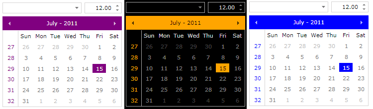
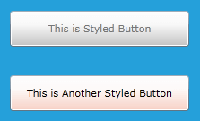
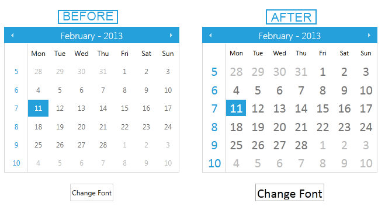

<style>
.theme-palette-color {
	width:20px;
	height:20px;
	margin: auto;
	border: 1px solid black;
}
</style>

# Windows8 and Windows8Touch Themes

This article will show you how to easily modify `Windows8` and `Windows8Touch` themes and how to change the font of your application at runtime.

Jump to the following topics to learn about the specifics of the theme's palette and features.

* [Windows8 and Windows8Touch Default Theme Colors](#windows8-and-windows8touch-default-theme-colors)
* [Changing Palette Colors](#changing-palette-colors)
* [Changing Font Properties](#changing-font-properties)
* [Changing Opacity](#changing-opacity)

## Windows8 and Windows8Touch Default Theme Colors

The Windows8 has one color variation, but it is designed to be easily modified via the exposed colors in the theme palette. The default values of the brushes in the theme are listed below:

|Color name|Hex code||
|----------|-----------|---|
|MainColor|#FFFFFFFF|<div class="theme-palette-color" style="background: #FFFFFF"></div>|
|BasicColor|#FFD6D4D4|<div class="theme-palette-color" style="background: #D6D4D4"></div>|
|MarkerColor|#FF000000|<div class="theme-palette-color" style="background: #000000"></div>|
|ValidationColor|#FFDE3914|<div class="theme-palette-color" style="background: #DE3914"></div>|
|AccentColor|#FF25A0DA|<div class="theme-palette-color" style="background: #25A0DA"></div>|
|StrongColor|#FF767676|<div class="theme-palette-color" style="background: #767676"></div>|

The same is with Windows8Touch:

|Color name|Hex code||
|----------|-----------|---|
|MainColor|#FFFFFFFF|<div class="theme-palette-color" style="background: #FFFFFF"></div>|
|ValidationColor|#FFE23907|<div class="theme-palette-color" style="background: #E23907"></div>|
|AccentColor|#FF26A0DA|<div class="theme-palette-color" style="background: #26A0DA"></div>|
|EffectHighColor|#FFFFFFFF|<div class="theme-palette-color" style="background: #FFFFFF"></div>|
|EffectLowColor|#FFE1E1E1|<div class="theme-palette-color" style="background: #E1E1E1"></div>|
|HighColor|#FF767676|<div class="theme-palette-color" style="background: #767676"></div>|
|InvertedColor|#FF000000|<div class="theme-palette-color" style="background: #000000"></div>|
|InvertedForegroundColor|#FFFFFFFF|<div class="theme-palette-color" style="background: #FFFFFF"></div>|
|LowColor|#FFE9E9E9|<div class="theme-palette-color" style="background: #E9E9E9"></div>|
|MainForegroundColor|#FF000000|<div class="theme-palette-color" style="background: #000000"></div>|
|MediumColor|#FFCCCCCC|<div class="theme-palette-color" style="background: #CCCCCC"></div>|

## Changing Palette Colors

The Windows8 and Windows8Touch themes provide dynamic change of the palette colors responsible for the brushes used in our controls. Their defaults are stated above. This mechanism is used to modify the color variation of the theme. 

The general naming convention is: `Windows8Palette.Palette.[name]Color` is responsible for `[name]Brush` – e.g. `Windows8Palette.Palette.AccentColor` sets the color for `telerik:Windows8Resource ResourceKey=AccentBrush`. The same is applicable for the Windows8Touch theme as well.

Changing the colors can be achieved in code behind.

__Changing the palette's default colors in code-behind__

```C#
	Windows8Palette.Palette.MainColor = Colors.Black;
	Windows8Palette.Palette.AccentColor = Colors.Orange;
	Windows8Palette.Palette.BasicColor = Colors.DarkGray;
	Windows8Palette.Palette.StrongColor = Colors.Gray;
	Windows8Palette.Palette.MarkerColor = Colors.LightGray;
	Windows8Palette.Palette.ValidationColor = Colors.Red;
	...
	
	Windows8TouchPalette.Palette.MainColor = Colors.Black;
	Windows8TouchPalette.Palette.AccentColor = Colors.Orange;
	Windows8TouchPalette.Palette.ValidationColor = Colors.Red;
	Windows8TouchPalette.Palette.EffectHighColor = Colors.Yellow;
	Windows8TouchPalette.Palette.EffectLowColor = Colors.Orange;
	...
```

Figure 1: Some of the possible looks you will be able to easily achieve.


__Using the brush resources in XAML__

```XAML
	<UserControl x:Class="Windows8ThemeColors.MainPage"
	             xmlns="http://schemas.microsoft.com/winfx/2006/xaml/presentation" 
	             xmlns:x="http://schemas.microsoft.com/winfx/2006/xaml"		
	             xmlns:telerik="http://schemas.telerik.com/2008/xaml/presentation">
	  <Grid x:Name="LayoutRoot" Background="{telerik:Windows8Resource ResourceKey=AccentBrush}">
	        <Grid.RowDefinitions>
	            <RowDefinition Height="*"/>
	            <RowDefinition Height="*"/>
	        </Grid.RowDefinitions>
	        
	        <Button Width="200" Height="40" 
	                Background="{telerik:Windows8Resource ResourceKey=MarkerBrush}" 
	                Foreground="{telerik:Windows8Resource ResourceKey=StrongBrush}" 
	                Content="This is Styled Button"/>
	        
	        <Button Grid.Row="1" Width="200" Height="40" 
	                Background="{telerik:Windows8TouchResource ResourceKey=ValidationBrush}" 
	                Foreground="{telerik:Windows8TouchResource ResourceKey=InvertedBrush}" 
	                Content="This is Another Styled Button"/>
	    </Grid>
	</UserControl>
```

__Result of the used resources__



## Changing Font Properties

When using any of these themes you can dynamically change the `FontSize` and `FontFamily` properties of all components in the application the same way as you do in all other [Available Themes]() which support ThemePalette.

Those properties are public so you can easily modify them at one single point. The property for the most commonly used FontSize in both themes is named FontSize and the property for most commonly used FontFamily resource is named FontFamily and it is set to `Segoe UI`. Bigger FontSizes are used for headers and footers while smaller FontSizes are used for complex controls such as RibbonView, Gauge, etc. 

The following example, shown after the note below, shows these resources and their default values for the  __Windows8Theme__. You can modify each of them based on your needs.

>important When you change these resources, you should ensure that the __Windows8ResourceDictionary__ / __Windows8TouchResourceDictionary__ is merged to App.xaml in the following way:


```XAML
	<Application.Resources>
	    <ResourceDictionary>
	        <ResourceDictionary.MergedDictionaries>
	            <telerik:Windows8ResourceDictionary/>
	            <telerik:Windows8TouchResourceDictionary/>
	        </ResourceDictionary.MergedDictionaries>
	    </ResourceDictionary>
	</Application.Resources>
```

     

__Setting the FontSize and FontFamily properties of the themes' palettes__

```C#
	//Windows8 Resources
	Windows8Palette.Palette.FontSizeXS = 10;
	Windows8Palette.Palette.FontSizeS = 11;
	Windows8Palette.Palette.FontSize = 12;
	Windows8Palette.Palette.FontSizeL = 14;
	Windows8Palette.Palette.FontSizeXL = 16;
	Windows8Palette.Palette.FontSizeXXL = 19;
	Windows8Palette.Palette.FontSizeXXXL = 24;
	Windows8Palette.Palette.FontFamily = new FontFamily("Segoe UI");
	Windows8Palette.Palette.FontFamilyLight = new FontFamily("Segoe UI Light");
	Windows8Palette.Palette.FontFamilyStrong = new FontFamily("Segoe UI Semibold");
	
	//Windows8Touch resources
	Windows8TouchPalette.Palette.FontSizeS = 10;
	Windows8TouchPalette.Palette.FontSize = 12;
	Windows8TouchPalette.Palette.FontSizeL = 15;
	Windows8TouchPalette.Palette.FontSizeXL = 20;
	Windows8TouchPalette.Palette.FontSizeXXL = 24;
	Windows8TouchPalette.Palette.FontFamily = new FontFamily("Segoe UI");
	Windows8TouchPalette.Palette.FontFamilyLight = new FontFamily("Segoe UI Light");
	Windows8TouchPalette.Palette.FontFamilyStrong = new FontFamily("Segoe UI Semibold");
```

This example shows how you can increase the __FontSize__ of a __RadCalendar__ with the click of a button.        


```XAML
	<Grid>
	    <Grid.RowDefinitions>
	        <RowDefinition Height="*"/>
	        <RowDefinition Height="60"/>
	    </Grid.RowDefinitions>
	    <telerik:RadCalendar x:Name="Calendar" Width="300" Height="250"/>
	    <telerik:RadButton x:Name="BtnChangeFontSize" Grid.Row="1" Height="30" HorizontalAlignment="Center" Content="Change Font" Click="BtnChangeFontSize_Click_1"/>
	</Grid>
```


```C#
	public MainPage()
	{
	    StyleManager.ApplicationTheme = new Windows8Theme();
	    InitializeComponent();
	}
	
	private void BtnChangeFontSize_Click_1(object sender, RoutedEventArgs e)
	{
	    Windows8Palette.Palette.FontSize = 22;
	    Windows8Palette.Palette.FontFamily = new FontFamily("Calibri");
	}
```
        
__Result of clicking the button__



## Changing Opacity 

If you need to change the opacity of the disabled elements, you can now easily do so by using the `DisabledOpacity` property of the `Windows8Palette`. Its default value is __0.5__. 

__Changing the opacity__		
```C#
	Windows8Palette.Palette.DisabledOpacity = 0.2;
```
```VB.NET
	Windows8Palette.Palette.DisabledOpacity = 0.2
```

## See Also

 * [Setting a Theme (Using  Implicit Styles)]()
