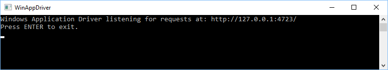
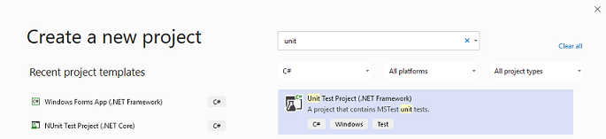
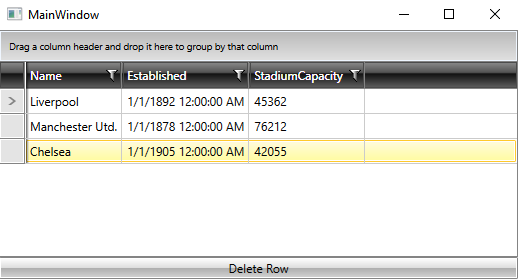
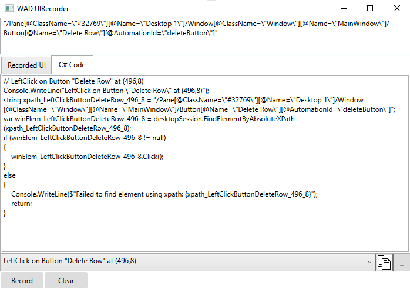

# Getting Started

This article will guide you through the creation of a **WinAppDriver** test.

1\. Run **WinAppDriver.exe** from the installation directory (C:\Program Files (x86)\Windows Application Driver) as an administrator and leave it running. Note the address the application is listening to as you will need it later.



2\. Add a **Unit Test** project to the solution of your test application or create a separate solution for it.



3\. Right-click the Unit Test project in **Solution Explorer** and select **Manage NuGet Packages…**. Install the latest stable **Appium.WebDriver** package.

4\. Create a **TestSession** class where you set the **AppiumOptions** as follows:

__Example 1: The TestSession class__

```C#
    public class TestSession
    {
        private const string WindowsApplicationDriverUrl = "http://127.0.0.1:4723";
        private const string TestApp = @"D:\TelerikControlsTest\bin\Debug\TelerikControlsTest.exe"; // replace with the actual location of the executable file of the application you want to test
     
        protected static WindowsDriver<WindowsElement> session;
        public static WindowsDriver<WindowsElement> desktopSession;
     
        public static void Setup(TestContext context)
        {
            // Launch RadGridView test application if it is not yet launched
            if (session == null || desktopSession == null)
            {
                TearDown();
     
                // Create a new session to bring up the test application
                AppiumOptions options = new AppiumOptions();
                options.AddAdditionalCapability("app", TestApp);
                options.AddAdditionalCapability("deviceName", "WindowsPC");
                options.AddAdditionalCapability("platformName", "Windows");
     
                session = new WindowsDriver<WindowsElement>(new Uri(WindowsApplicationDriverUrl), options);
                Assert.IsNotNull(session);
                Assert.IsNotNull(session.SessionId);
     
                // Set implicit timeout to 1.5 seconds to make element search to retry every 5- ms for at most three times
                session.Manage().Timeouts().ImplicitWait = TimeSpan.FromSeconds(1.5);
     
                AppiumOptions optionsDesktop = new AppiumOptions();
                optionsDesktop.AddAdditionalCapability("app", "Root");
                optionsDesktop.AddAdditionalCapability("deviceName", "WindowsPC");
                optionsDesktop.AddAdditionalCapability("ms:experimental-webdriver", true);
                desktopSession = new WindowsDriver<WindowsElement>(new Uri(WindowsApplicationDriverUrl), optionsDesktop);
            }
        }
     
        public static void TearDown()
        {
            if (session != null)
            {
                session.Quit();
                session = null;
            }
     
            if (desktopSession != null)
            {
                desktopSession.Quit();
                desktopSession = null;
            }
        }
    }
```

Here is the place to mention that our sample test application consists of the **RadGridView** setup from its respective [Getting Started]() article with the addition of a **RadButton** which deletes the currently selected item.



__Example 2: The test application setup__

```XAML
    <Grid>
        <Grid.RowDefinitions>
            <RowDefinition Height="\*" />
            <RowDefinition Height="Auto" />
        </Grid.RowDefinitions>
        <Grid.DataContext>
            <local:MyViewModel />
        </Grid.DataContext>
        <telerik:RadGridView x:Name="gridView" ItemsSource="{Binding Clubs}"/>
        <telerik:RadButton x:Name="deleteButton" Grid.Row="1" Content="Delete Row" Click="OnDeleteButtonClick" />
    </Grid>
```

__Example 3: The delete button click handler__

```C#
    private void OnDeleteButtonClick(object sender, RoutedEventArgs e)
    {
        this.gridView.PendingCommands.Add(RadGridViewCommands.SelectCurrentItem);
        this.gridView.PendingCommands.Add(RadGridViewCommands.Delete);
        this.gridView.ExecutePendingCommand();
    }
```

5\. Rename the auto-generated **UnitTest1** class to **TelerikControlsScenarios** which should inherit from **TestSession**.

6\. Next, create the following methods and fields for the class.

__Example 4: The TelerikControlsScenarios class__

```C#
    [TestClass]
    public class TelerikControlsScenarios : TestSession
    {
        private static WindowsElement gridView;
        private static WindowsElement button;

        [ClassInitialize]
        public static void ClassInitialize(TestContext context)
        {
            Setup(context);

            gridView = session.FindElementByAccessibilityId("gridView");
            button = session.FindElementByAccessibilityId("deleteButton");
        }

        [TestMethod]
        public void DeleteGridRow()
        {
        }

        [ClassCleanup]
        public static void ClassCleanup()
        {
            TearDown();
        }
    }
```

There are two general ways to write tests:

* Using the [WinAppDriver UI Recorder](https://github.com/Microsoft/WinAppDriver/wiki/WinAppDriver-UI-Recorder) tool to record tests at runtime
* Writing tests from scratch using the [inspect.exe](https://docs.microsoft.com/en-us/windows/win32/winauto/inspect-objects) tool for locating elements in your application

7\. Launch the **WinAppDriver UI Recorder** and click **Record**. Hover over the **deleteButton** and wait until it starts flashing blue. The Recorder's status bar will change its text from **Active** to **XPath Ready**. Once you have recorded a sequence of steps you wish to reproduce, click **Pause** within the recorder. You can open the actions selector to make certain that all UI actions have been recorded.



All you need to do now is to click the **Generate and copy C# code to Clipboard** button to copy the code for all recorded actions. You can then paste this code into the **DeleteGridRow** method and then extend it to test the expected functionality.

Alternatively, you can write the test from scratch.

__Example 5: Defining the DeleteGridRow method__

```C#
    [TestMethod]
    public void DeleteGridRow()
    {
        var gridRowElements = gridView.FindElementsByClassName(@"GridViewRow").ToList();
        Assert.IsTrue(gridRowElements.Count == 3, "Expected rows: 3, Actual rows: " + gridRowElements.Count);

        gridView.Click();

        desktopSession.FindElementByName("Delete Row").Click();

        gridRowElements = gridView.FindElementsByClassName(@"GridViewRow").ToList();
        Assert.IsTrue(gridRowElements.Count == 2, "Expected rows: 2, Actual rows: " + gridRowElements.Count);
    }
```

8\. Right-click the Unit Test project in Visual Studio and click **Run Tests**. The test will launch your application, repeat the recorded steps, and close the application afterwards. All test activity is logged in the WinAppDriver console.

## See Also

* [Overview]()
* [Requirements]()
