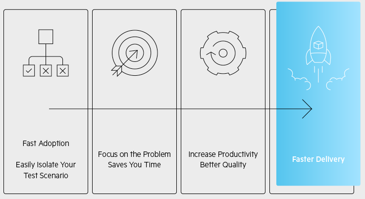

# Unit Testing with JustMock  

Unit Testing is a known practice in software development for validating that a unit of code (e.g. method) will behave as intended and the tested code will produce the same result every time the test is executed. This is one of the essential methods for improving application's quality.

Sometimes this is easier said than done due to different dependencies in the method (unit of code) and how they are controlled. Such dependencies include arguments, using the results of calling other methods, creation of new class instances and working with them, etc. Anything that is not the actual logic of the method under test should be strictly controlled. This allows the method under test to be tested in complete isolation from its dependencies. Mocking is a process employed in unit testing to simulate external dependencies.

Creating mock objects and managing them manually is usually time-consuming. To boost your productivity and focus on the important things, a good option is to use a mocking framework. Telerik [JustMock](https://www.telerik.com/products/mocking.aspx) is the fastest, most flexible and complete mocking solution for crafting unit tests. It allows you to isolate easily a unit of code and verify the testing scenario that you need. 

## How is JustMock Useful for Me?

You could create and maintain the mock objects by yourself, but this is time consuming and unproductive approach. A mocking tool like Telerik JustMock allows you to focus on the logic that matters and needs to be verified and lets you forget about the mocking details. The mock objects will be created automatically in memory when the tests run based on few lines of code in the unit test. There are no “physical” mock objects that have to be maintained as your project changes.

## What Can Be Mocked?

JustMock allows you to mock literally everything from **interfaces**, **virtual** and **abstract methods** and **properties** to **sealed classes**, **non-virtual methods** and **properties**, **static** (**classes**, **methods** and **properties**), **extension methods**, **LINQ queries**, **Delegates**, **Generics**, **Local Functions**, **Database calls**, even members from **mscorlib** like **DateTime**, **File**, **FileInfo**, and many more. All these can be mocked without a single change of your production code.

For the full list of what is supported please visit the Telerik [JustMock](https://www.telerik.com/products/mocking.aspx) product overview page.

## Next Steps

If you have the Telerik UI for WPF controls running in your project, you may want to explore how JustMock can be integrated in your unit testing project. Below you can find what are the requirements of using JustMock and how to test your WPF project:

* [Requirements]()
* [Unit Testing Tutorial with JustMock]()

## See Also  
* [Requirements]()
* [Unit Testing Tutorial with JustMock]()
