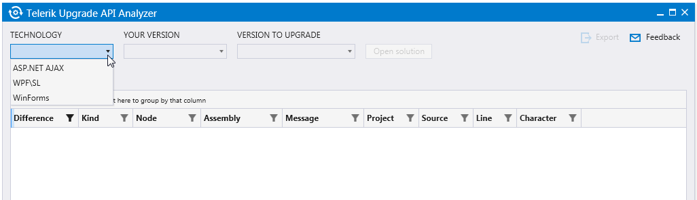

# How to Use the Upgrade API Analyzer 

With every release of UI for Silverlight we’re trying to avoid introducing changes that affect the public API. However, sometimes such changes are needed for the product to evolve. We understand that this could cause issues when upgrading your app to the latest release. The main purpose of the __Telerik Upgrade API Analyzer__ is to make the upgrade process easier by comparing both versions and determining the problematic areas.

Telerik Upgrade API Analyzer could be used when upgrading your desktop application such as WPF or WinForms as well as your Silverlight or ASP.NET Web application.

Currently the supported versions include the releases from Q1 2015 up to Q1 2016. Additional releases could be added per request. 

## Why Do You Need This?
           
In short, the __Telerik API Analyzer__ tool will help you with the upgrade of the Telerik controls to a newer version. It thoroughly analyzes the code of your project and provides a list of the changes found between the currently used release and the release you’re planning to upgrade to. Such changes could include obsolete and removed methods and properties as well as modified methods and properties. Additionally, the tool points out the exact piece of code that is affected by a certain change and in cases that involve an obsolete method/property, the tool gives suggestions of how to modify that code.                      

>At this stage, Upgrade API Analyzer checks only the C# code of your application. 

## Where Do You Get Telerik Upgrade API Analyzer?

**Upgrade API Analyzer** is a **ClickOnce** application and you can download the installation file directly from [our site](http://demos.telerik.com/UpgradeAPIAnalyzer/setup.exe).

>The tool relies on **.NET Framework 4.5.2** and in case you haven’t got it on your machine yet, the setup of the tool will install it automatically.

## How Do You Use It?

Running the __Upgrade API Analyzer__ will lead to the screen shown in __Figure 1__.

#### __Figure 1: Initial screen of Upgrade API Analyzer__

All you need to do is:

1. Choose the platform.

2. Select the current version of Telerik assemblies you are using.

3. Select the version you would like to upgrade to. 

	The three comboboxes are populated on the fly depending on your choices, so you should select the desired values consecutively.

4. Open the solution you’re planning to upgrade.  

The tool starts automatically analyzing the code as shown in __Figure 2__ and will list all the changes found between both versions as demonstrated in __Figure 3__. 

#### __Figure 2: The tool starts analyzing as soon as you open a solution__

#### __Figure 3: Upgrade API Analyzer lists the found differences__

 
__Upgrade API Analyzer__ provides a detailed list of the found differences between both versions in a convenient way for reviewing.  The tool uses [RadGridView for WPF](http://docs.telerik.com/devtools/wpf/controls/radgridview/overview2.html) to present the results, so you can benefit from its features such as sorting, filtering and resizing columns. 

For each of the changes, you can see the following information:

* __Difference__: It could be Obsolete, Deleted and Modified.

By default, the Modified changes are not shown as they actually indicate that there is an internal change in the method/class, which does not affect its function as a whole and does not require any action from your side. Still, you could see the __Modified__ changes by updating the Filter of the __Difference__ column as shown in __Figure 4__.

#### __Figure 4: Displaying all the changes found including the Modified ones.__

* __Kind__: It could be Type, Property, Method, and Field.
* __Node__: The name of the Type/Property/Method/Field.
* __Assembly__: The assembly where the change is found.
* __Message__: Presents a kind of “What to do now?” message; gives additional information on what action should be taken regarding the concrete change in order to make the upgrade flawless.
* __Project__: The project where the change resides.
* __Source__: The file in the project where the change is found.
* __Line__: The exact line in the source file.
* __Character__: The character in the previously set line.

Additionally, __Upgrade API Analyzer__ provides the option to save the gathered information for a later moment through the __Export button__ in the upper right corner, as shown in __Figure 5__. The data will be arranged and exported to a HTML document. The exported information include the currently visible (filtered) data in the grid. 

#### __Figure 6: API Analyzer provides export to a HTML document__

## Do You Have a Question?

__Upgrade API Analyzer__ is a subject of current and future development and we’d appreciate any feedback you might have regarding the tool. Let us know what you’d expect the tool to do and whether you’ve experienced any issues with it. Your feedback will help us prioritize our plans for adding the most requested features.

Please send us your comments either through the Feedback link inside __API Analyzer__ or directly at [UpgradeApiAnalyzer@telerik.com](mailto:UpgradeApiAnalyzer@telerik.com).

Additionally, please review the Frequently Asked Questions section in the [API Analyzer Helps Upgrading Telerik Projects](http://www.telerik.com/blogs/api-analyzer-helps-upgrading-telerik-projects) blog post.
