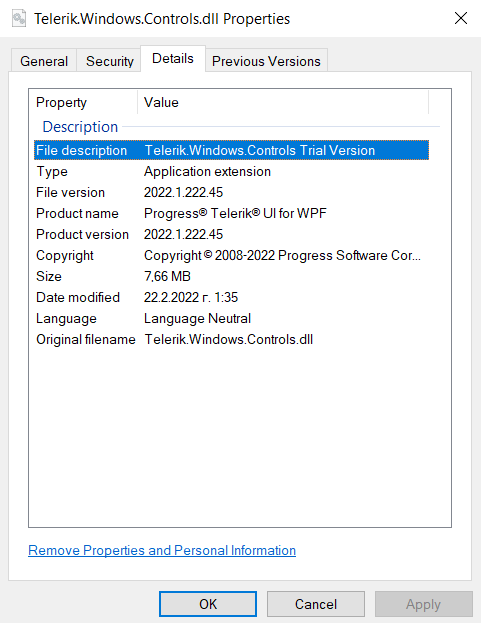

# Upgrading Telerik UI for WPF Trial to Developer License

This article describes how to upgrade your Telerik references from trial to developer version.

To upgrade you will need to replace the Telerik dlls referenced in the project and setup a license key. This can happen using any of the available [installation approaches](). 

1. Install the new version of the Telerik UI for WPF product. 
	
	* If you use assembly references in the project, you can [use the .msi installer]() or the [.zip archive with the dlls](). You can find these on the [Telerik UI for WPF download page](https://www.telerik.com/account/product-download?product=RCWPF).
	
	* If you are [using NuGet packages](), you can replace the Telerik NuGet packages that ends with `.Trial` with the ones which doesn't contain the trial postfix. For example:
	
		#### __[XML] Trial NuGet package__
		{{region installation-upgrading-from-trial-to-developer-license-0}}
			<ItemGroup>
				<PackageReference Include="Telerik.Windows.Controls.for.Wpf.Xaml.Trial" Version="2025.1.212" />
			</ItemGroup>
		{{endregion}}
	
		#### __[XML] Developer NuGet package__
		{{region installation-upgrading-from-trial-to-developer-license-1}}
			<ItemGroup>
				<PackageReference Include="Telerik.Windows.Controls.for.Wpf.Xaml" Version="2025.1.212" />
			</ItemGroup>
		{{endregion}}
	
	* If you prefer to use the __Visual Studio Extension__, you can use the automatic [Upgrade Wizard]() which will allow you to download the developer licensed dlls and also to install a license key.

2. [Download and install a license key]() in the Telerik's folder in the AppData directory or in the project's folder.

3. If you hit any errors related to missing Telerik references, make sure that all required Telerik dlls (for the used UI components) are referenced, and also that all referenced Telerik dlls use the same version (ex: 2025.1.212). Additionally, you can delete the `bin` and `obj` folders of the project, and then Clean and Rebuild the project, in order to ensure that any project cache is cleaned.

## Checking the Assemblies' Version

To check what type of license the binaries you're using have, you can check the **Properties** of the **Telerik.Windows.Controls.dll** file. **Only this file** contains information for the dlls version in its metadata. To get this information use the following steps:

1. Right click on the Telerik.Windows.Controls.dll file and select the __Properties__ options from the context menu. 
2. Go to the __Details__ tab in the Properties window.
3. Check the __File description__ attribute. It will contain the **"Trial Version"** suffix if the dlls are trial. Otherwise, there will be only the dll's name. 

__Telerik.Windows.Controls.dll Properties__  

          
If your dll files contain this suffix in the description then they are of the trial version and you have to replace them with the licensed assemblies.
            
## See Also  

 * [Controls Dependencies]()
