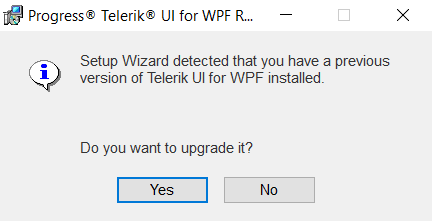
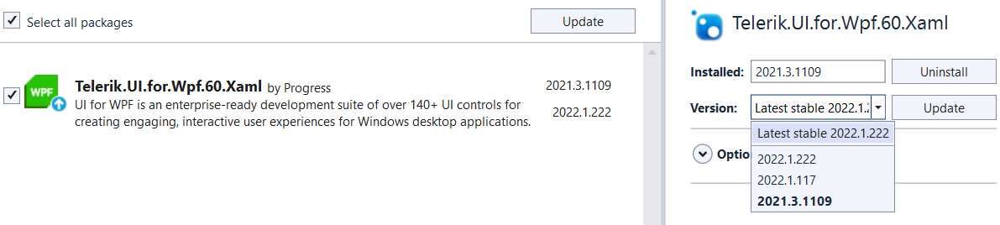

# Upgrading Telerik UI Trial to Telerik UI Developer License or Newer Version

This article will guide you through the process of upgrading your Telerik UI Trial to a Developer license or a newer version.

## Automatic Upgrade to a Newer Version of UI for WPF

To automatically upgrade to the newer version, you can utilize the __Progress Telerik UI for WPF Extension__ wizards. You can find more information in the respective articles:

* [Latest Version Acquirer Tool]()

* [Project Upgrade Wizard]()

## Upgrade to Newer Version or Other License of UI for WPF

In order to manually upgrade your controls to a newer version of the suite, you need to perform the following steps:

* Download the installation method you prefer:
             	  
	* [MSI file for automatic installation]()

	* [ZIP file for manual (advanced) installation]()

* If the upgrade is major (i.e. from R2 2021 to R3 2021), check the [Release History](http://www.telerik.com/products/wpf/whats-new.aspx) to see if there are any major changes. You can also run the [API Analyzer Tool]() to check for any breaking changes.

* Back up your application.

* Manually update the Telerik references in your Visual Studio project to point to the new DLLs or use the [References Resolver](https://marketplace.visualstudio.com/items?itemName=DeyanYosifov.ReferencesResolverExtension) extension to achieve this automatically.

* Clean the solution.

* Recompile your project.

* Run the project.

## MSI Installation

If you have installed the trial version of UI for WPF and try to install the developer version of the same release, you will receive the following message:

In this case, you need to remove the trial version first.

Alternatively, if a previous version is detected, you will observe the following prompt:

>If you agree to this prompt and the newly-installed version is a service pack, it will be installed in the same folder as the major release.

## Checking the Assemblies' Version

To check what type of license the binaries you're using have, you can check the **Properties** of the **Telerik.Windows.Controls.dll** file. **Only this file** contains information for the dlls version in its metadata. To get this information use the following steps:

1. Right click on the Telerik.Windows.Controls.dll file and select the __Properties__ options from the context menu. 
2. Go to the __Details__ tab in the Properties window.
3. Check the __File description__ attribute. It will contain the **"Trial Version"** suffix if the dlls are Trial. Otherwise, there will be only the dll's name. 

#### Figure 1: Telerik.Windows.Controls.dll Properties

          
If your dll files contain this suffix in the description then they are of the Trial version and you have to replace them with Development assemblies.

## Updating NuGet Packages

If you're using the Telerik NuGet packages, you can update them via the **NuGet Package Manager**:

#### Figure 2: Updating NuGet Packages

If you're upgrading from a Trial version, you will need to first remove the packages with the **.Trial** suffix before installing the Development packages (which lack this suffix). Alternatively, you can edit the project file and remove the suffix from the NuGet **PackageReferences**.
            
## See Also  
 * [Controls Dependencies]()
