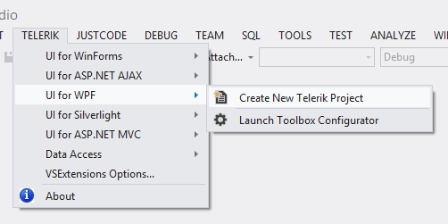
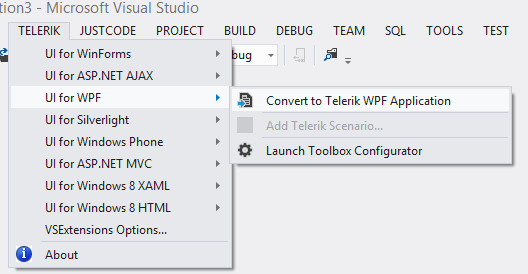
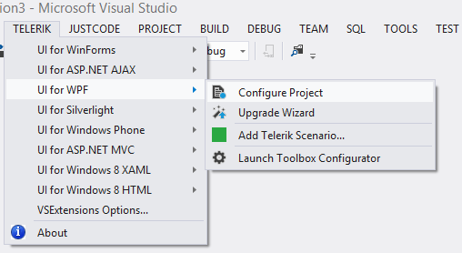

# Overview

##

__Visual Studio Extensions__ for __UI for WPF__ aim to help developers when creating WPF Application with __Telerik UI for WPF__.

The extensions handle the following major points in the development with __UI for WPF__:

* __Project creation, conversion and configuration__ – reference management.

* __Project Upgrade__ - upgrading __UI for WPF__ to a new version.

* __Common scenario page creation__ - aid creating pages with basic scenarios in the usage of __UI for WPF.__

* __Toolbox configuration__ – select what version of Telerik UI to be populated in the Toolbox.

__Visual Studio Extensions__ for __UI for WPF__ are distributed with the __UI for WPF__ installer. They can be downloaded and installed as separate product from the [Visual Studio Gallery](http://visualstudiogallery.msdn.microsoft.com/) for Visual Studio 2012 and later. The extensions support Visual Studio 2012, 2013, 2015 and 2017, handling .NET 4.0+ applications.

The __Visual Studio Extensions__ can be accessed through the __Telerik | UI for WPF__ menu which has different menu items depending on the selected project in Visual Studio. The extensions can be accessed through the context menu of a WPF Application as well.

__No selected project in Visual Studio__

__Selected project in Visual Studio is Standard WPF Application__

__Selected project in Visual Studio is Telerik WPF Application__

When installed, the extensions add several project templates to the New Project dialog of Visual Studio:

>These are available in the language specific nodes of the dialog as well. New Project dialog contains __Telerik WPF Application__ under both CSharp\Windows and Visual Basic\ Windows nodes.
