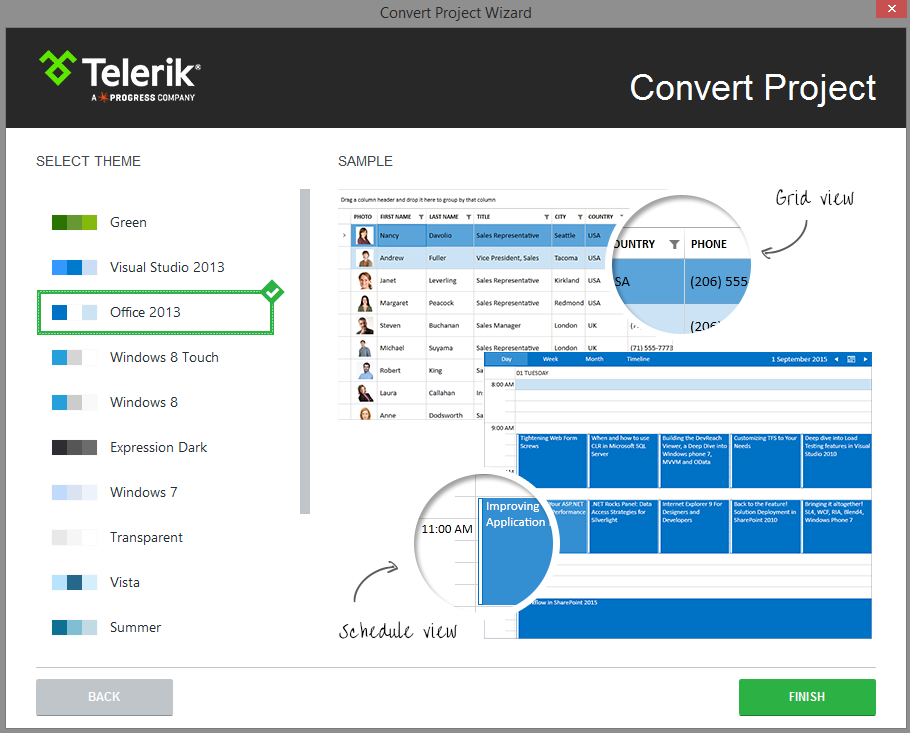

# Convert Project

__Convert to Telerik WPF Application__

Telerik Visual Studio extensions Convert Project Wizard could be accessed through the Telerik menu when you need to convert an existing WPF application to a Telerik WPF application:

The wizard could be also reached through the context menu counterparts accessed by right clicking on the project you want to convert. 

The Convert Project Wizard lets you tune your project's use of UI for WPF.

The wizard’s first page lets you:
        

* Select a Telerik UI version from the list of versions detected on your system

* Download the latest versions available on our website using the __GET LATEST__ button

* Specify which assemblies your project would use. When selecting a UI for WPF assembly all dependent controls are selected automatically and vice-versa.

>GET LATEST button is available only when there is a newer version released on our web site.

>If you prefer the Telerik assemblies to be copied into your solution folder, the **Copy referenced assemblies to solution and source control** option could be selected *only* into the [Visual Studio Extensions Options]().
  
>The Convert Project Wizard’s second page is only available if you use theming based on implicit styles. ([more information]())        

Through the Convert Project Wizard’s second page you can:

      

* Select which theme will be applied to your project. Check the content of each theme or see the preview of it when select it into the Convert Project:
            

When you click the Finish button:
        

* The selected assembly references get added to your project
          

* A default application-wide theme gets set if you use theming based on implicit styles.
          

# See Also

 * [Automatic Dependency resolving]()

 * [Upgrading to a new UI for WPF distribution]()

 * [Latest Version Acquirer Tool]()

 * [Setting a Theme (Using  Implicit Styles)]()
