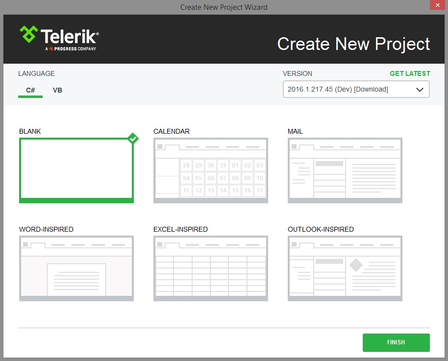

# Create Project

With the new Visual Studio Extensions for WPF you can quickly create an application pre-configured to use Telerik UI for WPF. The fastest way to have such a project is using the Visual Studio __New Project Wizard__. Under the __Telerik__ node there is a new node – __Windows__, where four project templates exist: 

For convenience the same project templates could be found under the __Visual C# -> Windows__ and __Visual Basic -> Windows__ nodes. 

After you click the __OK__ button, you get the Create New Project Wizard, provided by the Telerik UI for WPF Visual Studio Extensions. The wizard detects all the installed __Use Implicit Styles__ version of UI for WPF and lists them in a combobox. You can select a version which you want to be applied to your project. You can select what type of project to be created: Standard, Word-Inspired, Excel-Inspired or Outlook-Inspired. You can access the Create New Project Wizard through the Telerik menu when you need to create a new Telerik WPF application:

The Create New Project Wizard lets you:

        
* Select a Telerik UI version from the list of versions detected on your system

* Download the latest versions available on our website using the __GET LATEST__ button

* Specify which assemblies your project would use. When selecting a UI for WPF assembly all dependent controls are selected automatically and vice-versa.

>GET LATEST button is available only when there is a newer version released on our web site.

>If you prefer the Telerik assemblies to be copied into your solution folder, the **Copy referenced assemblies to solution and source control** option could be selected *only* into the [Visual Studio Extensions Options]().

When you click the Finish button:

* The selected assembly references get added to your project
          

* A default application-wide theme gets set if you use theming based on implicit styles.
          

# See Also

 * [Automatic Dependency Resolving]()

 * [Upgrade Project]()

 * [Download New Version]()

 * [Setting a Theme]()
