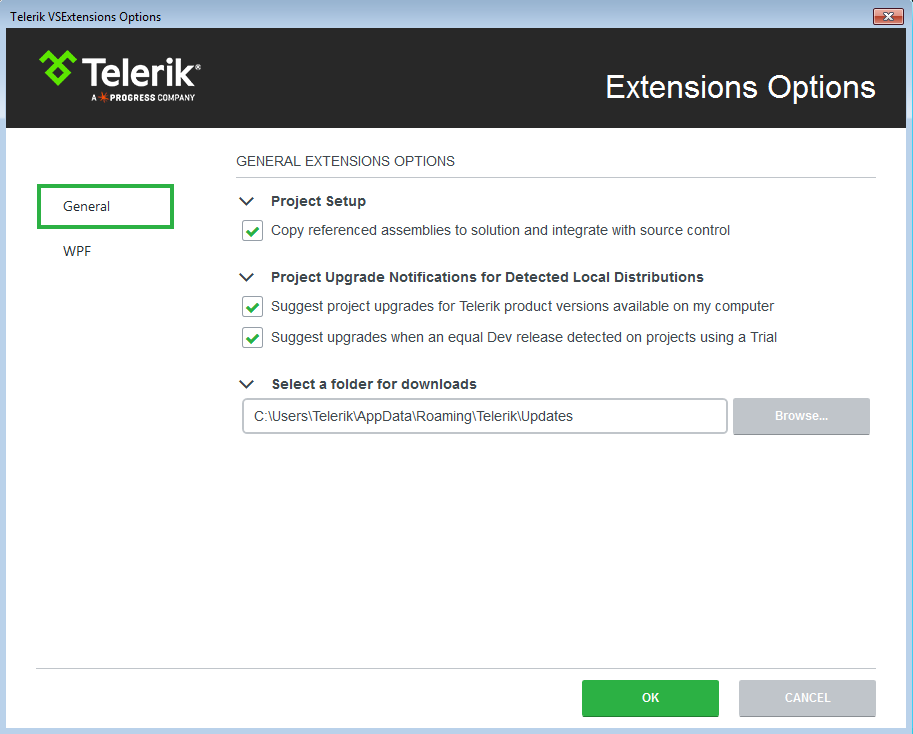

# Options

The __Visual Studio Extensions__ options dialog provides settings, so you can configure the Telerik Visual Studio Extensions to best suit your needs.

It can be accessed through the __Visual Studio | Telerik | VSExtensions Options…__

The __Options__ dialog contains two sets of options that affect the __UI for SilverlightWPF__.

The settings under the __General__ category affect all of the installed __Telerik Visual Studio Extensions__.

## Project setup

__Add referenced assemblies to solution and source control__ - Sets the default value for the __Add referenced assemblies to solution__ option in the Project Configuration Wizard__Add referenced assemblies to solution and source control__ - When enabled, the referenced assemblies will be copied to the solution when using Telerik wizards

        

## Project Upgrade Notifications for Detected Local Distributions

__Suggest project upgrades for Telerik product version available on my computer__ – When enabled, you will be prompted to upgrade upon opening a project, which is not using the latest version of Telerik UI installed on your system

__Suggest upgrades when an equal Dev release detected on projects using a Trial__– When enabled, you will be prompted to upgrade if a licensed version of UI for SilverlightWPF is available on your system, but the current project uses a trial version

## Other Notifications

__Notify me when a Telerik subscription I have is about to expire__ – When enabled, you will receive reminders if any of your subscriptions expire within the next month.
        

>You can benefit subscription reminders only if you have saved your credentials in the __[Latest Version Acquirer]()__ tool.
          

## Select a folder for downloads

Configures the path where the extensions look for and store distributions.
            

>Changing the folder path will not move existing folder contents from your previous path. Please, move your previous folder contents manually in case you still want to use them.
              

## Latest version retrieval

__Include internal builds in Latest Version update and retrieval__– When enabled, the __[Latest Version Acquirer]()__ tool will retrieve internal builds as well as official releases when checking for a new version.

## Notifications

__Show me a message when a newer version is available on [www.telerik.com](http://www.telerik.com) – When enabled, you will receive notifications if a new version of __UI for__ is available on the Telerik website.
