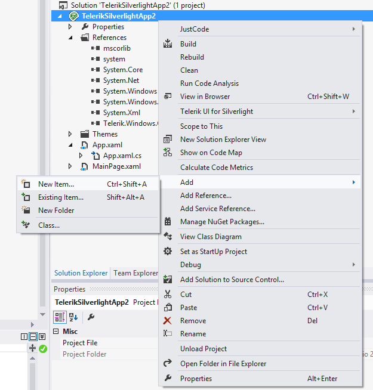
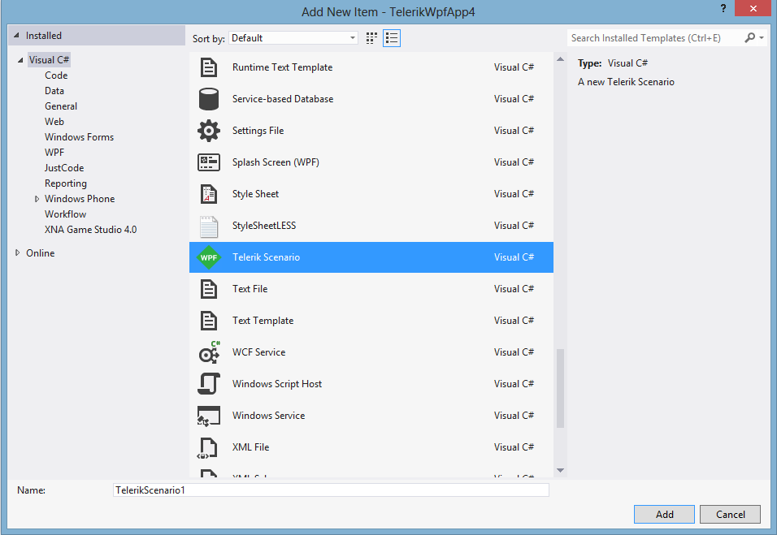
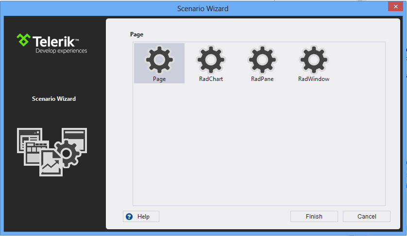
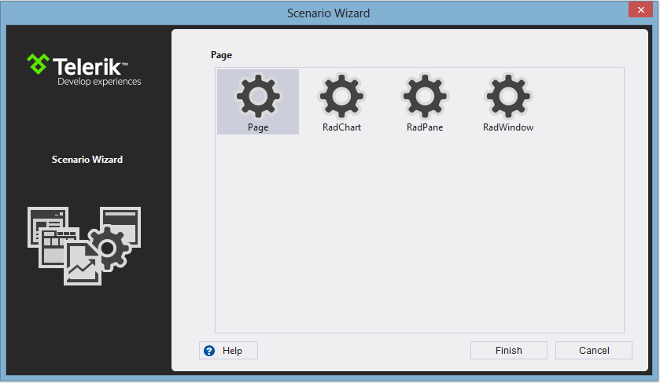

# Scenario Templates

## 

The Scenario templates’ purpose is to let you quickly start using UI for SilverlightWPF in your existing projects. You can use the following steps to use our Scenario templates.

1. Open the __Add New Item dialog__, just as you usually do when adding a new Item to your project and select the __Telerik Scenario__ Item template or use the __Add Telerik Scenario__ menu item
	
	
	
	

1. Click __Add__

	
	
	

1. Select a scenario in the __Telerik Scenario Wizard__ and click __Finish__

	
	
	

	>Currently there are three predefined scenarios: 
	
	* __Page__ – Creates a basic Page, ready to use with UI for SilverlightWPF
	
	* __RadWindow__ – Creates a new __RadWindow__ item. __RadWindow__ lets you create __Child__ and __Dialogs Windows__, which can have their appearance and content customized. 
	
	* __RadPane__ – Creates a new __RadPane__ item. __RadPane__ is the main content unit of the __RadDocking__ control.

	The result will be:
	
	
	
	
	
	* A new item will be added to your project, depending on your choice in the Scenario Wizard
	
	* All necessary references will be added to your project
