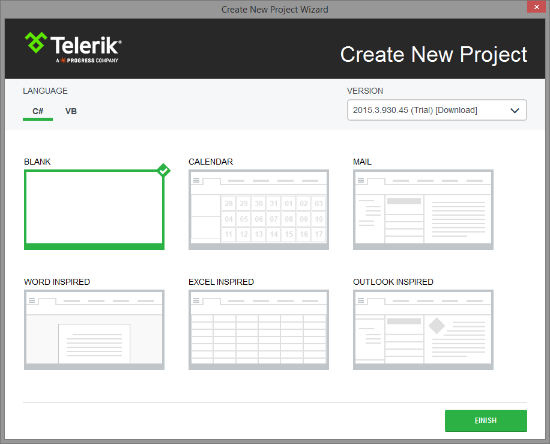
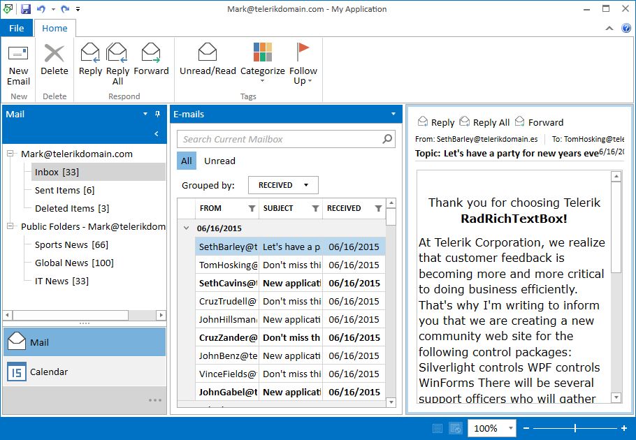
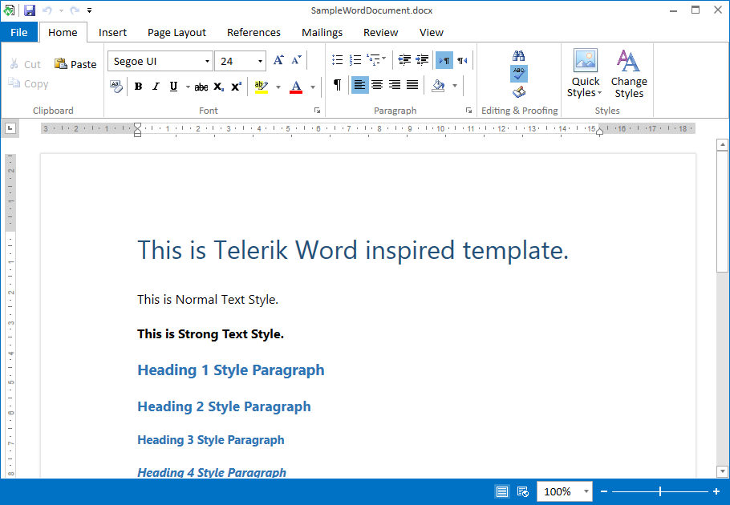
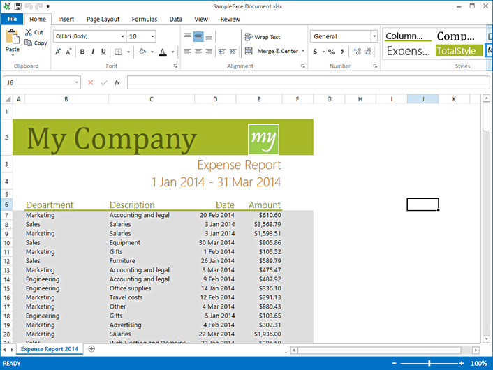

# Visual Studio Templates

With the official Q1 2015 release of __Telerik UI for WPF__ the __[Project Configuration Wizard]()__ provides few built in __Visual Studio Templates__. Now it is possible with just a few clicks to start building Windows inspired application. Currently you have the option to choose from the following templates: 

* [Outlook-Inspired Template](#outlook-inspired-template)

* [Word-Inspired Template](#word-inspired-template)

* [Excel-Inspired Template](#excel-inspired-template)

>All the templates are prepared with the __[Office 2013 theme]()__ and use __[Implicit Styles]()__.

In this article you will find more information on how to create a project from one of the available templates as well as more details regarding what controls each template contains.

## Getting Started

When creating new project, navigate to the __Choose project type__ and select the needed template as seen on Figure 1.

__Figure 1: Select template__

## Outlook-Inspired Template

The template uses variety of controls in order to provide the look and feel of MS Outlook. It is designed with MVVM in mind which is why most of the events that are required in achieving its functionality are passed to the ViewModel via __[EventToCommandBehavior]()__. There are a few scenarios which are not achievable via __EventToCommandBehavior__ and they are left in the code behind of the MainView. The template provides most of the important functionalities implemented, however some are left unimplemented as they are dependant on the custom application logic. The __Outlook-Inspired Template__ has been built using the following controls:

* RadRibbonWindow
* RadRichTextBoxRibbonUI
* RadRibbonButton
* RadRibbonSplitButton
* RadRibbonTab
* RadContextMenu
* RadRibbonComboBox
* RadDocking
* EventToCommandBehavior
* RadRichTextBox
* RadOutlookBar
* RadRadioButton
* RadBusyIndicator
* RadGridView
* RadRichTextBoxStatusBar

You can see how the template looks like on Figure 2.

__Figure 2: Outlook-Inspired Template__

## Word-Inspired Template

The __Word-Inspired Template__ implements Word-like editing experience represented with the __Telerik UI for WPF__ controls. It provides a complex integration of controls like __RadRibbonWindow__, __RadRibbonView__ and __RadRichTextBox__ in an already set up example. It also demonstrates the broad range of editing and formatting capabilities as well as built in specific features of these controls. In fact the __Word-Inspired Template__ is almost identical to the RadRichTextBox' TelerikEditor example in our __[WPF demos](http://demos.telerik.com/wpf/)__, however it have been visually improved in order to look like the MS Word.

__Figure 3: Word-Inspired Template__

## Excel-Inspired Template

The __Excel-Inspired Template__ implements Excel-like editing experience represented with the __Telerik UI for WPF__ controls. It provides a complex integration of controls like __RadRibbonWindow__, __RadRibbonView__ and __RadSpreadSheet__ in an already set up example. It also demonstrates the broad range of editing and formatting capabilities as well as built in specific features of these controls. In fact the __Word-Inspired Template__ is almost identical to the RadSpreadSheet' Theming example in our __[WPF demos](http://demos.telerik.com/wpf/)__, however it have been visually improved in order to look like the MS Word.

__Figure 4: Excel-Inspired Template__

# See Also

* [Project Configuration Wizard]()

* [Office 2013 Theme]()
