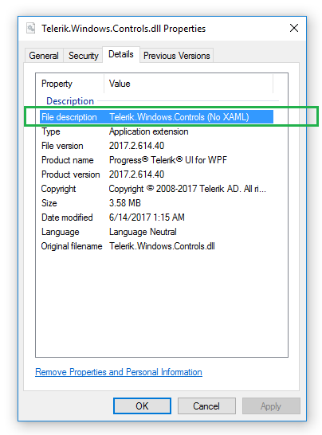

# Xaml vs. NoXaml

Telerik UI for {{ site.framework_name }} comes with two types of assemblies - Xaml and NoXaml. This artcile will describe the difference and help you to choose a version. 

Let's start with that both types of dlls contain the same source code. The only difference is that the Xaml assemblies embeds also all styles of the controls. 

## Assemblies location

The __Xaml__ dlls can be found in the __Telerik UI for {{ site.framework_name }} installation folder/Binaries/__

The __NoXaml__ dlls can be found in the __Telerik UI for {{ site.framework_name }} installation folder/Binaries.NoXaml/__

## Xaml assemblies

The Xaml dlls contains the same code as the NoXaml, but they hold also all the styles and templates of the UI controls, for all themes. This means that they are bigger in size compared to NoXaml.

Using Xaml dlls allows you to set up your project a bit easier and __change the controls UI theme very easiliy__ by setting a single property. Read more about this in the [Setting a Theme]() article.

## NoXaml assemblies

The NoXaml dlls has the same code as the Xaml, but they don't contain any styles and templates. This makes them __smaller in size__ compared to NoXaml, but they require a bit more effort to set up. You will need to reference additional theme dll and merge the ResourceDictionaries with the styles for each control dll. Read more about this in the [Setting a Theme]() article.

The benefit of using NoXaml is that you get a full __design-time support__ when a theme different than the default one (Office_Black) is used.

Because the NoXaml dlls apply the control styles implicitly, when you create a custom control deriving from a Telerik control you will need to create a custom style and base it on the default control style. For example a control deriving from RadCartesianChart should has a Style that targets the custom control and it is based on RadCartesianChartStyle. The same applies for any custom implict styles targeting Telerik controls. You need to base them on the default control style, otherwise it will be completely overridden and all setters and templates originally applied to the control will be lost. You can read more about this in the [Styling the Controls]() article.

## How to check the assemblies version

If the project assemblies are referenced from the Telerik UI for {{ site.framework_name }} installation folder, you can easily identify their version by checking their folder. */Binaries/* for the Xaml dlls and */Binaries.NoXaml/* for the NoXaml dlls.

Alternatively, you check the Properties of the Telerik.Windows.Controls.dll file. Only this file contains information for the dlls version in its metadata. To get this information use the following steps:

1. Right click on the Telerik.Windows.Controls.dll file and select the __Properties__ options from the context menu. 
2. Go to the __Details__ tab in the Properties window.
3. Check the __File description__ attribute. It should contain the Telerik.Windows.Controls + "(No XAML)" postfix if the dlls are NoXaml. Otherwise, there will be only the dll's name. 

#### Figure 1: Telerik.Windows.Controls.dll Properties

## See Also
* [Setting a Theme]()
* [Styling the Controls]()
* [Switching Custom Styles with Themes at Runtime]()
* [Switching Themes at Design-Time]()
