# RadDataBar

This tutorial will introduce the __RadDataBar__ control, part of the Telerik suite of XAML controls.	  

## Setting Up The Project

To begin, open Visual Studio and click on the Telerik menu option.  Under Rad Controls For Silverlight click on *Create New Telerik Project*.  Name your project, accept Silverlight 5 and in the* Project Configuration Wizard* dialog check DataVisualization (notice that the dependent references are automatically checked as well), as shown in figure 1.		

Figure 1
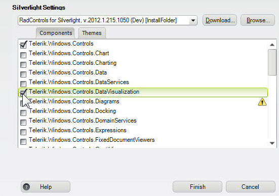

When you click ok, the necessary assemblies are added to the References as shown in figure 2

Figure 2
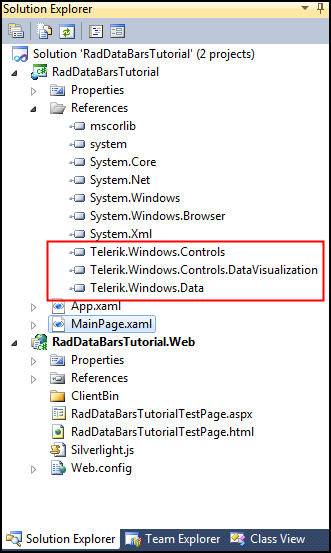

Your application will open to MainPage.xaml and, thanks to the *Telerik Visual Studio extensions*, the namespace __telerik__ will already have been created in the XAML heading.	

#### __XAML__
	<UserControl x:Class="RadDataBars.GettingStarted.MainPage"
			xmlns="http://schemas.microsoft.com/winfx/2006/xaml/presentation" 
			xmlns:x="http://schemas.microsoft.com/winfx/2006/xaml"
			xmlns:d="http://schemas.microsoft.com/expression/blend/2008" 
			xmlns:mc="http://schemas.openxmlformats.org/markup-compatibility/2006"
			xmlns:telerik="http://schemas.telerik.com/2008/xaml/presentation"
			mc:Ignorable="d" d:DesignWidth="640" d:DesignHeight="480">	
			
Begin by creating row and column definitions,

#### __XAML__
	<Grid.RowDefinitions>
		 <RowDefinition Height="40" />
		 <RowDefinition Height="40" />
		 <RowDefinition Height="40" />
		 <RowDefinition/>
	 </Grid.RowDefinitions>
	 <Grid.ColumnDefinitions>
		 <ColumnDefinition />
		 <ColumnDefinition />
	 </Grid.ColumnDefinitions>

Create prompts for three data bars,

#### __XAML__
	<TextBlock Text="RadDataBar"
			   HorizontalAlignment="Center"
			   VerticalAlignment="Center"
			   Grid.Row="0" />
	<TextBlock Text="RadStackedDataBar"
			   HorizontalAlignment="Center"
			   VerticalAlignment="Center"
			   Grid.Row="1" />
	<TextBlock Text="RadStacked100DataBar"
			   HorizontalAlignment="Center"
			   VerticalAlignment="Center"
			   Grid.Row="2" />

Let’s add a __RadDataBar__ in the second column of the first row,		

#### __XAML__
	<telerik:RadDataBar 
		Grid.Row="0"
		Grid.Column="1"
		Value="-8"
		Minimum="-20"
		Maximum="20" />

Notice that I’ve set the minimum to -20 and the Maximum to 20, creating a sale where 0 is in the center and positive values are to the right of the center, negative values to the left.  Since the current value is set to -8, we see that there is a red bar to the left of the center point in the column, as shown in figure 3.		

Figure 3
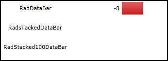

It is important that you play with the minimum and maximum values and see their effect on the display.

Add a __RadStackedDataBar__ to the XAML,	

#### __XAML__
	<telerik:RadStackedDataBar
		Name="xStatckedDataBar"
		Grid.Row="1"
		Grid.Column="1" />

Note that nothing is showing in the designer. Open the code behind page, MainPage.xaml.cs.

Let’s start by creating a class to hold our data,

#### __C#__
	public class RadDataBarItemClass
	{
		public string ToolTipItem { get; set; }
		public int BarValue { get; set; }
	}

Within the Loaded event handler, we’ll create a collection of RadDataBarItemClass objects,

#### __C#__
	List<RadDataBarItemClass> barItems = new List<RadDataBarItemClass>();

And we can add four objects to the collection,

#### __C#__
	barItems.Add(new RadDataBarItemClass() { BarValue = 4, ToolTipItem = "One" });
	barItems.Add(new RadDataBarItemClass() { BarValue = 6, ToolTipItem = "Two" });
	barItems.Add(new RadDataBarItemClass() { BarValue = 2, ToolTipItem = "Three" });
	barItems.Add(new RadDataBarItemClass() { BarValue = 8, ToolTipItem = "Four" });

Finally, assign that collection to be the ItemsSource for our stacked data bar,

#### __C#__
	xStatckedDataBar.ItemsSource = barItems

Return to the XAML and modify the control to set the path for its value, for its tooltips and turn on ShowToolTips,

#### __XAML__
	<telerik:RadStackedDataBar
		Name="xStatckedDataBar"
		Grid.Row="1"
		Grid.Column="1"
		ValuePath="BarValue"
		ToolTipPath="ToolTipItem"
		ShowToolTips="True"/>
		
The values are now displayed in the stacked databar as shown in figure 4,

Figure 4
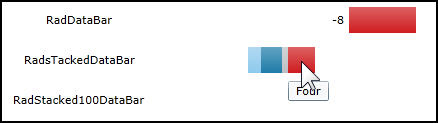

Let’s make two changes:

1. We’ll modify the value in the __RadDataBar__ to be positive 8			

1. We’ll use the same minimum and maximum values in the __StackedDataBar__

The results now line up a lot better and we begin to get a sense of the scale, as shown in figure 5,

Figure 5
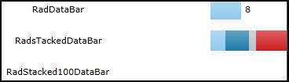

Let’s normalize the scale for our first two bars at __Minimum__ of 20 and a __Maximum__ of 40 and while we’re at it, let’s add the __RadStacked100DataBar__ (which doesn’t take a minimum/maximum as it always uses the available space for 0-100).	

#### __XAML__
	<telerik:RadDataBar 
		Grid.Row="0"
		Grid.Column="1"
		Value="8"
		Minimum="0"
		Maximum="40" />

	<telerik:RadStackedDataBar
		Name="xStackedDataBar"
		Grid.Row="1"
		Grid.Column="1"
		ValuePath="BarValue"
		ToolTipPath="ToolTipItem"
		ShowToolTips="True"
		Minimum="00"
		Maximum="40" />

	<telerik:RadStacked100DataBar 
		Name="xRadStacked100"
		Grid.Row="2"
		Grid.Column="1"
		ValuePath="BarValue"
		ToolTipPath="ToolTipItem"
		ShowToolTips="True" />

Remember to set the __ItemsSource__ for the new xRadStacked100,		

#### __C#__
	xStackedDataBar.ItemsSource = barItems;
	xRadStacked100.ItemsSource = barItems;
	
Run the application, and as you can see in figure 6, the RadStacked100 bar shows the proportional size using all available room, while the others size to their minimum and maximum.

Figure 6
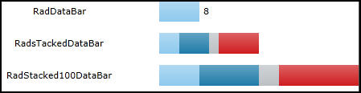

## Customizing RadDataBars

Let’s take a look at adding a data axis, and also at modifying the colors of the data bars.

Start a new application, create five rows and two columns and properties for your textBlocks as shown here,

#### __XAML__
	<Grid.RowDefinitions>
		 <RowDefinition Height="40" />
		 <RowDefinition Height="40" />
		 <RowDefinition Height="40" />
		 <RowDefinition Height="40" />
		 <RowDefinition/>
	 </Grid.RowDefinitions>
	 <Grid.ColumnDefinitions>
		 <ColumnDefinition />
		 <ColumnDefinition />
	 </Grid.ColumnDefinitions>
	 <Grid.Resources>
		 
	 </Grid.Resources>
	 
Add four prompts,

#### __XAML__
	<TextBlock Text="RadDataBar" Grid.Row="0"/>
	<TextBlock Text="RadStackedDataBar" Grid.Row="1" />
	<TextBlock Text="RadDataAxis" Grid.Row="2" />
	<TextBlock Text="RadStacked100DataBar" Grid.Row="3" />

Set up the three databars in the XAML,

#### __XAML__
	<telerik:RadDataBar
		Name="xRadDataBar"
		Grid.Row="0"
		Grid.Column="1"
		Minimum="-20"
		Maximum="20"
		Value="10" />

	<telerik:RadStackedDataBar
		Name="xStackedDataBar"
		Grid.Row="1"
		Grid.Column="1"
		Minimum="-20"
		Maximum="20" />

	<telerik:RadStacked100DataBar
		Name="xStacked100"
		Grid.Row="3"
		Grid.Column="1" />
		
Return to the code-behind, and grab the Loaded event handler and __RadDataBarItemClass__ definition from the previous example,
		

#### __C#__
    public partial class MainPage : UserControl
    {
        public MainPage()
        {
            InitializeComponent();
            Loaded += new RoutedEventHandler(MainPage_Loaded);
        }

        void MainPage_Loaded(object sender, RoutedEventArgs e)
        {
            List<RadDataBarItemClass> barItems = new List<RadDataBarItemClass>();
            barItems.Add(new RadDataBarItemClass() { BarValue = 3, ToolTipItem = "One" });
            barItems.Add(new RadDataBarItemClass() { BarValue = 4, ToolTipItem = "Two" });
            barItems.Add(new RadDataBarItemClass() { BarValue = 2, ToolTipItem = "Three" });
            barItems.Add(new RadDataBarItemClass() { BarValue = 5, ToolTipItem = "Four" });

           xStackedDataBar.ItemsSource = barItems;
           xStacked100.ItemsSource = barItems;

        }
    }

    public class RadDataBarItemClass
    {
        public string ToolTipItem { get; set; }
        public int BarValue { get; set; }
    }

>Note the small change to the __BarValues__ in the __Loaded__ event handler		  

Remember to now add the __ValuePath__ and __ToolTipPath__ to the __RadStackedDataBar__, and the stacked100 data bar,

#### __XAML__
	<telerik:RadStackedDataBar
		Name="xStackedDataBar"
		Grid.Row="1"
		Grid.Column="1"
		Minimum="-20"
		Maximum="20"
		ValuePath="BarValue"
		ToolTipPath="ToolTipItem"/>	 
		
If you run this it will look very much like the previous example. Let’s add a data axis control so that we can get a better idea of the values being displayed,

#### __XAML__
	<telerik:RadDataAxis
		 Name="xDataAxis"
		 Grid.Row="2"
		 Grid.Column="1"
		 Minimum="-20"
		 Maximum="20" />

The axis appears below our two relative bars and aids the eye in estimating the values, as shown in figure 7

Figure 7
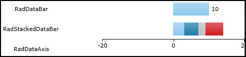

The display is overlapping the edges of the columns.  We can fix this by giving a margin to the data axis, but we must remember to use the same margins on the stack bars,
	
#### __XAML__
	<telerik:RadDataBar
		Name="xRadDataBar"
		Grid.Row="0"
		Grid.Column="1"
		Minimum="-20"
		Maximum="20"
		Value="10" 
		Margin="10,5"/>

	<telerik:RadStackedDataBar
		Name="xStackedDataBar"
		Grid.Row="1"
		Grid.Column="1"
		Minimum="-20"
		Maximum="20"
		ValuePath="BarValue"
		ToolTipPath="ToolTipItem"
		Margin="10,5"/>

	<telerik:RadDataAxis
		Name="xDataAxis"
		Grid.Row="2"
		Grid.Column="1"
		Minimum="-20"
		Maximum="20" 
		Margin="10,5"/>	

The results are readily apparent, as shown in figure 8,

Figure 8
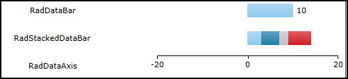

You can control the height of each databar with the BarHeightPercent.  This is on a scale of 0 to 1, so setting the BarHeightPercent to .2, for example, will make for a somewhat shorter bar, as shown in figure 9,

Figure 9
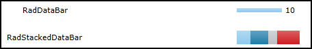

By default, negative values are displayed in __Red__ and positive values in __Blue__, however, you can change that with the NegativeValueBrush and __ValueBrush__ respectively,	

#### __XAML__
	<telerik:RadDataBar
		Name="xRadDataBar"
		Grid.Row="0"
		Grid.Column="1"
		Minimum="-20"
		Maximum="20"
		Value="10" 
		Margin="10,5"
		BarHeightPercent=".2"
		NegativeValueBrush="Yellow"
		ValueBrush="Green"/>

You’ll see the brush changes immediately in the design window.

The __StackedDataBar__ is a different story. Here we need a set of colors, one for each data point.		

Before proceeding, add the following namespace to your XAML file,

#### __XAML__
	xmlns:databars="clr-namespace:Telerik.Windows.Controls.DataBars;
	   assembly=Telerik.Windows.Controls.DataVisualization"
	   
Open the __RadStackedDataBar__ declaration, and within it, add BarBrushes, and within that the __BrushCollection__, as shown below,
		
#### __XAML__
	<telerik:RadStackedDataBar
		Name="xStackedDataBar"
		Grid.Row="1"
		Grid.Column="1"
		Minimum="-20"
		Maximum="20"
		ValuePath="BarValue"
		ToolTipPath="ToolTipItem"
		Margin="10,5">
		<telerik:RadStackedDataBar.BarBrushes>
			<databars:BrushCollection>
				
			</databars:BrushCollection>
		</telerik:RadStackedDataBar.BarBrushes>
	</telerik:RadStackedDataBar>

The __BrushCollection__ is an observable collection of __Brushes__, which you can fill with any brushes, and which we will fill with solid color brushes,		

#### __XAML__
	<databars:BrushCollection>
		 <SolidColorBrush Color="SlateBlue" />
		 <SolidColorBrush Color="AntiqueWhite" />
		 <SolidColorBrush Color="Aqua" />
		 <SolidColorBrush Color="Green" />
		 <SolidColorBrush Color="Blue" />
	 </databars:BrushCollection>
	 
Running the application shows the new colors being used, as shown in figure 10

Figure 10
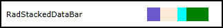

Turning to the __DataAxis__ bar, we can set the __TicksDistance__. If we set the __TicksDistance__ as __5__, we get a much finer scale, as shown in figure 11,		

Figure 11
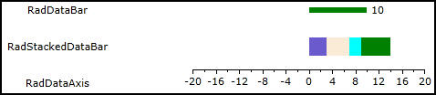

Try narrowing and widening the browser window and you’ll see that the ticks adjust to the available room.

Finally, on the Stack100 databar we can do the same trick with the __Brushes__ collection,
	
#### __XAML__
	<telerik:RadStacked100DataBar
		Name="xStacked100"
		Grid.Row="3"
		Grid.Column="1"
		ValuePath="BarValue"
		ToolTipPath="ToolTipItem">
		<telerik:RadStacked100DataBar.BarBrushes>
			<databars:BrushCollection>
				<SolidColorBrush Color="SlateBlue" />
				<SolidColorBrush Color="AntiqueWhite" />
				<SolidColorBrush Color="Aqua" />
				<SolidColorBrush Color="Green" />
				<SolidColorBrush Color="Blue" />
			</databars:BrushCollection>
		</telerik:RadStacked100DataBar.BarBrushes>
	</telerik:RadStacked100DataBar>