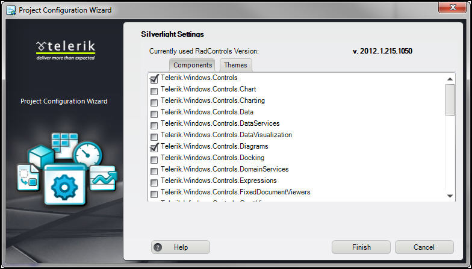
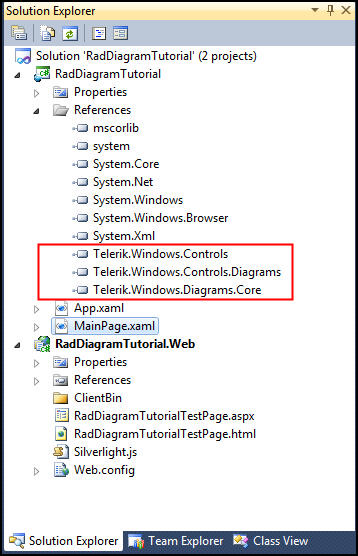
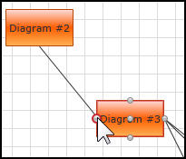
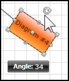
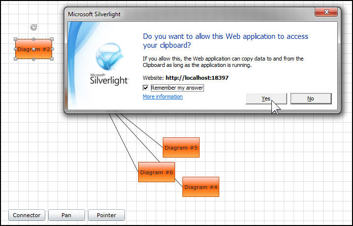
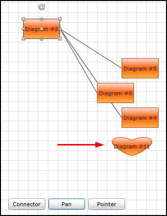

# RadDiagram

This tutorial will introduce the __RadDiagram__ control, part of the Telerik suite of XAML controls.   

## Setting Up The Project

To begin, open Visual Studio and click on the Telerik menu option.  Under *Rad Controls For Silverlight* click on *Create New Telerik Project*.  Name your project, accept Silverlight 5WPF and in the Project Configuration Wizard dialog check *Diagram* (notice that the dependent references are automatically checked as well), as shown in figure 1.

Figure 1



When you click ok, the necessary assemblies are added to the References as shown in figure 2:

>If you do not have __Windows.Controls.Diagrams.Expression.Design__ installed on your computer you will get a warning that the Design Time may be broken.  You can safely ignore this warning for this example.

Your application will open to *MainPage.xaml* and, thanks to the __Telerik Visual Studio extensions__, the namespace __telerik__ will already have been created in the XAML heading.       

#### __XAML__
{{region xamlflix-diagram-0}}
	<UserControl x:Class="RadBarCode.GettingStarted.MainPage"
			xmlns="http://schemas.microsoft.com/winfx/2006/xaml/presentation" 
			xmlns:x="http://schemas.microsoft.com/winfx/2006/xaml"
			xmlns:d="http://schemas.microsoft.com/expression/blend/2008" 
			xmlns:mc="http://schemas.openxmlformats.org/markup-compatibility/2006"
			xmlns:telerik="http://schemas.telerik.com/2008/xaml/presentation"
			mc:Ignorable="d" d:DesignWidth="640" d:DesignHeight="480">
		...
	</UserControl>
{{endregion}}

To begin, add the Xaml for an instance of the __RadDiagram__,       

#### __XAML__
{{region xamlflix-diagram-1}}
	<telerik:RadDiagram Name="xRadDiagram" Margin="9,0,0,0" />
{{endregion}}
	

You’ll see that the designer immediately creates a grid as the background for the diagram.

Let’s add a number of shapes to the diagram,
	
#### __XAML__
{{region xamlflix-diagram-2}}
	<telerik:RadDiagram Name="xRadDiagram" Margin="9,0,0,0">
		<telerik:RadDiagramShape Content="Diagram #1" Position="-400,-200" />
		<telerik:RadDiagramShape Content="Diagram #2" Position="-200,-200" />
		<telerik:RadDiagramShape Content="Diagram #3" Position="-100,-100" Name="s1" />
		<telerik:RadDiagramShape Content="Diagram #4" Position="100,100"  Name="s2"/>
		<telerik:RadDiagramShape Content="Diagram #5" Position="100,0"  Name="s3"/>
		<telerik:RadDiagramShape Content="Diagram #6" Position="50,50"  Name="s4"/>
	</telerik:RadDiagram>
{{endregion}}

Note that some of the shapes are positioned outside of the window.

Our next step is to connect some of the shapes together.

#### __XAML__
{{region xamlflix-diagram-3}}
	<telerik:RadDiagramConnection 
			 Source="{Binding ElementName=s1}" Target="{Binding ElementName=s2}" />
{{endregion}}

Note that we use __Element Binding__ to bind the source to the target.        

If we run the application we can zoom in and out on the diagram using the mouse wheel, but we can’t move the elements around. To get started with panning and more, drag three buttons to the bottom of the diagram,

#### __XAML__
{{region xamlflix-diagram-4}}
	<Button Content="Connector" 
			Height="23" 
			HorizontalAlignment="Left" 
			Margin="29,437,0,0" 
			Name="Connector" 
			VerticalAlignment="Top" 
			Width="75" 
			Click="Connector_Click" />
	<Button Content="Pan" 
			Height="23" 
			HorizontalAlignment="Left" 
			Margin="110,437,0,0" 
			Name="Pan" 
			VerticalAlignment="Top" 
			Width="75" 
			Click="Pan_Click" />
	<Button Content="Pointer" 
			Height="23" 
			HorizontalAlignment="Left" 
			Margin="191,437,0,0" 
			Name="Pointer" 
			VerticalAlignment="Top" 
			Width="75" 
			Click="Pointer_Click" />
{{endregion}}
			
Add a click event for each of the three buttons.  Add a __MouseTool__ as the __ActiveTool__ for each of the three event handlers,
        
#### __C#__
{{region xamlflix-diagram-4}}
	private void Connector_Click(object sender, RoutedEventArgs e)
	{
		xRadDiagram.ActiveTool = MouseTool.ConnectorTool;
	}

	private void Pan_Click(object sender, RoutedEventArgs e)
	{
		xRadDiagram.ActiveTool = MouseTool.PanTool;
	}

	private void Pointer_Click(object sender, RoutedEventArgs e)
	{
		xRadDiagram.ActiveTool = MouseTool.PointerTool;
	}
{{endregion}}
	
#### __VB__
{{region xamlflix-diagram-5}}
	Private Sub Connector_Click(sender As Object, e As RoutedEventArgs)
		xRadDiagram.ActiveTool = MouseTool.ConnectorTool
	End Sub

	Private Sub Pan_Click(sender As Object, e As RoutedEventArgs)
		xRadDiagram.ActiveTool = MouseTool.PanTool
	End Sub

	Private Sub Pointer_Click(sender As Object, e As RoutedEventArgs)
		xRadDiagram.ActiveTool = MouseTool.PointerTool
	End Sub
{{endregion}}

Run the application and click on the Pan button. You’ll be able to drag the entire diagram against the background.  You can pan the __RadDiagram__ by holding control and moving the mouse and you can zoom in and out with the mouse button.  For additional keyboard shortcuts see the [Keyboard Support]() article.

If you click on the connector tool, you’ll notice connector points showing on whichever shape you hover the mouse over, and you can drag connector lines between the shapes as shown in figure 3:

Figure 3

Click on the pointer button and then double click on a shape to edit its data, or grab its rotation marker, and change the angle of the shape, as shown in figure 4,

Figure 4

## Editing The Diagram

Allowing Copy, Paste, Cut and Delete is as simple as setting the appropriate attributes on the __RadDiagram__ control itself,
	
#### __XAML__
{{region xamlflix-diagram-6}}
	<telerik:RadDiagram 
			 Name="xRadDiagram" 
			 Margin="9,0,0,0"
			 AllowCopy="True"
			 AllowCut="True"
			 AllowPaste="True"
			 AllowDelete="True" />
{{endregion}}
			 
Once you’ve added these attributes, run the application, pan the shapes into place and click on a shape. Hit control-C and Silverlight 5 will ask if you want to allow the web application to access the clipboard. Click Yes, and you can copy that shape and paste it elsewhere on the diagram, as shown in figure 5,        

Figure 5


 and you can copy that shape and paste it elsewhere on the diagram


## Custom Shape 

You can add your own shapes to the diagram by generating the shape in, e.g., Expression Blend and then grabbing the resulting path.  Note that in the following custom shape the path is broken up across multiple lines to fit in this posting, but you will want the path to be on a single line with no carriage returns or line feeds,
	
#### __XAML__
{{region xamlflix-diagram-7}}
	<telerik:RadDiagramShape 
		Geometry="M9.4136295,2.4576555E-05 C14.800209,-0.013108866 21.555286,5.2417045 22.176739,5.7343717
		L22.197632,5.7509871 L22.217262,5.7353773 C22.838715,5.2427092 29.593792,-0.012109431 34.98037,0.0010241366
		C35.357132,0.0019429834 35.727203,0.028634096 36.088013,0.084530063 C42.004845,1.0011631 47.504379,6.5009952
		42.3377,16.251131 C37.251743,25.848923 27.320799,36.495747 22.4014,37.30304 L22.224001,37.326874 L22.224001,37.333
		L22.22303,37.332958 L22.200874,37.329983 L22.170971,37.334 L22.170465,37.325897 L21.992601,37.301998 C17.073202,36.494705
		7.1422567,25.847895 2.056303,16.250114 C-3.1103802,6.4999881 2.3891582,1.0001625 8.3059864,0.083530508
		C8.6667957,0.027634615 9.0368671,0.00094353169 9.4136295,2.4576555E-05 z" 
		Content="Diagram #11" 
		Position="120, 125"/> 
{{endregion}}
		
It turns out that this draws a heart shape.  Once this is added to your diagram, this shape can be used like any other, as shown in figure 6,

Figure 6

## Customizing the Look and Feel

A very simple change we can make is to change the color of the background of the __Grid__. You do that by adding the background attribute to the __RadDiagram__.

#### __XAML__
{{region xamlflix-diagram-8}}
	<telerik:RadDiagram Name="xRadDiagram" 
						Margin="9,0,0,0"
						AllowCopy="True"
						AllowCut="True"
						AllowPaste="True"
						AllowDelete="True"
						Background="AntiqueWhite"/>
{{endregion}}
						
You can also change the background of any of the individual shapes,

#### __XAML__
{{region xamlflix-diagram-9}}
	<telerik:RadDiagramShape Content="Diagram #4" 
							 Background="Aqua" 
							 Foreground="Red"  
							 Position="100,100"  
							 Name="s2"/>
{{endregion}}
							 
You can also change the __FontSize, FontFamily__, etc.