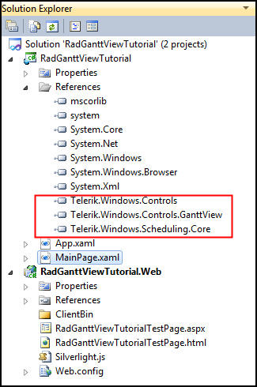
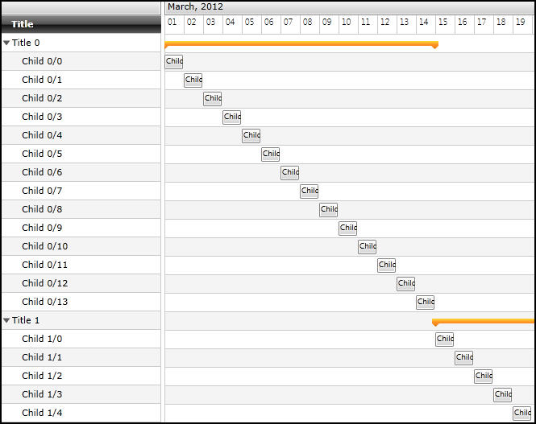
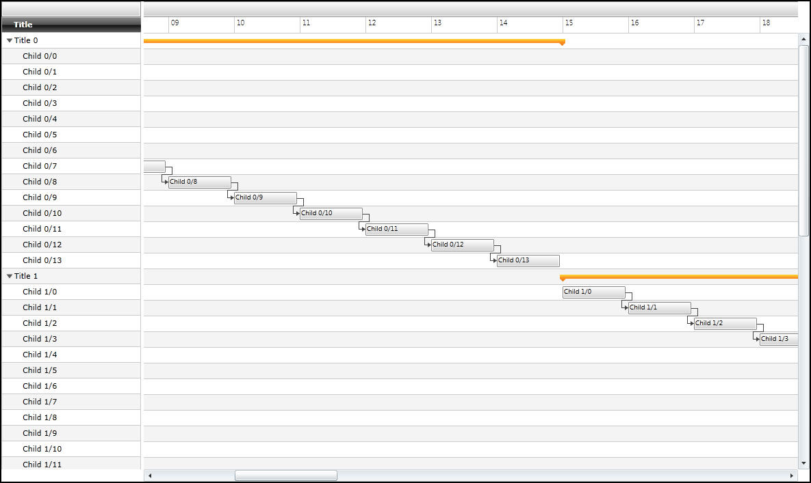
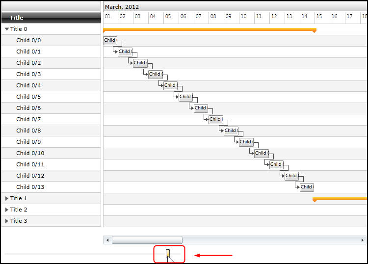
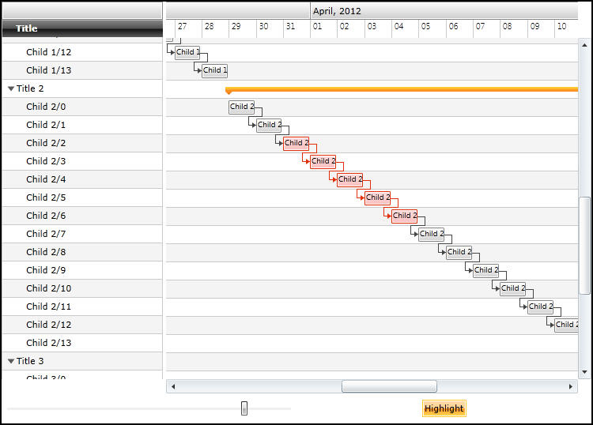

# RadGanttView

This tutorial will introduce __RadGanttView__, part of the Telerik suite of XAML controls.      

## Setting Up The Project

To begin, open Visual Studio and click on the Telerik menu option. Under *RadControls For Silverlight* click on *Create New Telerik Project*.  Name your project, accept Silverlight 5 and in the *Project Configuration Wizard* dialog check *GanttView*.

Your application will open to MainPage.xaml and, thanks to the Telerik Visual Studio extensions, the namespace __telerik__ will already have been created in the XAML heading.        

#### __XAML__

{{region xamlflix_gantt_0}}
	<UserControl x:Class="RadBarCode.GettingStarted.MainPage"
	    xmlns="http://schemas.microsoft.com/winfx/2006/xaml/presentation" 
	    xmlns:x="http://schemas.microsoft.com/winfx/2006/xaml"
	    xmlns:d="http://schemas.microsoft.com/expression/blend/2008" 
	    xmlns:mc="http://schemas.openxmlformats.org/markup-compatibility/2006"
	    xmlns:telerik="http://schemas.telerik.com/2008/xaml/presentation"
	    mc:Ignorable="d" d:DesignWidth="640" d:DesignHeight="480">
{{endregion}}

Add a __RadGanttView__  to the *Layout* grid in the XAML file,        

#### __XAML__

{{region xamlflix_gantt_1}}
	<telerik:RadGanttView Name="xGanttView" />
{{endregion}}

Open the code-behind file, where we will do three things,

1. Define tasks to add to the __GanttView__

1. Set the __PixelLength__ to determine how wide the display of each day will be            

1. Set the __VisibleRange__

We set the visible range by providing an instance of __VisibleRange__ passing in a starting date and an ending date,        

#### __C#__

{{region xamlflix_ganttview_0}}
	var d = DateTime.Today;
	xGanttView.VisibleRange = new VisibleRange(d, d.AddMonths(2));
{{endregion}}

We set the __PixelLength__ by passing in a __TimeSpan__, as shown below:        

#### __C#__

{{region xamlflix_ganttview_1}}
	xGanttView.PixelLength = new TimeSpan(1, 0, 0, 0);
{{endregion}}

Finally, we need to add tasks (and sub-tasks) to the __GanttView__. We start by creating an observable collection of __GanttTask__ objects,        

#### __C#__

{{region xamlflix_ganttview_2}}
	var tasks = new ObservableCollection<GanttTask>();
{{endregion}}

Next, we'll create four "parent" tasks, each with a start, end and title. For each "parent" task we'll create a set of child tasks based on the task's duration in days and add them to the Children collection of the "parent" GanttTask. All main tasks should be added to the task ObservableCollection named tasks.        

#### __C#__

{{region xamlflix_ganttview_3}}
	for (int i = 0; i < 4; i++)
	{
	    var gt = new GanttTask(d.AddDays(14 * i), d.AddDays(14 * i + 14), "Title " + i.ToString());
	
	    for (int j = 0; j < gt.Duration.Days; j++)
	    {
	        var childGT = new GanttTask();
	        childGT.Start = gt.Start.AddDays(j);
	        childGT.End = childGT.Start.AddHours(23);
	        childGT.Title = "Child " + i.ToString() + "/" + j.ToString();    
	        gt.Children.Add(childGT);
	    }
	
	    tasks.Add(gt);
	}
{{endregion}}

Finally, add the __ObservableCollection__ as the __TasksSource__ for the __GanttView__,        

#### __C#__

{{region xamlflix_ganttview_4}}
	xGanttView.TasksSource = tasks;
{{endregion}}

When you run the application you’ll see the tasks and subtasks, but because we set the __PixelLength__ to 1 day, you can’t see much detail.  Change the __PixelLength__ to 1 hour,       

#### __C#__

{{region xamlflix_ganttview_5}}
	xGanttView.PixelLength = new TimeSpan(0, 1, 0, 0);
{{endregion}}

Run the application again and you should get a better view of the Gantt chart, complete with parent and child tasks and durations, as shown in figure 3,

## Relations

Let’s establish a relationship among the various child tasks. Relationships add a link between tasks. To do so, first set the __PixelLength__ to 15 minutes. Then add the following code immediately after the creation of ChildGt:        

#### __C#__

{{region xamlflix_ganttview_6}}
	if (j > 0)
	{
	    GanttTask prevGt = gt.Children[j - 1] as GanttTask;
	    prevGt.Dependencies.Add(new Dependency { FromTask = childGT });
	}
{{endregion}}

The result is that you can now get a better view of the relationships among the child tasks, as shown in figure 4,

## GanttViewHighlighting

To examine __GanttViewHighlighting__ in depth, we’ll start a new project, very similar to the previous except this time we’ll also add __Telerik.Windows.Controls.Input__ to the references.        

Add two rows and two columns to the Layoutroot as shown  below:

#### __XAML__

{{region xamlflix_gantt_2}}
	<Grid.RowDefinitions>
	    <RowDefinition />
	    <RowDefinition Height="Auto" />
	</Grid.RowDefinitions>
	<Grid.ColumnDefinitions>
	    <ColumnDefinition />
	    <ColumnDefinition />
	</Grid.ColumnDefinitions>
	<telerik:RadGanttView Name="xGanttView" Grid.ColumnSpan="2" />
{{endregion}}

Let’s start by creating the __ViewModel__ class. Name it *GanttVM* and be sure to set it to derive from __ViewModelBase__ (a base for ViewModel classes provided by the Telerik library). Declare an observable collection of *GanttTask* objects and initialize it in the constructor.

#### __C#__

{{region xamlflix_ganttview_7}}
	public class GanttVM : ViewModelBase
	{
	    public ObservableCollection<GanttTask> Tasks { get; set; }
	
	    public GanttVM()
	    {
	        this.Tasks = new ObservableCollection<GanttTask>();
	        this.LoadTasks();
	    }
	}
{{endregion}}

The *LoadTasks* method will be based on the code used in the previous example,        

#### __C#__

{{region xamlflix_ganttview_8}}
	private void LoadTasks()
	{
	    var d = DateTime.Today;
	
	    for (int i = 0; i < 4; i++)
	    {
	        var gt = new GanttTask(d.AddDays(14 * i), d.AddDays(14 * i + 14), "Title " + i.ToString());
	
	        for (int j = 0; j < gt.Duration.Days; j++)
	        {
	            var childGT = new GanttTask();
	            childGT.Start = gt.Start.AddDays(j);
	            childGT.End = childGT.Start.AddHours(23);
	            childGT.Title = "Child " + i.ToString() + "/" + j.ToString();
	
	            if (j > 0)
	            {
	                GanttTask prevGt = gt.Children[j - 1] as GanttTask;
	                prevGt.Dependencies.Add(new Dependency { FromTask = childGT });
	            }
	
	            gt.Children.Add(childGT);
	
	        }
	
	        this.Tasks.Add(gt);
	    }
	}
{{endregion}}

Declare a property of type *VisibleRange*,       

#### __C#__

{{region xamlflix_ganttview_9}}
	public VisibleRange GanttRange { get; set; }
{{endregion}}

And initialize that property in the constructor:

#### __C#__

{{region xamlflix_ganttview_10}}
	this.GanttRange = new VisibleRange(DateTime.Today, DateTime.Today.AddMonths(2));
{{endregion}}

In this case we've initialized it to start today and to span two months.

Build the application just to make sure there are no errors or typos. Return to the Xaml file and add a local namespace,

#### __XAML__

{{region xamlflix_gantt_3}}
	xmlns:local="clr-namespace:GanttChartMVVM"
{{endregion}}

You’ll use this to create a resource to hold the VM,

#### __XAML__

{{region xamlflix_gantt_4}}
	<UserControl.Resources>
	    <local:GanttVM x:Key="xVM" />
	</UserControl.Resources>
{{endregion}}

This lets us set the __DataContext__ in the *LayoutRoot*,        

#### __XAML__

{{region xamlflix_gantt_5}}
	<Grid x:Name="LayoutRoot" DataContext="{StaticResource xVM}">
{{endregion}}

We’re now ready to update the bindings on the __RadGanttView__,        

#### __XAML__

{{region xamlflix_gantt_6}}
	<telerik:RadGanttView Name="xGanttView" 
	                      Grid.ColumnSpan="2"
	                      TasksSource="{Binding Tasks}"
	                      VisibleRange="{Binding GanttRange}" />
{{endregion}}

You should now see the GanttChart in the designer. If not, try rebuilding the application.

Let’s add a slider control to our application,

#### __XAML__

{{region xamlflix_gantt_7}}
	<telerik:RadSlider x:Name="xRadSlider" 
	                   Grid.Row="1" 
	                   Minimum="10000000" 
	                   Maximum="30000000000" 
	                   Value="18000000000" 
	                   Margin="5,10" />
{{endregion}}

The extremely large values are because we’ll be converting these values to ticks for a timespan.

Create a new class *TicksToTimespanConverter* and add the following code,        

#### __C#__

{{region xamlflix_ganttview_11}}
	public class TicksToTimeSpanConverter : IValueConverter
	{
	    public object Convert(object value, Type targetType, object parameter, CultureInfo culture)
	    {
	        return TimeSpan.FromTicks((long)(double)value);
	    }
	
	    public object ConvertBack(object value, Type targetType, object parameter, CultureInfo culture)
	    {
	        throw new NotImplementedException();
	    }
	}
{{endregion}}

Build the application.

Add the converter to the resources in MainPage.xaml,

#### __XAML__

{{region xamlflix_gantt_8}}
	<UserControl.Resources>
	    <local:GanttVM x:Key="xVM" />
	    <local:TicksToTimeSpanConverter x:Key="xConverter" />
	</UserControl.Resources>
{{endregion}}

We can now add the binding for the PixelLength to the __RadGanttView__ in the XAML,        

#### __XAML__

{{region xamlflix_gantt_9}}
	<telerik:RadGanttView Name="xGanttView" 
	        Grid.ColumnSpan="2" 
	        TasksSource="{Binding Tasks}" 
	        VisibleRange="{Binding GanttRange}" 
	        PixelLength="{Binding ElementName=xRadSlider, Path=Value, Converter={StaticResource xConverter}}"/>
{{endregion}}

Run the application. We now have a slider at the bottom which works to zoom in and out on our Gantt chart, as shown in figure 5

We’re now going to add a toggle button which will turn highlighting on and off. We’re using the RadTogglebutton and __RadSlider__ which are part of the suite of Telerik tools for Silverlight and WPF        

#### __XAML__

{{region xamlflix_gantt_10}}
	<telerik:RadToggleButton Name="xRadToggleButton"
	    Grid.Row="1"
	    Grid.Column="1"
	    HorizontalAlignment="Center"
	    VerticalAlignment="Center"
	    Content="Highlight" />
{{endregion}}

We need a public property to bind the __IsChecked__ attribute to.  Open the *ViewModel* and add the following property,       

#### __C#__

{{region xamlflix_ganttview_13}}
	private bool checkedValue;
	 public bool CheckedValue
	 {
	     get { return checkedValue;  }
	     set
	     {
	     	if ( checkedValue != value)
	         {
	             checkedValue = value;
	             OnPropertyChanged(() => this.CheckedValue);
	         }
	     }
	 }
{{endregion}}

You can now update the __ToggleButton__’s __IsChecked__ property,        

#### __XAML__

{{region xamlflix_gantt_11}}
	<telerik:RadToggleButton Name="xRadToggleButton"
	    Grid.Row="1"
	    Grid.Column="1"
	    HorizontalAlignment="Center"
	    VerticalAlignment="Center"
	    Content="Highlight"
	    IsChecked="{Binding CheckedValue, Mode=TwoWay}"/>
{{endregion}}

The toggle button doesn’t yet affect the highlighting.  First thing we need is another collection, just of the highlighted tasks,

#### __C#__

{{region xamlflix_ganttview_14}}
	public ObservableCollection<GanttTask> HighlightedTasks { get; set; }
{{endregion}}

Initialize that collection in the constructor,

#### __C#__

{{region xamlflix_ganttview_15}}
	this.HighlightedTasks = new ObservableCollection<GanttTask>();	
{{endregion}}

We need a method to make the highlighting happen. If the argument is null, we just return. Otherwise, we clear the collection and if the argument is true, for this demo, we’ll randomly add tasks and children to the list of highlighted tasks. The method should look like below:       

#### __C#__

{{region xamlflix_ganttview_16}}
	private void ToggleHighlight(bool? amIHighlighted)
	{
	    if (amIHighlighted == null)
	    {
	        return;
	    }
	
	    this.HighlightedTasks.Clear();
	
	    if (amIHighlighted == true)
	    {
	        var rnd = new Random();
	        GanttTask parentGT = Tasks[rnd.Next(0, Tasks.Count)] as GanttTask;
	        int randNumber = rnd.Next(2, parentGT.Children.Count - 2);
	        for (int i = 2; i < randNumber; i++)
	        {
	            this.HighlightedTasks.Add(parentGT.Children[i] as GanttTask);
	        }
	    }  
	}
{{endregion}}

Returning to the property __CheckedValue__, after we set the value we’ll call *ToggleHighlight*,        

#### __C#__

{{region xamlflix_ganttview_17}}
	this.ToggleHighlight(CheckedValue);		
{{endregion}}

Now that we have a collection of the tasks we want to highlight, return to the XAML and in the definition for the __GanttView__ we add one more attribute,        

#### __XAML__

{{region xamlflix_gantt_12}}
	<telerik:RadGanttView Name="xGanttView" Grid.ColumnSpan="2"
	                TasksSource="{Binding Tasks}"
	                VisibleRange="{Binding GanttRange}"
	                PixelLength="{Binding ElementName=xRadSlider, Path=Value, Converter={StaticResource xConverter}}"
	                HighlightedItemsSource="{Binding HighlightedTasks}"/>
{{endregion}}

Run the application, click the *Highlight* button and scroll down until you find the highlighted task and children, as shown in figure 6,

Clicking the toggle button a second time will make the highlighting disappear.

## Custom GanttTask

Let’s create a custom __GanttTask__ so that we can add criteria to that task that does not exist in the default.
        

We’ll create a new class called *TeamGanttTask*. The new class will inherit from the default __GanttTask__ and should have two constructors that our base class needs:        

#### __C#__

{{region xamlflix_ganttview_18}}
	public class TeamGanttTask : GanttTask	
	{
	    public TeamGanttTask() :
	        base()
	    {}
	
	    public TeamGanttTask(DateTime startDate, DateTime endDate, string title) :
	        base(startDate, endDate, title)
	    {}
	}	
{{endregion}}

Add a new property to the custom *TeamGanttTask*,       

#### __C#__

{{region xamlflix_ganttview_19}}
	private int teamID;
	public int TeamID
	{
	     get { return teamID; }
	     set
	     {
	     	if (teamID != value)
	         {
	             teamID = value;
	             OnPropertyChanged(() => this.TeamID);
	         }
	     }
	}	  	
{{endregion}}

We’ll use this new property to create custom business logic to control highlighting.

Add two new observable collections to the VM,

#### __C#__

{{region xamlflix_ganttview_20}}
	public ObservableCollection<TeamGanttTask> TeamTasks { get; set; }
	public ObservableCollection<TeamGanttTask> HighlightedTeamTasks { get; set; }	  	
{{endregion}}

Don’t forget to modify the initialization in the constructor,

#### __C#__

{{region xamlflix_ganttview_21}}
	this.TeamTasks = new ObservableCollection<TeamGanttTask>();
	this.HighlightedTeamTasks = new ObservableCollection<TeamGanttTask>();  	
{{endregion}}

We’ll also modify LoadTasks to LoadTeamTasks,

#### __C#__

{{region xamlflix_ganttview_22}}
	//LoadTasks();
	this.LoadTeamTasks();	
{{endregion}}

Copy and paste *LoadTasks* to the new method, *LoadTeamTasks* and make the appropriate substitutions (e.g., TeamGanttTask for GanttTask).        

Next, set the new property on the ChildGanttTask, childGT.TeamID,

#### __C#__

{{region xamlflix_ganttview_23}}
	Random rnd = new Random();
	private void LoadTeamTasks()
	{
	    var d = DateTime.Today;
	
	    for (int i = 0; i < 4; i++)
	    {
	        var gt = new TeamGanttTask(d.AddDays(14 * i), d.AddDays(14 * i + 14), "Title " + i.ToString());
	
	        for (int j = 0; j < gt.Duration.Days; j++)
	        {
	            var childGT = new TeamGanttTask();
	            childGT.Start = gt.Start.AddDays(j);
	            childGT.End = childGT.Start.AddHours(23);
	            childGT.Title = "Child " + i.ToString() + "/" + j.ToString();
	            childGT.TeamID = rnd.Next(0, 4);
	
	            if (j > 0)
	            {
	                GanttTask prevGt = gt.Children[j - 1] as GanttTask;
	                prevGt.Dependencies.Add(new Dependency { FromTask = childGT });
	            }
	
	            gt.Children.Add(childGT);
	
	        }
	
	        TeamTasks.Add(gt);
	    }
	}	
{{endregion}}

Don’t forget to update the binding in MainPage.xaml,

#### __XAML__

{{region xamlflix_gantt_13}}
	<telerik:RadGanttView Name="xGanttView" Grid.ColumnSpan="2"
	                TasksSource="{Binding TeamTasks}"
	                VisibleRange="{Binding GanttRange}"
	                PixelLength="{Binding ElementName=xRadSlider, Path=Value, Converter={StaticResource xConverter}}"
	                HighlightedItemsSource="{Binding HighlightedTeamTasks}"/>
{{endregion}}

Before we proceed we need a new property to hold the selectedTask,

#### __C#__

{{region xamlflix_ganttview_24}}
	private TeamGanttTask selectedTask;
	public TeamGanttTask SelectedTask
	{
	    get { return selectedTask; }
	    set
	    {
	    if ( selectedTask != value)
	        {
	            selectedTask = value;
	            OnPropertyChanged(() => this.SelectedTask);
	        }
	    }
	}
{{endregion}}

Returning to MainPage.xaml we’ll use that new property for a new binding,

#### __XAML__

{{region xamlflix_gantt_14}}
	<telerik:RadGanttView Name="xGanttView" Grid.ColumnSpan="2"
	                TasksSource="{Binding TeamTasks}"
	                VisibleRange="{Binding GanttRange}"
	                PixelLength="{Binding ElementName=xRadSlider, Path=Value, Converter={StaticResource xConverter}}"
	                HighlightedItemsSource="{Binding HighlightedTeamTasks}"
	                SelectedItem="{Binding SelectedTask, Mode=TwoWay}" />
{{endregion}}

Finally, we just need to update our highlighting logic to work with our new TeamTasks. Copy and paste ToggleHighlight to ToggleTeamHighlight. You will need to iterate through the tasks and find the children where the teamID matches the selected team id:        

#### __C#__

{{region xamlflix_ganttview_25}}
	void ToggleTeamHighlight(bool? amIHightlighting)
	{
	    if (amIHightlighting == null || SelectedTask == null)
	    {
	        return;
	    }
	    this.HighlightedTeamTasks.Clear();
	
	    if (amIHightlighting == true)
	    {
	        int counter = TeamTasks.Count;
	
	        for (int i = 0; i < counter; i++)
	        {
	            TeamGanttTask tgt = TeamTasks[i];
	
	            var teamKids = tgt.Children.OfType<TeamGanttTask>().
	                   Where(x => x.TeamId == SelectedTask.TeamId);
	
	            foreach (var teamkid in teamKids)
	            {
	                HighlightedTeamTasks.Add(teamkid);
	            }
	        }
	    }
	}
{{endregion}}

Run the application and select a child. Toggle the Highlight button and all the children on the same team are highlighted as well.       
