# RadGridView

This tutorial will introduce the __RadGridView__ control, part of the Telerik suite of XAML controls. You can jump ahead to these topics:   
	  

* [Set up and install UI for WPF by working through the Project Configuration Wizard.](a77dca03-6485-4aa5-b404-216a427279ea#setting-up-the-project)

* [Explore built-in functionality such as sorting, grouping, reordering columns.](a77dca03-6485-4aa5-b404-216a427279ea#built-in-functionality)

* [
			  Export data from RadGridView to additional formats (text, CSV, HTML, Excel XML).
		  ](a77dca03-6485-4aa5-b404-216a427279ea#exporting-to-additional-formats)

* [Control paging with RadDataPager.](a77dca03-6485-4aa5-b404-216a427279ea#data-paging)

* [Explore seven modes of aggregate functions.](a77dca03-6485-4aa5-b404-216a427279ea#aggregate-functions)

* [Support localization in RadGridView.](a77dca03-6485-4aa5-b404-216a427279ea#localization)

* [Support client-side validation.](a77dca03-6485-4aa5-b404-216a427279ea#validation)

* [Copy and paste values and rows from RadGridView to Microsoft Excel.](a77dca03-6485-4aa5-b404-216a427279ea#copy-and-paste-to-excel)

## Setting up the Project

To begin, open Visual Studio and click on the Telerik menu option.  Under __UI For Silverlight__ click on __Create New Telerik Project__.  Name your project, accept Silverlight 5 and in the Project Configuration Wizard dialog check __GridView__ (notice that the dependent references are automatically checked as well), as shown in __Figure 1__.

__Figure 1:__ In the Project Configuration Wizard, you can check __GridView__ and the wizard is smart enough to also check dependent references.
		  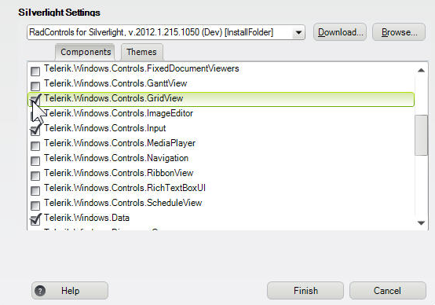

When you click __Finish__, the necessary assemblies are added to the project's References as shown in __Figure 2__

__Figure 2:__ The Project Configuration Wizard added the References for the __GridView__.
			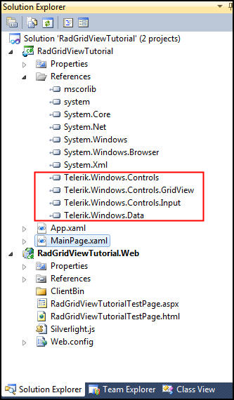

Your application will open to MainPage.xaml and, thanks to the Telerik Visual Studio extensions, the namespace telerik will already have been created in the XAML heading as shown in __Example 1__.
        

#### __[XAML] Example 1: After finishing the Project Configuration Wizard, the telerik namespace is added in the heading.__

{{region xamlflix_gridview_0}}
	<UserControl x:Class="RadBarCode.GettingStarted.MainPage"
			xmlns="http://schemas.microsoft.com/winfx/2006/xaml/presentation" 
			xmlns:x="http://schemas.microsoft.com/winfx/2006/xaml"
			xmlns:d="http://schemas.microsoft.com/expression/blend/2008" 
			xmlns:mc="http://schemas.openxmlformats.org/markup-compatibility/2006"
			xmlns:telerik="http://schemas.telerik.com/2008/xaml/presentation"
			mc:Ignorable="d" d:DesignWidth="640" d:DesignHeight="480">
	
	{{endregion}}

Drag __RadGridView__ from the toolbox onto the design surface.  If you look at the XAML for the __GridView__, you’ll see that Visual Studio set the alignments and margin to mark the placement of the __Gridview__ where you happened to drop it.
        

#### __XAML__

{{region xamlflix_gridview_1}}
	<telerik:RadGridView HorizontalAlignment="Left" Margin="77,46,0,0" Name="radGridView1" VerticalAlignment="Top" />
	{{endregion}}

You can clean that up by right-clicking on the __GridView__ and choosing Reset Layout -> All, as shown in __Figure 3__,
        

__Figure 3:__ You can clear the default alignment by resetting the layout of the __GridView__.
			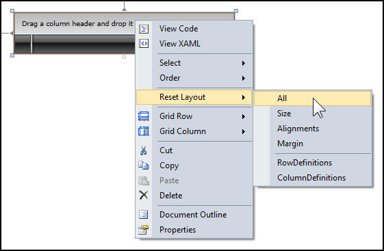

Jump over to the code behind, and in the MainPage.xaml.cs file, below the closing brace for the class, let’s create a demonstration data class called DemoClass (__Example 2__)
        

#### __[C#] Example 2: A simple class with a few values of different data types.__

{{region xamlflix_gridview_16}}
	public class DemoClass
	{
	    public int ID { get; set; }
	    public string Name { get; set; }
	    public string Company { get; set; }
	    public bool IsComplete { get; set; }
	    public DateTime DueDate { get; set; }
	}
	
	{{endregion}}

In the constructor, initialize a collection of these class instances.
        

#### __C#__

{{region xamlflix_gridview_17}}
	var myDemoClasses = new ObservableCollection<DemoClass>();
	{{endregion}}

You can now create a for-loop (__Example 3__) to populate 2000 instances and add them to the collection.
        

#### __[C#] Example 3: populate your collection with some data.__

{{region xamlflix_gridview_18}}
	for ( int x = 1; x <= 2000; x++)
	{
	    var dc = new DemoClass();
	    dc.ID = x;
	    dc.Name = "Person " + x.ToString();
	    dc.Company = x % 2 == 0 ? 
	        "Super Company " + x.ToString() : "Sub-par company " + x.ToString();
	    dc.IsComplete = x % 4 == 0 ? true : false;
	    dc.DueDate = DateTime.Today.AddDays(x);
	    myDemoClasses.Add(dc);
	}
	{{endregion}}

Finally, we set the collection as the __ItemsSource__ property for our __GridView__,
        

#### __C#__

{{region xamlflix_gridview_19}}
	radGridView1.ItemsSource = myDemoClasses;
	{{endregion}}

Run the application and you’ll see the 2000 records are displayed in the __GridView__.
          Note that the columns are not taking up the full width of the browser.  If you prefer, you can set the columns to take the available space by setting the column width of the __GridView__ in the XAML file to __*__.
        

#### __XAML__

{{region xamlflix_gridview_2}}
	<telerik:RadGridView Name="radGridView1" ColumnWidth="*" />
	{{endregion}}

The columns now expand to fill the available width, as shown in __Figure 4__.
        

__Figure 4:__ Setting the __ColumnWidth__ to __“*”__ causes the __GridView__ to fill the available width.
			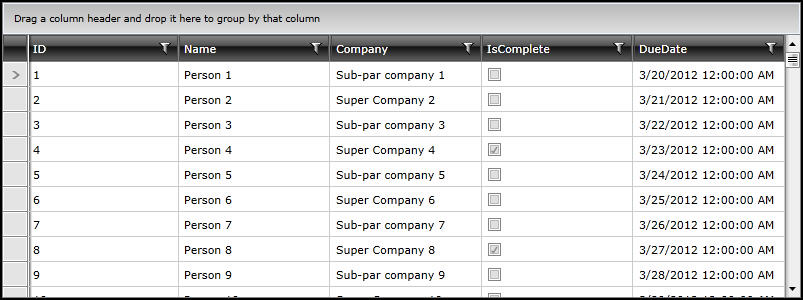

## Built-in Functionality

A great deal of functionality is built into the __RadGridView__ control. For example, sorting, grouping and reordering columns.
		

First, let's explore sorting. Just click on a column header to sort that column. Click the column header again to reverse sort that column. Try this with __IsComplete__ or __DueDate__.
		  You can sort on multiple columns by clicking on one column header, then holding Shift and clicking on a second column header.
		  Advanced filtering is built in as well.  To see this, click on the filter icon on any column. You’ll see the advanced filter dialog, as shown in __Figure 5__.
        

__Figure 5:__ You can configure advanced filtering with a few clicks.
			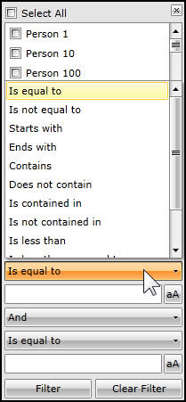

__RadGridView__ has a built-in support for grouping with simple dragging and dropping a column header into the top row. As an example, you can drag and drop the __IsComplete__ column header into the grouping area and you'll see the results immediately sorted into the two groups, as shown in __Figure 6__.
        

__Figure 6:__ Dragging the __IsComplete__ column header into the Grouped by area immediately sorts the results into two groups.
		  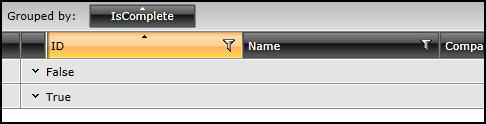

You can group by multiple columns by dragging additional columns into the grouping area. For example, click the __DueDate__ column header and drag it into the Grouped by area after __IsComplete__. If you want to remove grouping, hover over the column heading in the Grouped by area and click the X to remove it, as shown in __Figure 7__.
        

__Figure 7:__ Click the X on the column headings that you no longer want to use for grouping.
		  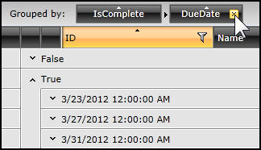

__RadGridView__ also allow you to reorder your columns using drag and drop, as shown in __Figure 8__, which shows dragging the ID column to a new position.
        

__Figure 8:__ Clicking the __ID__ column and moving it after the __Name__ column will cause __RadGridView__ to group by the __IsComplete__ and __DueDate__ columns and within that, sort by __Name__.
		  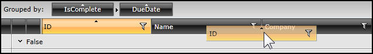

For additional information you can check: 		  	  
		

* [RadGridView Sorting]() section.
			

* [RadGridView Grouping]() section.
			

* [RadGridView Filtering]() section.
			

* [RadGridView Selection]() section.
			

* [RadGridView Reordering]() article.
			

## Exporting to Additional Formats

You can export your data from __RadGridView__ into different formats:

* Text

* CSV

* HTML

* Excel XML

For this section on exporting, start a new project.
        

Drag a __RadGridView__ onto the design surface, but this time let’s go to the XAML and add the attribute, __AutoGenerateColumns__, and set it to __False__.
        

#### __[XAML]__

{{region xamlflix_gridview_3}}
	<telerik:RadGridView Name="radGridView1" ColumnWidth="*" AutoGenerateColumns="False"/>
	{{endregion}}

This tells __RadGridView__ not to generate its columns based on the properties in the data class; rather, you’ll create the columns yourself using the XAML in __Example 4__. 
        

#### __[XAML] Example 4: Manually defining columns for the fields in a RadGridView control and add the defined columns to the Columns collection.__

{{region xamlflix_gridview_4}}
	<telerik:RadGridView Name="radGridView1" ColumnWidth="*" AutoGenerateColumns="False">
	     <telerik:RadGridView.Columns>
	         <telerik:GridViewDataColumn DataMemberBinding="{Binding LastName}" 
	                   Header="Last Name" />
	         <telerik:GridViewDataColumn DataMemberBinding="{Binding FirstName}"
	                   Header="First Name" />
	         <telerik:GridViewDataColumn DataMemberBinding="{Binding Age}" 
	                   Header="Age" />
	         <telerik:GridViewDataColumn DataMemberBinding="{Binding Married}" 
	                   Header="Is Married?" />
	     </telerik:RadGridView.Columns>
	 </telerik:RadGridView>
	{{endregion}}

Add a new class called __Employee__ to your project in the file Employee.cs as shown in __Example 5__.
        

#### __[C#] Example 5: The Employee class will use the same names as the column names you created in Example 4.__

{{region xamlflix_gridview_20}}
	public class Employee
	{
	    public string FirstName { get; set; }
	    public string LastName { get; set; }
	    public int Age { get; set; }
	    public bool Married { get; set; }
	}
	
	{{endregion}}

In MainPage.xaml.cs, in the __Loaded__ event handler, you’ll set the __ItemsSource__ property for the grid to the result of calling __GetEmployees__ as shown in __Example 6__.
        

#### __[C#] Example 6: Subscribing to the Loaded event of the MainPage and populate the GridView.__

{{region xamlflix_gridview_21}}
	public MainPage()
	{
	    InitializeComponent();
	    Loaded += new RoutedEventHandler(MainPage_Loaded);
	}
	
	void MainPage_Loaded(object sender, RoutedEventArgs e)
	{
	    this.radGridView1.ItemsSource = EmployeeService.GetEmployees();
	}
	{{endregion}}

Run the application to ensure that the __GridView__ properly displays the 15 records.  Shut down the application and return to MainPage.xaml.  In the design surface, drag the bottom of the grid up a bit to make room to add a button.
        

Set the content of the button to __Export__. Add a __Click__ event for the button and return to the code behind to write the event handler (__Example 7__).
	  

You will need to resolve a number of namespaces, or let 
		[JustCode](http://www.telerik.com/help/justcode/introduction.html) do it for you.
      

#### __[C#] Example 7: How to export data from RadGridView.__

{{region xamlflix_gridview_22}}
	private void button1_Click(object sender, RoutedEventArgs e)
	{
	    string extension = "xls";
	    SaveFileDialog dialog = new SaveFileDialog()
	    {
	        DefaultExt = extension,
	        Filter = String.Format("{1} files (*.{0})|*.{0}|All files(*.*)|*.*", extension, "Excel"),
	        FilterIndex = 1
	    };
	
	    if ( dialog.ShowDialog() == true)
	    {
	    	using (Stream stream = dialog.OpenFile())
	        {
	            radGridView1.Export(stream,
	                new GridViewExportOptions()
	                {
	                    Format = ExportFormat.ExcelML,
	                    ShowColumnHeaders = true,
	                    ShowColumnFooters = true,
	                    ShowGroupFooters = false,
	
	                });
	        }
	    }
	}
	{{endregion}}

The essence of this event handler is to create a standard __SaveFileDialog__ (with the default extension of Excel), and then if __True__ is returned from the dialog (the user clicks OK) to open a stream and to export to the __Format__ specified.  The key is the __Format__, which is set to one of the four enumerated __ExportFormat__ values. __Example 7__ shows .xls while later in this section of the article (__Example 8__, and __Figures 10 - 12__), you'll see .html, .txt, and .csv.
        

Run the program and save the file to Employees.xls.  Open the file in Excel and you’ll see that the columns and data appear as expected, as seen in __Figure 9__.
	  

__Figure 9:__ If the event handler code worked, the Employees.xls file should open.
		  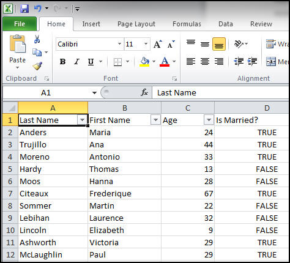

In __Example 8__, you'll modify the code from __Example 7__ to change the extension from “xls” to “htm” and change the name of the extension to HTML.  Change the format to HTML as shown here.
        

#### __[C#] Example 8: This event handler saves the Employees class as HTML.__

{{region xamlflix_gridview_23}}
	string extension = "htm";
	SaveFileDialog dialog = new SaveFileDialog()
	{
	    DefaultExt = extension,
	    Filter = String.Format("{1} files (*.{0})|*.{0}|All files(*.*)|*.*", 
	          extension, "HTML"),
	    FilterIndex = 1
	};
	
	if ( dialog.ShowDialog() == true)
	{
		using (Stream stream = dialog.OpenFile())
	    {
	        radGridView1.Export(stream,
	            new GridViewExportOptions()
	            {
	                Format = ExportFormat.Html,
	                ShowColumnHeaders = true,
	                ShowColumnFooters = true,
	                ShowGroupFooters = false,
	
	            });
	{{endregion}}

When you run the program and save the files to Employees.htm, the result is an HTML table that you can display in a browser as shown in __Figure 10__.
        

__Figure 10:__ When you run __Example 8__, the data is in an HTML table that you can view in a browser.
		  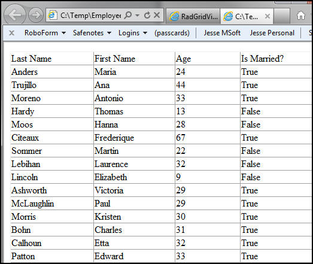

Similarly, change the event handler code in __Example 8__ to Text and you save a text file as seen in __Figure 11__ and if you change the event handler code in __Example 8__ to CSV you get a comma separated values file as shown in __Figure 12__. 
		

__Figure 11:__ The event handler code in __Example 8__ changed to Text.
			

__Figure 12:__ The event handler code in __Example 8__ changed to CSV.
			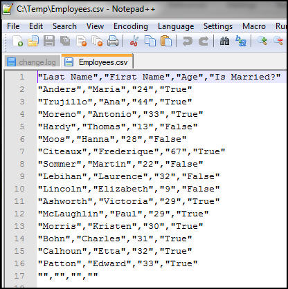

For additional information you can check [RadGridView Export]() section.
		

## Data Paging

There are certainly times when you do not want to send all of the possible records matching your search criteria to the client machine.  While __RadGridView__ is extremely fast and responsive, it can take a bit of time to transmit a lot of data, e.g., 100,000 records. If you have a large result set, you want to be able to let your user “page” through the data and perhaps see just 10 records at a time.
		

To support scenarios as this, you’ll use a second control, the __RadDataPager__.  Open your XAML file to the last line of the __RadGridView__ and add a __RadDataPager__ as shown in __Example 9__. 
		

#### __[XAML] Example 9: Add a RadDataPager to the XAML from Example 4.__

{{region xamlflix_gridview_5}}
	<telerik:RadDataPager Name="xRadDataPager" Source="{Binding Items, ElementName=radGridView1}" PageSize="5" />
	{{endregion}}

The source in this case is using element binding – that binds the __RadDataPager__ to another element on the page, in this case the __GridView__.  We are specifically binding to the __Items__ in radGridView1.  The __PageSize__ attribute determines how many items will be in a given page.  __Example 9__ sets this value to 5, and since this example has a total of 15 records, you’ll see three pages of data, as shown in __Figure 13__.
		

__Figure 13:__ Adding a __RadDataPager__ lets you restrict the number of items to view at one time and adds controls for navigating through the pages of results.
		  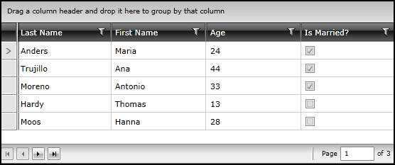

Notice that the __RadDataPager__ attaches itself to the bottom of the __GridView__. The default __RadDataPager__ has four buttons on the left and a “jump” box on the right (which displays the page you are on and lets you type in the page number you want to jump to).
        

The four buttons are, left to right:

* Go to first page

* Go to previous page

* Go to next page

* Go to last page

__RadDataPager__ will automatically enable and disable the various buttons (e.g, disable next page on the last page).
        

This, of course is the default display, but __RadDataPager__ supports many alternatives. You can see this by entering __DisplayMode__ in the XAML and IntelliSense will bring up a long list of options, as shown in __Figure 14__.
        

__Figure 14:__ You can set different display modes for __RadDataPager__.
		  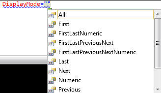

Let’s scroll down and choose __PreviousNextNumeric__, as shown in __Example 10__.
		

#### __[XAML] Example 10: You set the DisplayMode of RadDataPager to PreviousNextNumeric.__

{{region xamlflix_gridview_6}}
	<telerik:RadDataPager DisplayMode="PreviousNextNumeric" Name="xRadDataPager" Source="{Binding Items, ElementName=radGridView1}" PageSize="5" />
	{{endregion}}

When  you run the application, you’ll see that the visible buttons are previous, next and a numeric button for each page, as shown in __Figure 15__.
		

__Figure 15:__ When you run the XAML from Example 10, the display mode of __RadDataPager__ changes to five buttons.
		  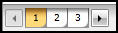

You can also manipulate the __RadDataPager__ programmatically, as shown by IntelliSense in __Figure 16__.
        

__Figure 16:__ Methods for manupulating __RadDataPager__ programmatically shown by IntelliSence.
		  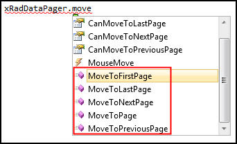

For additional information you can check [RadGridView Paging]() section.
		

## Aggregate Functions

__RadGridView__ provides seven modes of aggregate functions to provide aggregated data at the bottom of columns in the grid.
        

* Average

* Count

* First / Last

* Minimum / Maximum

* Sum

Let’s return to our application (__Example 4__) but comment out the __RadDataPager__ control (__Examples 9 - 10__).  In the XAML, we’ll go up to the LastName GridViewDataColumn and open it up, adding in  __AggregateFunctions__ (__Example 11__).
        

#### __[XAML] Example 11: Defines AggregateFunctions for the GridViewDataColumn.__

{{region xamlflix_gridview_7}}
	<telerik:GridViewDataColumn DataMemberBinding="{Binding LastName}" Header="Last Name" >
	    <telerik:GridViewDataColumn.AggregateFunctions>
	        
	    </telerik:GridViewDataColumn.AggregateFunctions>
	</telerik:GridViewDataColumn>
	{{endregion}}

Inside the __AggregateFunctions__ IntelliSense will show all the possible aggregations, as shown in __Figure 17__.
	  

__Figure 17:__ The seven __AggregateFunctions__ supported by a __GridViewDataColumn__.
		  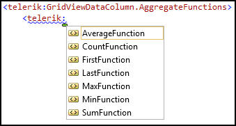

This article will use the __CountFunction__ (__Example 12__) and it wiill add an attribute for the caption to be associated with the count.
        

#### __[XAML] Example 12: Adding a Caption attribute to the CountFunction.__

{{region xamlflix_gridview_8}}
	<telerik:GridViewDataColumn DataMemberBinding="{Binding LastName}" Header="Last Name" >
	    <telerik:GridViewDataColumn.AggregateFunctions>
	        <telerik:CountFunction Caption="Total # of records: " />         
	    </telerik:GridViewDataColumn.AggregateFunctions>
	</telerik:GridViewDataColumn>
	
	{{endregion}}

Before we go any further, we need to go up to the __GridView__ itself and turn on __ShowColumnFooters__ (Example 13). 
        

#### __[XAML] Example 13: Setting ShowColumnFooters to true so the CountFunction will be visible.__

{{region xamlflix_gridview_9}}
	<telerik:RadGridView Name="radGridView1" ColumnWidth="*" AutoGenerateColumns="False" Margin="0,0,0,72" ShowColumnFooters="True"> 
	{{endregion}}

When you run the application, the total number of records is shown in the footer for the __LastName__ column, as shown in __Figure 18__.
	  

__Figure 18:__ You can see the __CountFunction__ in the footer that you just made visible.
		  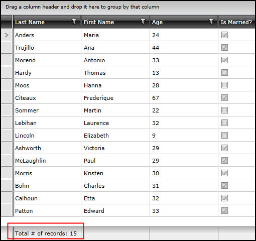

The most common column footer manipulates numeric data. Let’s find the average age of our 15 records.
          __Example 14__ shows how to add the __AverageFunction__ and add a __Caption__ attribute to the __Age__ column.
        

#### __[XAML] Example 14: Using the AverageFunction to get an average of the records in the Age column.__

{{region xamlflix_gridview_10}}
	<telerik:GridViewDataColumn DataMemberBinding="{Binding Age}" Header="Age">
	    <telerik:GridViewDataColumn.AggregateFunctions>
	        <telerik:AverageFunction Caption="Average age: " />
	    </telerik:GridViewDataColumn.AggregateFunctions>
	</telerik:GridViewDataColumn>
	{{endregion}}

When you run the application, you should see, at the bottom of the age column, Average age: 30.4.
        

For additional information you can check [RadGridView Aggregate Functions]() article.
		

## Localization

Localization is the process of adapting a product to a particular language or culture. __RadGridView__ has support for localization baked in.
        

Running the application (from __Example 14__) shows that there are various areas that are in English, as shown in __Figure 19__; now lets make changes to localize the application so that these are in Spanish.
	  

__Figure 19__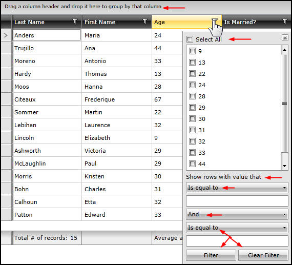

The first step (after stopping the application) is to unload the main project by right-clicking on it and choosing __Unload Project__.
        

Once unloaded, right-click on the project and choose __Edit__, as shown in __Figure 20__.
        

__Figure 20:__ Edit the __RadGridViewExport__ project.
		  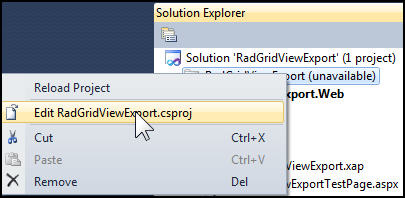

Find the element for __SupportedCultures__, and add __es__ for Español (Spanish).
        

Save and close the file and then right-click on the project and click __Reload Project__ from the shortcut menu.
        

#### __[C#] Open App.xaml.cs and find Application_Startup.__

{{region xamlflix_gridview_24}}
	private void Application_Startup(object sender, StartupEventArgs e)
	{
	    this.RootVisual = new MainPage();
	}
	
	{{endregion}}

Before the first line of this method, you need to set the culture you’ll be using (__Example 15__).
        

#### __[C#] Example 15: In the Application_Startup method, set the Culture.__

{{region xamlflix_gridview_25}}
	Thread.CurrentThread.CurrentCulture = new CultureInfo("es");
	Thread.CurrentThread.CurrentUICulture = new CultureInfo("es");
	
	{{endregion}}

Run the application and *Hey! Presto!* All the strings that are not hard-coded into your application are now in Spanish, as shown in __Figure 21__.
        

__Figure 21:__ The various areas highlighted are now in Spanish.
		  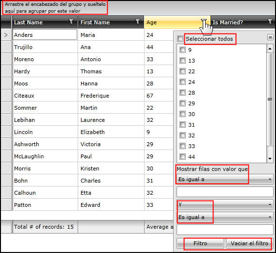

If you want the headings and footers to be in Spanish as well, you’ll need to create resources for those strings.
        

For additional information you can check [RadGridView Localization]() section.
		

## Validation

Validation is intended to support user input – validating the user’s data locally on the client.  __Example 16__ will demostrate how to use validation in a __RadGridView__ to validate the age using the __CellValidating__ event, which is always raised before the __CellValidated__ event.
        

__CellValidating__ lets you stop the commit process on a cell if the data is invalid.
        

Open MainPage.xaml and find the declaration of the __GridView__.  Add an event for __CellValidating__.
        

#### __[XAML] Example 16: Add a CellValidating event to the GridView (all of the next few code snippets).__

{{region xamlflix_gridview_11}}
	<telerik:RadGridView Name="radGridView1" CellValidating="radGridView1_CellValidating" ColumnWidth="*" AutoGenerateColumns="False" Margin="0,0,0,72" ShowColumnFooters="True">
	{{endregion}}

#### __[C#] Switch to the code behind and find the stub for the event handler.__

{{region xamlflix_gridview_26}}
	private void radGridView1_CellValidating(
	    object sender, GridViewCellValidatingEventArgs e)
	 {
	 }
	
	{{endregion}}

#### __[C#] We only want (for now) to validate the Age column, so begin with an if statement.__

{{region xamlflix_gridview_27}}
	if ( e.Cell.Column.UniqueName == "Age" )
	{{endregion}}

Inside the if statement we’ll place the logic for our validation. __Example 17__ shows the complete event handler.
        

#### __[C#] Example 17: The event handler logic for the Age validation for the GridView.__

{{region xamlflix_gridview_28}}
	private void radGridView1_CellValidating(
	     object sender, GridViewCellValidatingEventArgs e)
	 {
	     if ( e.Cell.Column.UniqueName == "Age" )
	     {
	         var newValue = Int32.Parse(e.NewValue.ToString());
	         if (newValue < 0 || newValue > 130)
	         {
	             e.IsValid = false;
	             e.ErrorMessage = "The entered value for age must be between 0 and 130.";
	         }
	     }
	 }
	{{endregion}}

Run the application and change one of the ages to 500.  Notice that the cell turns red and if you place the mouse on the red triangle, the error message appears next to the cell, as shown in __Figure 22__.
        

__Figure 22:__ Thomas cannot be 500 years old. Cell validation will prevent the user from saving this value.
			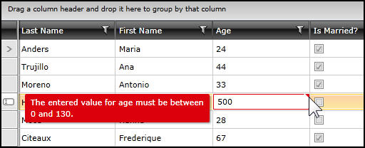

In addition to cell validating there is also a row validating event that occurs before the row is committed.  You can see this by adding the __RowValidating__ event (__Example 17__) and a handler (__Example 18__) to the __GridView__.
		

#### __[XAML] Example 17: Adding a RowValidating event to the GridView.__

{{region xamlflix_gridview_12}}
	<telerik:RadGridView 
	    Name="radGridView1" 
	    CellValidating="radGridView1_CellValidating"
	    RowValidating="radGridView1_RowValidating"
	    ColumnWidth="*" 
	    AutoGenerateColumns="False" 
	    Margin="0,0,0,72" 
	    ShowColumnFooters="True">
	{{endregion}}

In the event handler (__Example 18__), we’ll stub out a message box to indicate that the __RowValidating__ event fired.
		

#### __[C#] Example 18: Stub out a message box in the event handler so you’ll know when the event occurs.__

{{region xamlflix_gridview_29}}
	private void radGridView1_RowValidating(
	    object sender, GridViewRowValidatingEventArgs e)
	{
	    MessageBox.Show("Row Validating");
	}
	
	{{endregion}}

To see this at work, change a cell in the row, and then notice the Row-Commit indicator in the left margin. Click on that, as shown in __Figure 23__, to see the message box.
        

__Figure 23:__ The message box fires when a cell in a row is changed.
			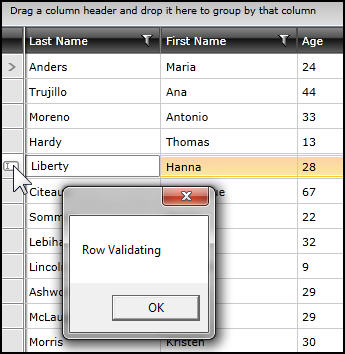

For additional information you can check:		  
		

* [RadGridView Validating]() article.
			

* [RadGridView Events Validation]() article.
			

## Copy and Paste to Excel

The ability to copy and paste values and rows to and from __RadGridView__ greatly enhances the interoperability of your application with Microsoft Excel.
        

This example uses the MainPage.xaml from __Example 17__ and adds four attributes.
        

#### __[XAML] Example 19: Adding four attributes to add copy and paste and selection functionality to the GridView.__

{{region xamlflix_gridview_13}}
	<telerik:RadGridView 
	    Name="radGridView1" 
	    CellValidating="radGridView1_CellValidating"
	    RowValidating="radGridView1_RowValidating"
	    ColumnWidth="*" 
	    AutoGenerateColumns="False" 
	    Margin="0,0,0,72" 
	    ShowColumnFooters="True"
	    ClipboardCopyMode="All"
	    ClipboardPasteMode="Default"
	    SelectionMode="Extended"
	    SelectionUnit="Cell">
	{{endregion}}

The four attributes determine how much will be copied to the clipboard and how entries on the clipboard will be pasted back into the grid. You can get a good idea of what the copy options are through IntelliSense as shown in __Figure 24__, and of the paste options as well, as shown in __Figure 25__.
        

__Figure 24:__ The available copy attributes for a __GridView__.
			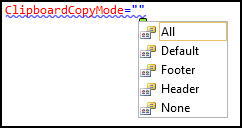

__Figure 25:__ The available paste attributes for a __GridView__.
			

You can now make selections in the __GridView__ and copy them to the clipboard and paste them to Excel.  You can do this by row or by cell, or by using Ctrl-click you can copy noncontiguous cells.
        

__Figure 26__ shows a user has used Ctrl-click to select a number of cells, and then hit Ctrl-C to copy and then Ctrl-P to paste them into Excel.  The pasted cells are placed in Excel in the appropriate rows and columns, and because the example selected __All__ from the __ClipboardCopyMode__ property (__Figure 24__);  the headers and footers are copied and pasted as well.
		

__Figure 26:__ The cells are copied from __GridView__ and pasted into Excel, including the header and footer.
			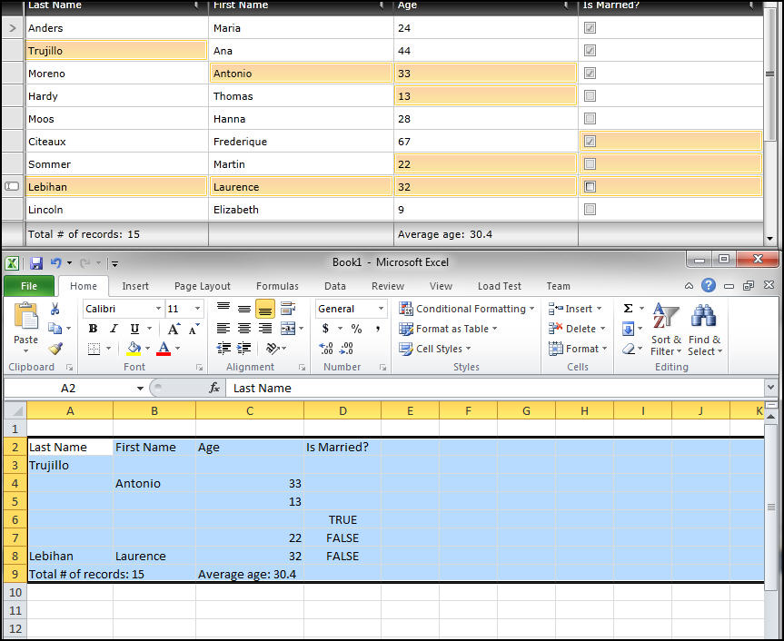

You can edit cells in Excel and when you copy and then paste them back, the modified values will be shown in the __RadGridView__.
        

For additional information you can check [RadGridView Clipboard]() section.
		
