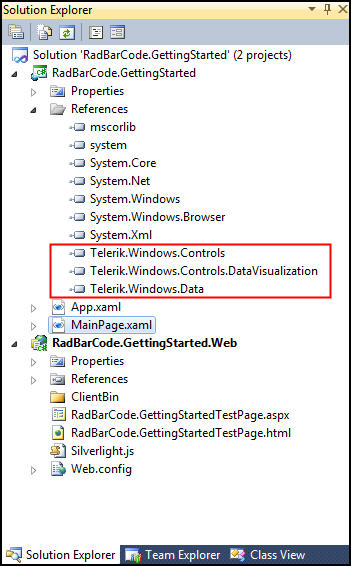
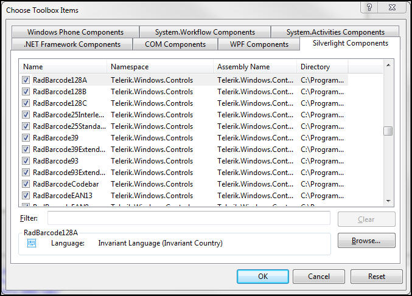
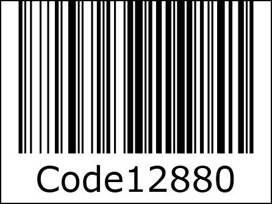
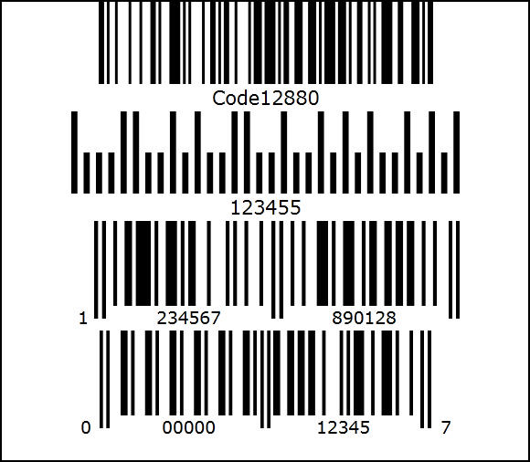

# RadBarCode

This tutorial will introduce the RadBarCode control, part of the Telerik suite of XAML controls.   

## Setting Up The Project

To begin, open Visual Studio and click on the Telerik menu option.  Under Rad Controls For Silverlight click on Create New Telerik Project.  Name your project, accept Silverlight 5 and in the Silverlight Settings dialog check DataVisualization (notice that the dependent references are automatically checked as well).  When you click ok, the necessary assemblies are added to the References as shown in figure 1

               Figure 1
            

Your application will open to MainPage.xaml and, thanks to the Telerik Visual Studio extensions, the namespace telerik will already have been created in the XAML heading.
        

#### __XAML__

{{region xamlflix_radbarcode_0}}
	<UserControl x:Class="RadBarCode.GettingStarted.MainPage"
			xmlns="http://schemas.microsoft.com/winfx/2006/xaml/presentation" 
			xmlns:x="http://schemas.microsoft.com/winfx/2006/xaml"
			xmlns:d="http://schemas.microsoft.com/expression/blend/2008" 
			xmlns:mc="http://schemas.openxmlformats.org/markup-compatibility/2006"
			xmlns:telerik="http://schemas.telerik.com/2008/xaml/presentation"
			mc:Ignorable="d" d:DesignWidth="640" d:DesignHeight="480">
	
	{{endregion}}

You may find that the RadBarCode control is not in your toolbox.  Right click in the tool box and select Choose Items…   Scroll to the RadBarCode entries in the Silverlight tab and check them all, as shown in figure 2,
        

               Figure 2
            

Click OK and note that these controls are now in your toolbox.  The most commonly used BarCode is 128, a high density bar code symbology used for alphanumeric (or numeric only) bar codes.  The most common use for this bar code is industrial applications and for inventory labels.
Drag and Drop BarCode128 onto your design surface.  In the Xaml, remove the alignments and the margin.
Add text to the RadBarCode128 control, such as Code128.  You’ll see that the bar code is created for you as you add the text, visible in the designer as shown in figure 3,
        

               Figure 3
            

Note that you typed in Code128 and it appended 80. That is the checksum value.  You can turn this off with an attribute,
        

#### __XAML__

{{region xamlflix_radbarcode_1}}
	<telerik:RadBarcode128 Name="xRadBarCode128" Text="Code128" ShowChecksum="False" />
	{{endregion}}

You can also add a height and a width to constrain the size of the bar code,
        

#### __XAML__

{{region xamlflix_radbarcode_2}}
	<telerik:RadBarcode128 
	    Name="xRadBarCode128"
	    Text="Code128" 
	    ShowChecksum="True"
	    Height="120"
	    Width="425"/>
	
	{{endregion}}

When we run the application, the bar code is displayed in the browser.
        

## Additional Formats

Out of the box, RadBarCode supports the following types of bar codes:
          
        

* 
            	Code 128
          

* 
            	Code 39
          

* 
            	Code EAN
          

* 
            	Codebar
          

* 
            	Code 11
          

* 
              Code MSI
          

* 
            	PostNet
          

* 
            	Code 25
          

* 
            	Code 93
          

* 
            	Code UPC
          

* 
            	Code UPC Supplement
          

Of these, the most popular are Code 128, PostNet, EAN-13 and UPC-A
          128 is used for alphanumeric codes in industrial applications as noted above.
          PostNet stands for Postal Numeric Encoding Technology and is used by the United States Postal Service
          EAN-13 bar codes are used world-wide for Point of Sale. It is a superset of the original UPC system.
          UPC is commonly used in North America and the UK.
          To compare these, return to your application and change the Grid to a Stack Panel.  You can then add the various types of bar codes, giving each the same size and some text to display,
        

#### __XAML__

{{region xamlflix_radbarcode_3}}
	<StackPanel x:Name="LayoutRoot">
	    <telerik:RadBarcode128 Height="120" Width="425" Text="Code128" />
	    <telerik:RadBarcodePostnet Height="120" Width="425" Text="12345" />
	    <telerik:RadBarcodeEAN13 Height="120" Width="425" Text="123456789012" />
	    <telerik:RadBarcodeUPCA Height="120" Width="425" Text="12345" />
	</StackPanel>
	
	{{endregion}}

When you run the application you’ll see the four popular bar code formats, as shown in figure 4,
        

               Figure 4
            

## Sample Application

In this application we’ll insert bar codes into a RadBook, and also demonstrate how to print bar codes using Silverlight’s printing support.
          Create a new application and call it RadBarCodeP3.  Add the DataVisualization library in the project configuration wizard.
          We also need to add the references for RadBook.  Click on Telerik->Rad Controls for Silverlight -> Configure Project and add references to Telerik.Windows.Controls.Navigation.
          Add the RadBook to the XAML as follows,
        

#### __XAML__

{{region xamlflix_radbarcode_4}}
	<telerik:RadBook Name="xRadBook" Margin="50" RightPageIndex="1">    
	</telerik:RadBook>
	
	{{endregion}}

Within the RadBook element, add a series of RadBookITems, as shown here,

#### __XAML__

{{region xamlflix_radbarcode_5}}
	    <telerik:RadBookItem Background="AntiqueWhite">
	               <TextBlock Text="Page 1" FontSize="36" />
	               <TextBlock Text="Item 1" FontSize="36" />
	               <TextBlock Text="Description 1" FontSize="36" />
	               <telerik:RadBarcodeUPCA Height="120" Width="255" 
	Text="123456789" ShowChecksum="True" Margin="5" />
	               <Button Content="Print" Click="Button_Click" Height="40" Width="100" />
	            </telerik:RadBookItem>
	            <telerik:RadBookItem Background="Aqua">
	
	            </telerik:RadBookItem>
	            <telerik:RadBookItem Background="Azure">
	
	            </telerik:RadBookItem>
	            <telerik:RadBookItem Background="Purple">
	
	            </telerik:RadBookItem>
	            <telerik:RadBookItem Background="Yellow">
	
	            </telerik:RadBookItem>
	
	{{endregion}}

On each of these pages we want to display the page number,  an item, a description and the bar code for the item.
        

#### __XAML__

{{region xamlflix_radbarcode_6}}
	<telerik:RadBook Name="xRadBook" Margin="50" RightPageIndex="3">
	    <telerik:RadBookItem Background="AntiqueWhite">
	        <StackPanel>
	            <TextBlock Text="Page 1" FontSize="36" />
	            <TextBlock Text="Item 1" FontSize="36" />
	            <TextBlock Text="Description 1" FontSize="36" />
	            <telerik:RadBarcodeUPCA Height="120" Width="255" 
	Text="123456789" ShowChecksum="True" Margin="5" />
	            <Button Content="Print" Click="Button_Click" Height="40" Width="100" />
	        </StackPanel>
	    </telerik:RadBookItem>
	    <telerik:RadBookItem Background="Aqua">
	        <StackPanel>
	                    <TextBlock Text="Page 2" FontSize="36" />
	                    <TextBlock Text="Item 2" FontSize="36" />
	                    <TextBlock Text="Description 2" FontSize="36" />
	                    <telerik:RadBarcodeUPCA Height="120" Width="255" 
	Text="839487567" ShowChecksum="True" Margin="5" />
	                </StackPanel>
	    </telerik:RadBookItem>
	    <telerik:RadBookItem Background="Azure">
	        <StackPanel>
	            <TextBlock Text="Page 3" FontSize="36" />
	            <TextBlock Text="Item 3" FontSize="36" />
	            <TextBlock Text="Description 3" FontSize="36" />
	            <telerik:RadBarcodeUPCA Height="120" Width="255" 
	Text="038376567" ShowChecksum="True" Margin="5" />
	        </StackPanel>
	
	    </telerik:RadBookItem>
	    <telerik:RadBookItem Background="Purple">
	        <StackPanel>
	            <TextBlock Text="Page 4" FontSize="36" />
	            <TextBlock Text="Item 4" FontSize="36" />
	            <TextBlock Text="Description 4" FontSize="36" />
	            <telerik:RadBarcodeUPCA Height="120" Width="255" 
	Text="8372625434" ShowChecksum="True" Margin="5" />
	        </StackPanel>
	
	    </telerik:RadBookItem>
	    <telerik:RadBookItem Background="Yellow">
	        <StackPanel>
	            <TextBlock Text="Page 5" FontSize="36" />
	            <TextBlock Text="Item 5" FontSize="36" />
	            <TextBlock Text="Description 5" FontSize="36" />
	            <telerik:RadBarcodeUPCA Height="120" Width="255" 
	Text="8783652648" ShowChecksum="True" Margin="5" />
	        </StackPanel>
	
	    </telerik:RadBookItem>
	
	{{endregion}}

Notice that the first page has a Print button.  Here is the event handler for that button which goes in MainPage.xaml.cs,
        

#### __C#__

{{region xamlflix_radbarcode_10}}
	    private void Button_Click(object sender, RoutedEventArgs e)
	 {
	     PrintDocument document = new PrintDocument();
	     document.PrintPage += (s, args) =>
	     {
	         args.PageVisual = this.radBookItem1;
	     };
	     document.Print("Silverlight Printing Demo");
	
	 }
	{{endregion}}

Notice that we are printing radBookItem1.  Return to the XAML and give the first item the corresponding name.
        

#### __XAML__

{{region xamlflix_radbarcode_6}}
	<telerik:RadBook Name="xRadBook" Margin="50" RightPageIndex="3">
	    <telerik:RadBookItem Background="AntiqueWhite">
	        <StackPanel>
	            <TextBlock Text="Page 1" FontSize="36" />
	            <TextBlock Text="Item 1" FontSize="36" />
	            <TextBlock Text="Description 1" FontSize="36" />
	            <telerik:RadBarcodeUPCA Height="120" Width="255" 
	Text="123456789" ShowChecksum="True" Margin="5" />
	            <Button Content="Print" Click="Button_Click" Height="40" Width="100" />
	        </StackPanel>
	    </telerik:RadBookItem>
	    <telerik:RadBookItem Background="Aqua">
	        <StackPanel>
	                    <TextBlock Text="Page 2" FontSize="36" />
	                    <TextBlock Text="Item 2" FontSize="36" />
	                    <TextBlock Text="Description 2" FontSize="36" />
	                    <telerik:RadBarcodeUPCA Height="120" Width="255" 
	Text="839487567" ShowChecksum="True" Margin="5" />
	                </StackPanel>
	    </telerik:RadBookItem>
	    <telerik:RadBookItem Background="Azure">
	        <StackPanel>
	            <TextBlock Text="Page 3" FontSize="36" />
	            <TextBlock Text="Item 3" FontSize="36" />
	            <TextBlock Text="Description 3" FontSize="36" />
	            <telerik:RadBarcodeUPCA Height="120" Width="255" 
	Text="038376567" ShowChecksum="True" Margin="5" />
	        </StackPanel>
	
	    </telerik:RadBookItem>
	    <telerik:RadBookItem Background="Purple">
	        <StackPanel>
	            <TextBlock Text="Page 4" FontSize="36" />
	            <TextBlock Text="Item 4" FontSize="36" />
	            <TextBlock Text="Description 4" FontSize="36" />
	            <telerik:RadBarcodeUPCA Height="120" Width="255" 
	Text="8372625434" ShowChecksum="True" Margin="5" />
	        </StackPanel>
	
	    </telerik:RadBookItem>
	    <telerik:RadBookItem Background="Yellow">
	        <StackPanel>
	            <TextBlock Text="Page 5" FontSize="36" />
	            <TextBlock Text="Item 5" FontSize="36" />
	            <TextBlock Text="Description 5" FontSize="36" />
	            <telerik:RadBarcodeUPCA Height="120" Width="255" 
	Text="8783652648" ShowChecksum="True" Margin="5" />
	        </StackPanel>
	
	    </telerik:RadBookItem>
	
	{{endregion}}

You are now ready to run the application, to page through the pages each of which has its own bar code, and to print the first page with its bar code
        

# See Also
