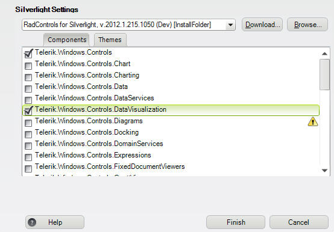
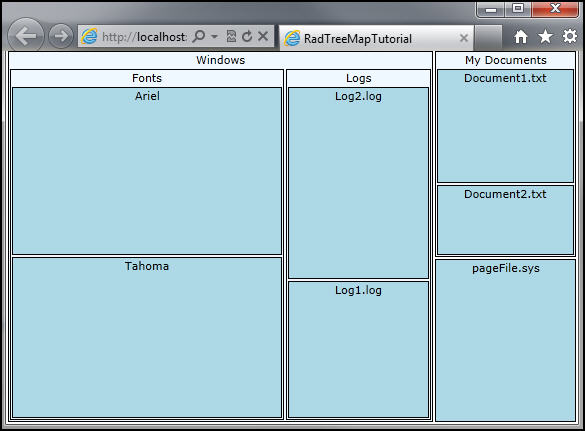
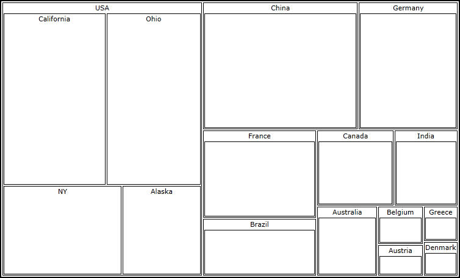
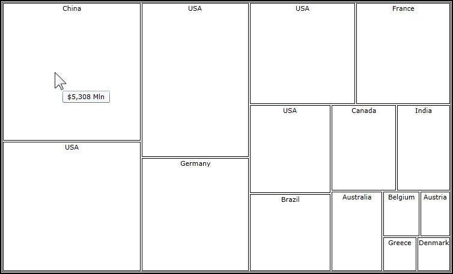
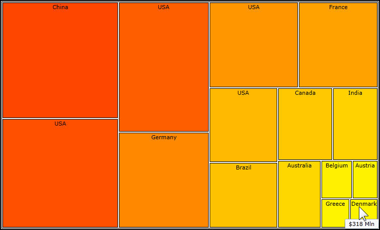
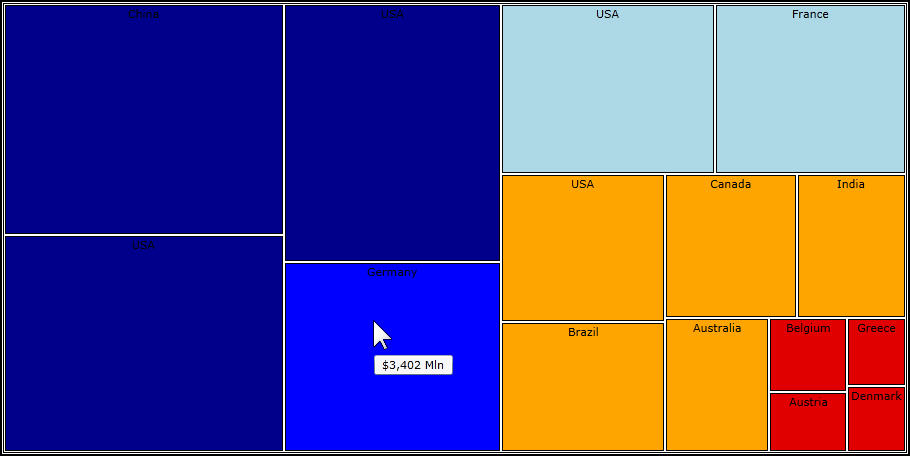

# RadTreeMap and RadPivotMap

This tutorial will introduce the __RadTreeMap__ and __RadPivotMap__ controls, part of the Telerik suite of XAML controls.   Both the __RadPivotMap__ and the __RadTreeMap__ are used to display hierarchical data.  The key difference is that __RadTreeMap__ can be bound to a collection and the data will be converted into a visual tree, while the __RadPivotMap__ can be bound to flat data and the control automatically groups the data.
	  

## Setting Up The Project

To begin, open Visual Studio and click on the Telerik menu option.  Under *RadControls For Silverlight* click on *Create New Telerik Project*.  Name your project, accept Silverlight 5 and in the *Project Configuration Wizard* dialog check DataVisualization (notice that the dependent references are automatically checked as well), as shown in figure 1.
		

Figure 1

When you click ok, the necessary assemblies are added to the References as shown in figure 2

Figure 2

Your application will open to MainPage.xaml and, thanks to the *Telerik Visual Studio Extensions* , the namespace __telerik__ will already have been created in the XAML heading.
		

	
<UserControl x:Class="RadTreeMapTutorial.GettingStarted.MainPage"
		xmlns="http://schemas.microsoft.com/winfx/2006/xaml/presentation" 
		xmlns:x="http://schemas.microsoft.com/winfx/2006/xaml"
		xmlns:d="http://schemas.microsoft.com/expression/blend/2008" 
		xmlns:mc="http://schemas.openxmlformats.org/markup-compatibility/2006"
		xmlns:telerik="http://schemas.telerik.com/2008/xaml/presentation"
		mc:Ignorable="d" d:DesignWidth="640" d:DesignHeight="480">
		  

Let’s begin by setting up data for the __RadTreeMap__ application.  To begin, we’ll define an interface, *IDiskItem* that implements __INotifyPropertyChanged__,
		

	
public interface IDiskItem : INotifyPropertyChanged
{
    string Name { get;  }
    long Size { get;  }
    IList<IDiskItem> Children { get;  }
}
		  

Create a Folder class that implements IDiskItem,

	
public class Folder : IDiskItem
{
    private long size = 0;
}
		  

A lot of the heavy lifting is done in the constructor,

	
public Folder(string name, IEnumerable<IDiskItem> children)
 {
     this.Name = name;
     var collection = new ObservableItemCollection<IDiskItem>();
     collection.AddRange(children);
     collection.ItemChanged += 
         new EventHandler<ItemChangedEventArgs<IDiskItem>>(collection_ItemChanged);
     collection.CollectionChanged += new 
       System.Collections.Specialized.NotifyCollectionChangedEventHandler(collection_CollectionChanged);
     this.Children = collection;
 }
		  

We set up the __ObservableItemCollection__ of __IDiskItems__ and add the children to the collection. We then set up two event handlers. The first is ItemChanged,
		

	
void collection_ItemChanged(object sender, ItemChangedEventArgs<IDiskItem> e)
{
    if ( e.PropertyName == "Size")
    {
        this.OnPropertyChanged("Size");
    }
}
		  

The second is CollectionChanged,

	
void collection_CollectionChanged(
    object sender, 
    System.Collections.Specialized.NotifyCollectionChangedEventArgs e)
{
    this.OnPropertyChanged("Size");
}
		  

The folder is overloaded to handle a cached size,

	
public Folder(string name, IEnumerable<IDiskItem> children, long cachedSize)
{
    this.size = cachedSize;
}
		  

The Size property computes the sum of the sizes of all the child folders,

	
public long Size
{
    get
    {
        if (this.Children != null && this.Children.Count() > 0)
            this.size = this.Children.Sum(c => c.Size);
        return this.size;
	}
}
		  

The folder of course also defines properties for Name and Children and implements __INotifyPropertyChanged__,
		

	
public string Name { get; set; }

public IList<IDiskItem> Children { get; private set; }

public event PropertyChangedEventHandler PropertyChanged;

protected virtual void OnPropertyChanged(string propertyName)
{
    if (this.PropertyChanged != null)
        this.PropertyChanged(this, new PropertyChangedEventArgs(propertyName));
}
		  

Similarly, we also define a class for File,

	
public class File : IDiskItem
 {
     private long size;
     public File(string name, long size)
     {
         this.Name = name;
         this.size = size;
     }
     public string Name { get; private set; }

     public long Size
     {
         get
         {
             return this.size;
     	}
         set
         {
             if (this.size == value)
                 return;

             this.size = value;
             OnPropertyChanged("Size");
         }
     }

     public IList<IDiskItem> Children
     {
         get { return null;  }
     }

     public event PropertyChangedEventHandler PropertyChanged;

     protected virtual void OnPropertyChanged(string propertyName)
     {
         if (this.PropertyChanged != null)
             this.PropertyChanged(this, new PropertyChangedEventArgs(propertyName));
     }
 }
		  

Returning to the MainPage.xaml.cs file, the work is done in the Loaded event handler,

In the Loaded event handler, we’ll create a folder, Windows, that will contain two folders, each of which will contain two files. We’ll also add a second folder, MyDocuments (which will hold two files) and a file, pagefile.sys,

	
void MainPage_Loaded(object sender, RoutedEventArgs e)
{
    var datasource = new List<IDiskItem>(){
    new Folder ( "Windows", 
        new List<IDiskItem> (){
        new Folder ( "Fonts", new List<IDiskItem> () { new File ( "Ariel", 256 ), new File ( "Tahoma",246 ) } ),
        new Folder ( "Logs", new List<IDiskItem> () { new File ( "Log1.log", 112 ), new File ( "Log2.log",156 ) } )
    }),
    new Folder ( "My Documents", new List<IDiskItem> (){
        new File ( "Document1.txt",88 ), new File ( "Document2.txt", 55 )}),
    new File("pageFile.sys", 114)};

    treemap1.ItemsSource = dataSource;
}
		  

Of course, we’ve not yet created the treemap, so let’s do that new in MainPage.xaml,

Add a __RadTreeMap__, give it a name, and set the LayoutStategy to “Squarified” (rather than “Slice and Dice”) –
		

We’re then going to add TypeDefinitions,

	
<telerik:RadTreeMap Name="xRadTreeMap"
                    LayoutStrategy="Squarified">
    <telerik:RadTreeMap.TypeDefinitions>
        <telerik:TypeDefinition TargetTypeName="Folder"
                                ValuePath="Size"
                                LabelPath="Name"
                                ChildrenPath="Children"
                                ToolTipPath="Size">
		  

Next we’ll add TypeDefinition Mappings,

	
<telerik:RadTreeMap Name="xRadTreeMap"
                    LayoutStrategy="Squarified">
    <telerik:RadTreeMap.TypeDefinitions>
        <telerik:TypeDefinition TargetTypeName="Folder"
                                ValuePath="Size"
                                LabelPath="Name"
                                ChildrenPath="Children"
                                ToolTipPath="Size">
            <telerik:TypeDefinition.Mappings>
                <telerik:BrushColorizer Brush="AliceBlue" />
            </telerik:TypeDefinition.Mappings>              
        </telerik:TypeDefinition>
		  

That sets up the folder, next we need to set up the file,

	
<telerik:TypeDefinition TargetTypeName="File"
                        LabelPath="Name"
                        ValuePath="Size">
    <telerik:TypeDefinition.Mappings>
        <telerik:BrushColorizer Brush="LightBlue" />
    </telerik:TypeDefinition.Mappings>
</telerik:TypeDefinition>
		  

When we run the application we get a graphical representation of both the containment of files within folders, and of the relative size of the files, as shown in figure 3,

Figure 3

## RadPivotMap

Create a new application and use the same set up as in the previous example (e.g., DataVisualization).

In this demo we’ll work with GDP information that we will scientifically gather by making it up.  In MainPage.xaml.cs, create a new class within MainPage, called GdpInfo,

	
public partial class MainPage : UserControl 
{
 public class GdpInfo
 {
     public string Continent { get; set; }
     public string Country { get; set; }
     public string State { get; set;  }
     public double Gdp { get; set;  }
 }
		  

Create a GetData method which will generate dummy GDP data for our use,

	
public List<GdpInfo> GetData()
{
    List<GdpInfo> data = new List<GdpInfo>()
    {
        new GdpInfo() { Country = "Australia", Gdp = 1146 },
        new GdpInfo() { Country = "Austria", Gdp = 385.1 },
        new GdpInfo() { Country = "Belgium", Gdp = 468.6 },
        new GdpInfo() { Country = "Brazil", Gdp = 1749 },
        new GdpInfo() { Country = "Canada", Gdp = 1565 },
        new GdpInfo() { Country = "China", Gdp = 5308 },
        new GdpInfo() { Country = "Denmark", Gdp = 318.1 },
        new GdpInfo() { Country = "France", Gdp = 2669 },
        new GdpInfo() { Country = "Germany", Gdp = 3402 },
        new GdpInfo() { Country = "Greece", Gdp = 329 },
        new GdpInfo() { Country = "India", Gdp = 1290 },
        new GdpInfo() { Country = "USA", State = "NY", Gdp = 3000 },
        new GdpInfo() { Country = "USA", State = "Alaska", Gdp = 2000 },
        new GdpInfo() { Country = "USA", State = "California", Gdp = 5000 },
        new GdpInfo() { Country = "USA", State = "Ohio", Gdp = 4600 },
    };
    return data;
}
		  

Before wiring this up to the __ItemsSource__ property of the __PivotMap__ we need to add the __PivotMap__ to the XAML,
		

	
<telerik:RadPivotMap Name="xPivotMap"
                     LayoutStrategy="Squarified"
                     ValuePath="Gdp"
                     LabelPath="State">
    
</telerik:RadPivotMap>
		  

Next we add the grouping,

	
<telerik:RadPivotMap Name="xPivotMap"
                     LayoutStrategy="Squarified"
                     ValuePath="Gdp"
                     LabelPath="State">
    <telerik:RadPivotMap.GroupDefinitions>
        <telerik:GroupDefinition Member="Country" />
    </telerik:RadPivotMap.GroupDefinitions>
</telerik:RadPivotMap>
		  

Return to the constructor in the code behind and add the ItemsSource assignment,

	
xPivotMap.ItemsSource = this.GetData();		  
		  

Run the application and you can see the relative GDP represented graphically (the bigger the GDP, the larger the box), as shown in figure 4

Figure 4

## Adding Color

You can add color to your __RadTreeMap__ and your __RadPivotMap__ to enhance the visualization of data.
		

For this iteration, we’ll use the GDP data from the previous example, but we’ll change the XAML to use a TreeMap,

	
<telerik:RadTreeMap Name="xTreeMap"
                    LayoutStrategy="Squarified"
                    BorderThickness="1"
                    BorderBrush="Black">
   
    <telerik:RadTreeMap.TypeDefinitions>
        <telerik:TypeDefinition TargetTypeName="GdpInfo"
                                ValuePath="Gdp"
                                LabelPath="Country"
                                ToolTipPath="Gdp"
                                ToolTipFormat="{}{0:C0} Mln">
            <telerik:TypeDefinition.Mappings>
                
            </telerik:TypeDefinition.Mappings>
        </telerik:TypeDefinition>
		  

When you run this, you get a nice representation of the various country’s GDP but as with Figure 4 it is a bit boring in that there is no color, as is shown in figure 5,

Figure 5

We can fix that in the __Mappings__ definition. We’ll add a gradient brush, and tell it the range of values that the gradient will represent. We’ll also tell it how to distribute the gradient colors using Gradient Stops.
		

	
<telerik:TypeDefinition.Mappings>
    <telerik:ValueGradientColorizer RangeMaximum="14600"
                                    RangeMinimum="0">
        <GradientStop Offset="0"
                      Color="Yellow" />
        <GradientStop Offset="0.5"
                      Color="Red" />
        <GradientStop Offset="1"
                      Color="Maroon" />
    </telerik:ValueGradientColorizer>
</telerik:TypeDefinition.Mappings>
		  

When we run the application again, making no other changes, we get a much more intuitive and powerful feel for the differences among the GDP of the various countries because the color reinforces the sizes, as shown in figure 6,

Figure 6

We can lend even more meaning to the colors by using a RangeBrushColorizer.  To do so, remove the mappings and create two new resources. First, create a set of SolidColorBrush resources with keys that correspond to the values we care about,

	
<UserControl.Resources>
     <SolidColorBrush Color="#FFE10000"
                      x:Key="Thousand" />
     <SolidColorBrush Color="Orange"
                      x:Key="TwoThousand" />
     <SolidColorBrush Color="LightBlue"
                      x:Key="ThreeThousand" />
     <SolidColorBrush Color="Blue"
                      x:Key="FourThousand" />
     <SolidColorBrush Color="DarkBlue"
                      x:Key="FiveThousand" />
     <SolidColorBrush Color="Gray"
                      x:Key="BorderBrush" />
		  

With those in place, create a __RangeBrushCollection__ (also in your resources) that uses __RangeBrushes__ to map the keys to colors.
		

	
<telerik:RangeBrushCollection x:Key="ColorizerBrushes">
     <telerik:RangeBrush Brush="{StaticResource Thousand}"
                         From="0"
                         To="1000" />

     <telerik:RangeBrush Brush="{StaticResource TwoThousand}"
                         From="1001"
                         To="2000" />
     <telerik:RangeBrush Brush="{StaticResource ThreeThousand}"
                         From="2001"
                         To="3000" />
     <telerik:RangeBrush Brush="{StaticResource FourThousand}"
                         From="3001"
                         To="4000" />
     <telerik:RangeBrush Brush="{StaticResource FiveThousand}"
                         From="4001"
                         To="15000" />
 </telerik:RangeBrushCollection>
		  

Return to the mappings, but this time use a __ValueBrushColorizer__,
		

	
<telerik:TypeDefinition.Mappings>
    <telerik:ValueBrushColorizer IsAbsolute="True"
                                 ValuePath="Gdp"
                                 RangeMinimum="0"
                                 RangeMaximum="14600"
                                 Brushes="{StaticResource ColorizerBrushes}" />
</telerik:TypeDefinition.Mappings>
		  

The net effect is that we’ve determined the “meaning” of the colors. They are not just a gradient of relative value, but each color represents a range. The result is shown in figure 7,

Figure 7

With this type of representation you could create a color key so that the user can tell at a glance what each color indicates (eg., DarkBlue is our highest value, Blue is our 3,001 – 4000, etc.). 

# See Also
